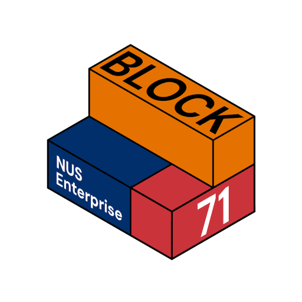
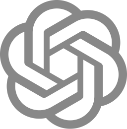
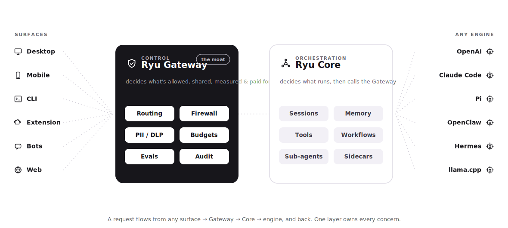

<p align="center">
  <a href="https://ryuhq.com">
    <picture>
      <source media="(prefers-color-scheme: dark)" srcset=".github/banner-dark.png" />
      
    </picture>
  </a>
</p>

<p align="center"></p>
<h1 align="center">Ryu</h1>

<p align="center">
  The open platform for agent orchestration and human collaboration. With tools, security, memory, cost saving, and routing all built in.
</p>

<p align="center">
  &nbsp;
  &nbsp;
  &nbsp;
  
</p>

<p align="center">
  <a href="https://www.npmjs.com/package/@ryuhq/client"></a>&nbsp;
  <a href="https://www.npmjs.com/package/@ryuhq/client"></a>&nbsp;
  <a href="https://github.com/amajorai/ryu/releases"></a>&nbsp;
  <a href="https://github.com/amajorai/ryu/releases"></a>&nbsp;
  <a href="https://github.com/amajorai/ryu/stargazers"></a>
</p>

<p align="center">
  <a href="https://ryuhq.com"></a>&nbsp;
  <a href="https://ryuhq.com/help"></a>&nbsp;
  <a href="https://ryuhq.com/download"></a>&nbsp;
  <a href="https://ryuhq.com/discord"></a>
  <a href="./docs/open-core.md"></a>
</p>

## Backed by

Ryu is built with the support of leading startup programs.

<p align="center">
  <a href="https://aws.amazon.com/startups/" target="_blank" rel="noopener"></a>
  &nbsp;&nbsp;&nbsp;&nbsp;&nbsp;
  <a href="https://block71.co" target="_blank" rel="noopener"></a>
  &nbsp;&nbsp;&nbsp;&nbsp;&nbsp;
  <a href="https://www.anthropic.com/startups" target="_blank" rel="noopener"></a>
  &nbsp;&nbsp;&nbsp;&nbsp;&nbsp;
  <a href="https://openai.com/startups" target="_blank" rel="noopener"></a>
  &nbsp;&nbsp;&nbsp;&nbsp;&nbsp;
  <a href="https://www.cloudflare.com/forstartups/" target="_blank" rel="noopener"></a>
</p>

<p align="center">
  <sub>AWS Activate&nbsp; · &nbsp;BLOCK71&nbsp; · &nbsp;Claude for Startups&nbsp; · &nbsp;OpenAI for Startups&nbsp; · &nbsp;Cloudflare for Startups</sub>
</p>

## About Ryu

Your agents don't know what each other did. They burn through subscriptions you
already pay for. They're one misconfiguration away from a leak. And setting them
up takes weeks of wiring, keys, and glue code.

Ryu fixes that. It's the control layer around any agent — OpenAI, Claude Code,
Codex, Pi, OpenClaw, Hermes, any OpenAI-compatible runtime. Every model call
goes through one Gateway that handles routing, firewall, PII/DLP, budgets,
evals, and audit. Agents share context, subscriptions stack, and security is on
by default. Local-first, encrypted, no telemetry. **Works with everything.
Locked to nothing.**

> [!WARNING]
> Ryu is pre-1.0 and under active development. Interfaces, APIs, and on-disk formats may change between releases. Not recommended for production use yet.

## Why Ryu

- **Agents that know what each other did.** Shared memory and context across every surface — desktop, mobile, CLI, bots, web.
- **Your subscriptions, fully used.** Point Claude Code, Codex, and Gemini at one Gateway. Smart routing keeps cheap tasks on local models; cloud handles only what needs it.
- **Secure out of the box.** Firewall, prompt-injection protection, PII/DLP redaction, per-agent budgets, and a full audit trail — not bolted on, built in.
- **One-click setup.** Pick an agent from the catalog, install, and go. No MCP wiring, no API-key hunt, no week-long integration.
- **Works with everything, locked to nothing.** Every layer — model, embedder, reranker, engine, RAG strategy, sandbox — swaps via one registry. BYO agent, key, subscription.

## Architecture

<picture>
  <source media="(prefers-color-scheme: dark)" srcset=".github/architecture-dark.svg">
  
</picture>

**The one design rule:** if code decides *what runs* (which agent, session, workflow, tool), it is
**Core**. If it decides *what is allowed, shared, measured, or paid for*, it is **Gateway**. Core
never enforces policy inline — it routes every model call through the Gateway.

## Quick start (self-host)

### Install (prebuilt binaries)

One line pulls the headless stack — `ryu-core`, `ryu-gateway`, `ryu-cli` — into
`~/.ryu/bin` and puts it on your PATH. Great for servers, containers, and CI.

**macOS & Linux** (x86_64 Linux, Apple Silicon macOS):

```bash
curl -fsSL https://raw.githubusercontent.com/amajorai/ryu/main/install.sh | sh
```

**Windows** (x86_64, PowerShell):

```powershell
irm https://raw.githubusercontent.com/amajorai/ryu/main/install.ps1 | iex
```

Then just run the CLI — it self-bootstraps, starting a local Core (which brings up
the Gateway + a fully-local model stack) if none is running:

```bash
ryu-cli      # fetches + starts Core on first run, then attaches — no API key
```

Or start the node yourself and point clients at it:

```bash
ryu-core     # starts the Gateway + local model stack on :7980
```

<sub>Prebuilt targets: Linux x86_64, macOS Apple Silicon, Windows x86_64. On Intel
Macs or ARM Linux, build from source below. Override the install dir with
`RYU_INSTALL_DIR` or pin a release with `RYU_VERSION=v0.0.4`.</sub>

### Build from source

```bash
cd apps/core    && cargo build --release   # ryu-core    :7980
cd apps/gateway && cargo build --release   # ryu-gateway :7981
```

Point any OpenAI-compatible client at the Gateway's `/v1/chat/completions`.

On first run, Ryu downloads a fully-local stack (llama.cpp with Gemma 4 for chat, nomic embeddings, whisper for speech), so it works with **no API key**.

Swap any piece later: model, embedder, engine, and RAG strategy are all config.

The TypeScript units (SDK, docs) use [Bun](https://bun.sh):

```bash
bun install && bun run build
```

### One-click deploy

Stand up a hosted node (Core + Gateway) on a container host. Each builds the
[`Dockerfile`](./Dockerfile): Core runs the stack and manages the Gateway on
loopback, so only Core's port is published.

[](https://render.com/deploy?repo=https://github.com/amajorai/ryu)
&nbsp;
[](https://railway.com/new)
&nbsp;
[](https://cloud.digitalocean.com/apps/new?repo=https://github.com/amajorai/ryu/tree/main)

Or run it yourself:

- **Docker Compose** — `docker compose up --build` ([`docker-compose.yml`](./docker-compose.yml)): Core on `:7980`, Gateway on `:7981`, model state in a named volume.
- **Fly.io** — `fly launch --copy-config` then `fly deploy` ([`fly.toml`](./fly.toml)).

> **Sizing.** Core downloads a fully-local model stack on first boot, so pick a
> plan with **≥ 2 GB RAM** (4 GB is comfortable), or set a provider key such as
> `OPENAI_API_KEY` to skip the local download and run small.
>
> **License.** The Gateway is **AGPL-3.0**: host a *modified* Gateway and §13
> obliges you to offer those changes to its users. Core is Apache-2.0.

The documentation site (`apps/fumadocs`) is a Next.js app and deploys to Vercel
in one click — [](https://vercel.com/new/clone?repository-url=https://github.com/amajorai/ryu&root-directory=apps/fumadocs&project-name=ryu-docs). Vercel is serverless and cannot host the long-running Core/Gateway; use a container host above for the backend.

## Batteries-included defaults (all swappable)

- **Engine/model:** llama.cpp + Gemma 4 — runs on most machines, no key.
- **Default agent:** **"Ryu"** = Pi with the Gateway on top (the flagship "car around the engine"). Claude Code, Codex, Gemini CLI, OpenClaw, Hermes, and ~18 more ACP agents are opt-in via the catalog.
- **RAG:** local nomic embeddings + BGE reranker; vector + GraphRAG.
- **Modalities:** chat, image-gen, TTS, STT — all first-class, all swappable.
- **Standards:** Agent Skills + MCP + ACP, all first-class.

## Repository layout & licensing

Ryu is an **open-core** monorepo: the orchestration engine is open-source and self-hostable;
the UX and identity surfaces are closed. Each unit carries its own `LICENSE` and `README.md`.

### Open source — self-hostable

Apache-2.0 (Gateway: AGPL-3.0; Raycast: MIT).

| Unit | What it is |
|---|---|
| [`apps/core`](./apps/core) | Orchestration engine, the real local backend (Rust/Axum, :7980) |
| [`apps/gateway`](./apps/gateway) | The LLM control layer: routing, firewall, cache, evals, audit (Rust, :7981) |
| [`apps/cli`](./apps/cli) | Terminal client for Core (Rust/ratatui) |
| [`apps/ghost`](./apps/ghost) | Desktop-automation MCP server: screen perception + input control (Rust) |
| [`apps/shadow`](./apps/shadow) | Screen/audio capture + semantic memory (Rust, :3030) |
| [`apps/fumadocs`](./apps/fumadocs) | Documentation site + interactive OpenAPI (Next/Fumadocs) |
| [`apps/raycast`](./apps/raycast) | Raycast extension, fenced out of the workspace (TS) |
| [`packages/sdk`](./packages/sdk) · [`create-ryu-app`](./packages/create-ryu-app) | Ryu's dev SDK + project scaffolder |
| [`packages/client`](./packages/client) | Typed TypeScript client for the Core HTTP API |
| [`crates/ryu-sdk{,-ffi,-napi,-uniffi}`](./crates) | SDK kernel + C-ABI/Node-API/UniFFI bindings |
| [`crates/ghost-{core,eyes,hands}`](./crates) · [`shadow-core`](./crates/shadow-core) | Automation + capture crates |

### Proprietary — the UX/identity layer

© 2026 A Major Pte. Ltd.

| Unit | What it is |
|---|---|
| [`apps/desktop`](./apps/desktop) | The flagship app (Tauri v2 + React) |
| [`apps/web`](./apps/web) | Marketing, dashboard, billing, docs (Next.js, :3001) |
| [`apps/server`](./apps/server) | Identity / content / billing plane (Hono/TS, :3000) |
| [`apps/native`](./apps/native) | Mobile app, iOS + Android (Expo/RN) |
| [`apps/island`](./apps/island) | Companion overlay + command bar (Electron) |
| [`apps/storyboard`](./apps/storyboard) | Internal screen + design-system explorer (Next.js, :3002) |
| [`apps/extension`](./apps/extension) | Browser extension (WXT/TS) |
| [`packages/ui`](./packages/ui) · [`command`](./packages/command) | Shared design system + command palette |
| [`packages/{auth,db,api,email,settings,env,config}`](./packages) | Identity / persistence / config plane |

## Footprint

<!-- BENCH:ROOT:START (generated by scripts/benchmark.mjs, do not edit by hand) -->

The native tier ships as a handful of small self-contained Rust binaries: no interpreter,
no runtime, no Electron, no Docker. Every number below is emitted by
[`scripts/benchmark.mjs`](./scripts/benchmark.mjs); reproduce it with `node scripts/benchmark.mjs --build --runtime`.

| Component | Release binary | Crates | Source (LOC) | Idle RSS | Idle CPU |
| --- | --- | --- | --- | --- | --- |
| [`apps/core`](./apps/core) | 44.2 MB | 687 | 105,168 | n/a | n/a |
| [`apps/gateway`](./apps/gateway) | 18.7 MB | 405 | 20,658 | 17.0 MB | 0.0% |
| [`apps/shadow`](./apps/shadow) | 21.5 MB | 604 | 16,410 | n/a | n/a |
| [`apps/ghost`](./apps/ghost) | 12.8 MB | 428 | 3,427 | n/a | n/a |
| [`apps/cli`](./apps/cli) | 5.9 MB | 235 | 10,497 | n/a | n/a |

_Idle RSS and CPU are sampled only for the Gateway (a stateless proxy with a clean idle), and idle CPU is effectively nil. Core boots a full local stack on first run, and the capture/automation tools (Shadow, Ghost) and the CLI have no steady idle, so they report size/deps/LOC. Measured on `win32`._

<!-- BENCH:ROOT:END -->

## Star History

<a href="https://www.star-history.com/#amajorai/ryu&Date">
 <picture>
   <source media="(prefers-color-scheme: dark)" srcset="https://api.star-history.com/svg?repos=amajorai/ryu&type=Date&theme=dark" />
   <source media="(prefers-color-scheme: light)" srcset="https://api.star-history.com/svg?repos=amajorai/ryu&type=Date" />
   
 </picture>
</a>

## Contributing

Contributions to the OSS units are welcome — see each unit's README for build instructions.
Report security issues privately to security@ryuhq.com.

Open-source units are Apache-2.0, AGPL-3.0 (Gateway), or MIT (Raycast). Proprietary units are
© 2026 A Major Pte. Ltd. Each subdirectory carries its own `LICENSE` file.

---

Built on the shoulders of [kernel.sh](https://github.com/onkernel/kernel) (identity vault),
[Jan](https://github.com/menloresearch/jan) (local-first desktop),
[Ghost OS](https://github.com/ghostwright/ghost-os) (desktop automation), and
[Shadow](https://github.com/ghostwright/shadow) (capture + semantic memory).
