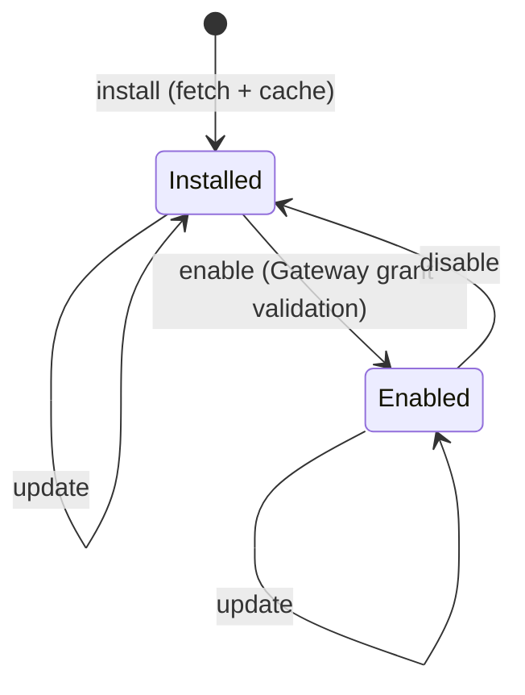

Once you have Runnables, you bundle them into an **App** (also called a plugin). An app is a manifest that packages your Runnables plus an optional companion surface, so other people can install your work in one step.

## The manifest

The manifest file is `ryu.json`. The canonical newer path uses `plugin.json`, and both are read, so either name works.

```json
{
  "name": "weather-app",
  "version": "1.0.0",
  "runnables": [
    { "kind": "agent", "id": "weather-helper" },
    { "kind": "tool", "id": "get_weather" }
  ]
}
```

The manifest is modeled on the convergent plugin shape that Claude Code and Codex also use - a `plugin.json` plus a `marketplace.json`, with git or npm sources copied to a local cache. If you know that shape, this will feel familiar.

Each manifest is validated per-kind against a schema, so an agent entry is checked differently from a tool entry.

## Lifecycle and grants

<TryInRyu page="apps" />

Apps are installable and enable-on-the-fly, with permission grants. The lifecycle has four states:

- **install** - fetch and cache the app.
- **enable** - turn it on, with Gateway grant validation.
- **disable** - turn it off without uninstalling.
- **update** - move to a new version.



<Callout type="warn">
  Enabling an app validates its grants against the Gateway. An app cannot quietly reach a model, tool, or surface it was not granted.
</Callout>

## Built-in apps

Ryu ships with built-in apps you can study as examples:

- **Ghost** - desktop automation.
- **Shadow** - screen capture and search.
- **spider** - a default for scraping.

These are real apps built on the same manifest and lifecycle you just used, so you can model yours on them. (agentbrowser ships as a default tool for web browsing, not a plugin manifest, so it is not one of these manifest-backed examples.)

## Knowledge check

First, the reflection prompts. Answer them in your own words.

- What two file names can a Ryu app manifest use?
- What are the four lifecycle states of an app?
- What happens to an app's grants when it is enabled?

Then confirm the details with a quick self-test.

<Quiz
  questions={[
    {
      q: "What two file names can a Ryu app manifest use?",
      options: [
        "ryu.json or plugin.json, since both are read",
        "manifest.json or marketplace.json",
        "app.json or package.json",
      ],
      answer: 0,
      explain:
        "The manifest file is ryu.json, and the canonical newer path uses plugin.json. Both are read, so either name works.",
    },
    {
      q: "What are the four lifecycle states of an app?",
      options: [
        "Draft, review, publish, and archive",
        "Install, enable, disable, and update",
        "Fetch, sign, verify, and list",
      ],
      answer: 1,
      explain:
        "The four states are install (fetch and cache), enable (with grant validation), disable (turn off without uninstalling), and update (move to a new version).",
    },
    {
      q: "What happens to an app's grants when it is enabled?",
      options: [
        "They are granted automatically with no checks",
        "They are validated against the Gateway",
        "They are copied from a built-in app",
      ],
      answer: 1,
      explain:
        "Enabling an app validates its grants against the Gateway, so an app cannot quietly reach a model, tool, or surface it was not granted.",
    },
    {
      q: "Which of these is a built-in app you can study as an example?",
      options: ["Ghost, for desktop automation", "Polar, for billing", "Tauri, for the desktop shell"],
      answer: 0,
      explain:
        "Ghost (desktop automation), Shadow, and spider ship as built-in apps on the same manifest and lifecycle you just used.",
    },
  ]}
/>

Next: sign and ship your app in [Publishing](/docs/academy/builder/publishing).
