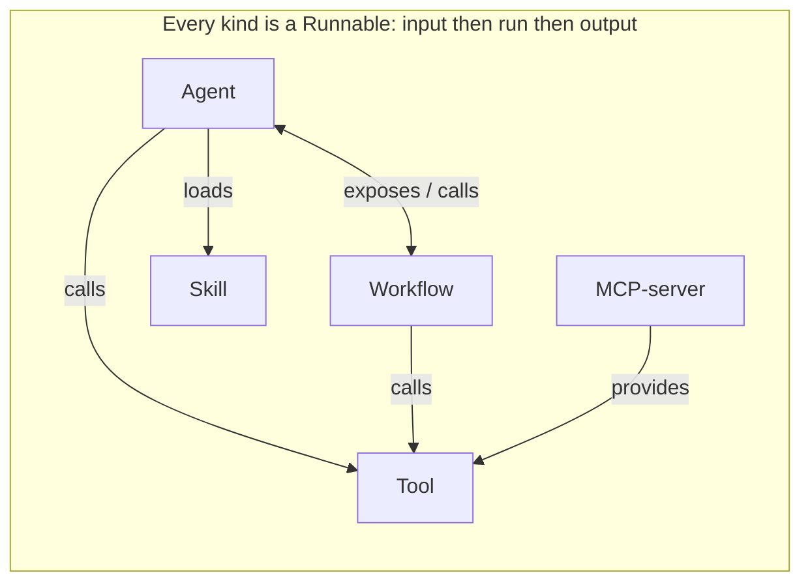

Most platforms give you a different shape for every concept: one for agents, another for tools, another for workflows. Ryu does not. It has a single contract called the **Runnable**, and everything you build implements it.

A Runnable is simple: input, then run, then output. That is the whole shape.

## Five kinds, one shape

The Runnable contract unifies five kinds you will use directly:

- **Agent** - a model with a persona, tools, and memory.
- **Workflow** - a graph of steps run in order.
- **Tool** - a single typed function the model can call.
- **Skill** - a packaged instruction set the agent can load.
- **MCP-server** - a server exposing tools over the Model Context Protocol.

Internally there are a few more kinds (Companion, Channel, Engine, and Policy), but the five above are what you author as a developer.

## Peers, not a hierarchy

The kinds are peers. None sits above another, so they compose in both directions:

- An **agent** can invoke a **workflow** by exposing it as a named tool.
- A **workflow** can orchestrate **agents** by calling them as steps.



```ts
// A workflow step that calls an agent, and an agent tool that calls a workflow.
// Both are just Runnables invoking other Runnables.
const research = defineWorkflow({
  id: "workflow-research",
  name: "Research",
  steps: [spiderTool, writerAgent],
  async run({ topic }, ctx) {
    const gathered = await spiderTool.run({ url: topic }, ctx);
    return await writerAgent.run({ query: gathered }, ctx);
  },
});
```

<Callout type="info">
  Learn the contract once and the whole platform opens up. If you can build a tool, you already know how a workflow, skill, or agent is shaped.
</Callout>

## Why this matters

Because the shape is identical, the same plumbing applies everywhere: the Gateway can govern every call, the registry can list every kind, and you can swap one Runnable for another without rewriting the caller. There is nothing special-cased.

## Knowledge check

First, the reflection prompts. Answer them in your own words.

- What are the three parts of the Runnable shape?
- Which five kinds do you author directly as a developer?
- How can an agent and a workflow each call the other?

Then confirm the details with a quick self-test.

<Quiz
  questions={[
    {
      q: "What is the shape of a Runnable?",
      options: [
        "Input, then run, then output",
        "Request, response, and callback",
        "Setup, loop, and teardown",
      ],
      answer: 0,
      explain:
        "A Runnable is input, then run, then output. That is the whole shape.",
    },
    {
      q: "Which five kinds do you author directly as a developer?",
      options: [
        "Agent, Companion, Channel, Engine, and Policy",
        "Agent, Workflow, Tool, Skill, and MCP-server",
        "Agent, Tool, Session, App, and Gateway",
      ],
      answer: 1,
      explain:
        "Agent, Workflow, Tool, Skill, and MCP-server are the five you author. Companion, Channel, Engine, and Policy exist internally.",
    },
    {
      q: "How can an agent and a workflow each call the other?",
      options: [
        "An agent exposes a workflow as a named tool, and a workflow calls an agent as a step",
        "Only an agent can call a workflow, never the reverse",
        "They communicate through a shared database table",
      ],
      answer: 0,
      explain:
        "The kinds are peers. An agent invokes a workflow by exposing it as a named tool, and a workflow orchestrates agents by calling them as steps.",
    },
    {
      q: "Why does the identical shape matter across every kind?",
      options: [
        "It makes the code shorter to write",
        "The same plumbing applies everywhere, so the Gateway governs every call, the registry lists every kind, and Runnables swap without rewriting the caller",
        "It forces every kind to use the same model",
      ],
      answer: 1,
      explain:
        "Because the shape is identical, the same plumbing applies everywhere and there is nothing special-cased.",
    },
  ]}
/>

Next: scaffold a project and define your first Runnables in the [SDK quickstart](/docs/academy/builder/sdk-quickstart).
