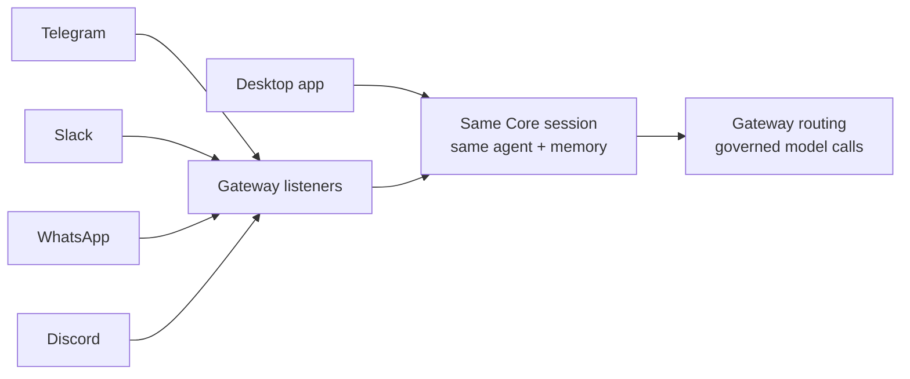

Channel bots put your agents into the chat platforms people already use: Telegram, Slack, WhatsApp, and Discord. The key idea is that a bot is not a separate, dumber agent. It is just another surface onto the same agent your desktop talks to.

## A bot is another surface

Inbound bot messages route through Core sessions, the same agent path, the same memory, and the same Gateway routing the desktop uses. So a question asked in a Telegram group gets the same agent, the same context, and the same governed model calls as a question asked in the desktop app.

- The agent path is shared, so behavior is consistent across surfaces.
- Memory is shared, so a bot conversation is not stranded.
- Gateway routing applies, so a bot's model calls are governed like any other.

## How you set them up

<TryInRyu page="channels" />

The desktop exposes Channels inside the Gateway settings dialog (Gateway -> Channels), where you do CRUD on bot configs. It talks to the control-plane server using your signed-in account, not a Core node directly. The Gateway runs the actual platform listeners, so once a config exists the Gateway is what connects to Telegram, Slack, and the rest.

<Callout type="info">
  Think of it as two roles: the Channels section in the Gateway dialog is where you describe a bot, and the Gateway is what actually listens and responds on the platform.
</Callout>

## A known gap to be honest about

There is one rough edge in multi-tenant setups. Desktop-created channel configs default to no organization, while the Gateway filters enabled channels by organization. So a config you create from the desktop may not be picked up when an organization scope is expected. This is a known server-side gap, not a setting you can fix from the bot itself.

<Callout type="warn">
  If a desktop-created bot is not picking up messages in a team or multi-tenant setup, the missing organization on the config is the likely cause.
</Callout>

## Knowledge check

First, the reflection prompts. Answer them in your own words.

- What does it mean that a bot is "another surface onto the same agent"?
- Which component runs the actual platform listeners?
- Why might a desktop-created channel config fail to be picked up in a multi-tenant setup?

Then confirm the details with a quick self-test.

<Quiz
  questions={[
    {
      q: "What does it mean that a channel bot is 'another surface onto the same agent'?",
      options: [
        "Each platform gets its own separate, simpler agent",
        "Inbound bot messages route through Core sessions using the same agent path, memory, and Gateway routing as the desktop",
        "Bots run a stripped-down model to save cost",
      ],
      answer: 1,
      explain:
        "A bot is not a separate, dumber agent. It is just another surface onto the same agent your desktop talks to, sharing the agent path, memory, and Gateway routing.",
    },
    {
      q: "Which component runs the actual platform listeners that connect to Telegram, Slack, and the rest?",
      options: [
        "The desktop Channels section in the Gateway dialog",
        "The Gateway",
        "Each platform's own webhook",
      ],
      answer: 1,
      explain:
        "The Channels section in the Gateway dialog describes a bot, but the Gateway is what actually listens and responds on the platform.",
    },
    {
      q: "What does the desktop Channels section in the Gateway dialog talk to when doing CRUD on bot configs?",
      options: [
        "A Core node directly",
        "The control-plane server, using your signed-in account",
        "The platform APIs directly",
      ],
      answer: 1,
      explain:
        "The Channels section in the Gateway dialog talks to the control-plane server using your signed-in account, not a Core node directly.",
    },
    {
      q: "Why might a desktop-created channel config fail to be picked up in a multi-tenant setup?",
      options: [
        "The bot token expired",
        "Desktop-created configs default to no organization, while the Gateway filters enabled channels by organization",
        "The Gateway only supports one platform at a time",
      ],
      answer: 1,
      explain:
        "Desktop-created channel configs default to no organization, so a missing organization on the config is the likely cause when an organization scope is expected.",
    },
  ]}
/>

Next: spread work across machines in [multiple nodes](/docs/academy/cloud/multi-node).
