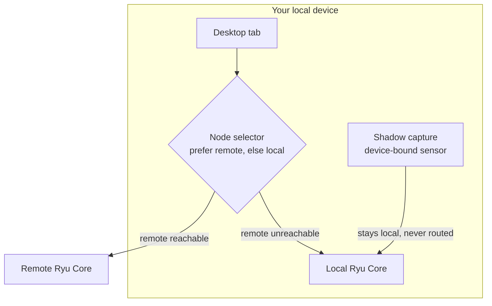

Ryu does not assume one machine. A node is any Ryu Core you can reach: your local machine, or a remote server. Teams run several, and Ryu is built to spread work across them while keeping device-bound sensors firmly local.

## The node selector

<TryInRyu page="fleet" />

The desktop has a node selector, and each tab can target a different node. A client can prefer a reachable remote node and otherwise fall back to local compute, so you get remote power when it is available without losing the ability to work offline.

- Each tab picks its own node, so one window can mix local and remote work.
- Prefer-remote-else-local keeps things working when the remote is unreachable.
- The selector shows per-node system info: CPU, RAM, disk, and GPU, so you can pick the right machine for a job.

## Mesh and webhook ingress

For nodes that are not on the same network, Ryu has a mesh capability built on Tailscale or Headscale. It is opt-in via an environment flag and uses userspace networking. There is also public webhook ingress for receiving external triggers.

Both are fail-closed for safety. For example, Core refuses to start tokenless under mesh, so you cannot accidentally expose an unauthenticated node.

<Callout type="warn">
  Mesh and webhook ingress are opt-in and fail-closed by design. If Core will not start under mesh, check that a token is set; tokenless mesh start is refused on purpose.
</Callout>

## Sync and the sensor rule

Cross-device sync keeps conversations consistent across the nodes you use, so moving between machines does not strand your history.

One rule is firm: compute is swappable, sensors are not. Device-bound sensors, like the Shadow screen capture, always stay local and are never routed to a remote node. You can move the thinking to another machine, but what a machine sees and hears stays on that machine.

<Callout type="info">
  The split is simple to remember. Compute (the model calls and orchestration) can move to any node. Sensors (screen, input capture) stay on the device that has them.
</Callout>

## Knowledge check

First, the reflection prompts. Answer them in your own words.

- What happens when a client's preferred remote node is unreachable?
- Why does Core refuse to start tokenless under mesh?
- Which kinds of capability stay local and are never routed to a remote node?

Then confirm the details with a quick self-test.

<Quiz
  questions={[
    {
      q: "What is a node in Ryu?",
      options: [
        "Any Ryu Core you can reach, whether your local machine or a remote server",
        "A single dedicated cloud server that all clients must share",
        "A model running inside the Gateway",
      ],
      answer: 0,
      explain:
        "A node is any Ryu Core you can reach: your local machine, or a remote server. Teams run several.",
    },
    {
      q: "What happens when a client's preferred remote node is unreachable?",
      options: [
        "The client stops working until the remote returns",
        "It falls back to local compute, so you can keep working offline",
        "It automatically provisions a new remote node",
      ],
      answer: 1,
      explain:
        "Prefer-remote-else-local keeps things working when the remote is unreachable, falling back to local compute.",
    },
    {
      q: "Why does Core refuse to start tokenless under mesh?",
      options: [
        "Mesh requires a paid subscription",
        "It is fail-closed for safety, so you cannot accidentally expose an unauthenticated node",
        "Tailscale does not support anonymous nodes",
      ],
      answer: 1,
      explain:
        "Mesh and webhook ingress are opt-in and fail-closed by design, so tokenless mesh start is refused on purpose.",
    },
    {
      q: "Which kind of capability stays local and is never routed to a remote node?",
      options: [
        "Model calls and orchestration",
        "Cross-device conversation sync",
        "Device-bound sensors, like the Shadow screen capture",
      ],
      answer: 2,
      explain:
        "Compute is swappable and can move to any node, but device-bound sensors like Shadow screen capture always stay on the device that has them.",
    },
  ]}
/>

Next: finish the track and earn your credential with the [certifications guide](/docs/academy/certifications).
