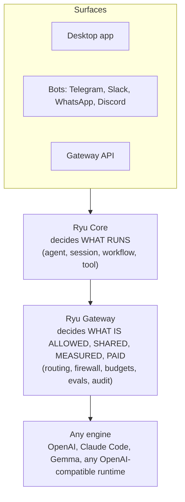

**Agents are powerful. Using them shouldn't be.** That sentence is the whole product.

The engines that run agents already exist, including OpenAI, Claude Code, Gemma, and any
OpenAI-compatible runtime. Ryu is not another engine. Ryu is **the whole car built around them**:
the orchestration and control layer that decides what an agent can reach, what tools it can use,
what data is safe to send, what it costs, and how good its outputs are.

## Why a control layer?

A raw engine is an engine block on a stand. It runs, but you cannot drive it anywhere. To get real
work done you need the rest of the car around it. In Ryu that car has three big pieces.

- **Core** decides **what runs**, including which agent, session, workflow, and tool.
- **Gateway** decides **what is allowed, shared, measured, and paid for**, including routing,
  firewall, budgets, evals, and audit.
- **Any engine** does the actual generation, and you are never locked to one.

Every model call travels down the same path: a surface hands the request to Core, Core decides what
runs and hands the call to the Gateway, and the Gateway governs it before it reaches an engine.

You will meet Core and the Gateway properly in later courses. For now, hold one idea - Ryu sits
**above** every model and every harness, so you are locked to none of them.

## Three products, one core

Ryu shows up in three shapes depending on who you are.

- **Ryu App** - For individuals and small teams. Download, pick an agent, go.
- **Ryu Gateway** - For developer and platform teams. One config change puts a firewall in front of
  any agent you already run.
- **Ryu Cloud** - For businesses. Ryu audits, builds, deploys, and hosts agents, and ships bots into
  Telegram, Slack, WhatsApp, and Discord.

This course is about the **App**, because it is the fastest way to feel what Ryu does.

## Nothing hardcoded

The single rule that runs through everything is this - **nothing is hardcoded, everything is
swappable**. The chat model, the embedding model, the voice and image models, the agent engine, the
retrieval strategy, the sandbox - each one is a sensible default you can replace, never a lock. Ryu
gives you batteries included so it works on install, and an exit ramp from every default so you are
never stuck.

<Callout type="info">
  This is the moat in one sentence. Other tools own a model and a harness. Ryu sits above all of
  them and locks you to none.
</Callout>

## Knowledge check

First, the reflection prompts. Say the answers out loud or jot them down, in your own words.

- In one sentence, what does Ryu add on top of a raw engine?
- Which of the three products are you about to use in this course?
- What does "nothing hardcoded" mean for the model an agent uses?

Then confirm the details with a quick self-test.

<Quiz
  questions={[
    {
      q: "What is Ryu in relation to the engines that run agents?",
      options: [
        "Another engine that competes with OpenAI and Claude Code",
        "The orchestration and control layer built around any engine",
        "A faster local model you swap your engine for",
      ],
      answer: 1,
      explain:
        "Ryu is not an engine. It is the whole car built around them, the control layer that decides what an agent can reach, use, send, and cost.",
    },
    {
      q: "In Ryu, what does the Gateway decide?",
      options: [
        "Which agent, session, workflow, and tool runs",
        "What is allowed, shared, measured, and paid for",
        "How the engine generates each token",
      ],
      answer: 1,
      explain:
        "Core decides what runs; the Gateway decides what is allowed, shared, measured, and paid for, including routing, firewall, budgets, evals, and audit.",
    },
    {
      q: "Which of the three products is this course about?",
      options: [
        "Ryu App",
        "Ryu Gateway",
        "Ryu Cloud",
      ],
      answer: 0,
      explain:
        "This course is about the App, because it is the fastest way to feel what Ryu does.",
    },
    {
      q: "What does \"nothing hardcoded\" mean for the model an agent uses?",
      options: [
        "The default model can never be changed once installed",
        "Every default, including the chat model, is swappable and never a lock",
        "Ryu picks the model for you based on the cloud",
      ],
      answer: 1,
      explain:
        "Nothing is hardcoded and everything is swappable. Each default is a sensible choice you can replace, never a lock.",
    },
  ]}
/>

Ready to install? Continue to [Install and first run](/docs/academy/essentials/install-and-setup).
