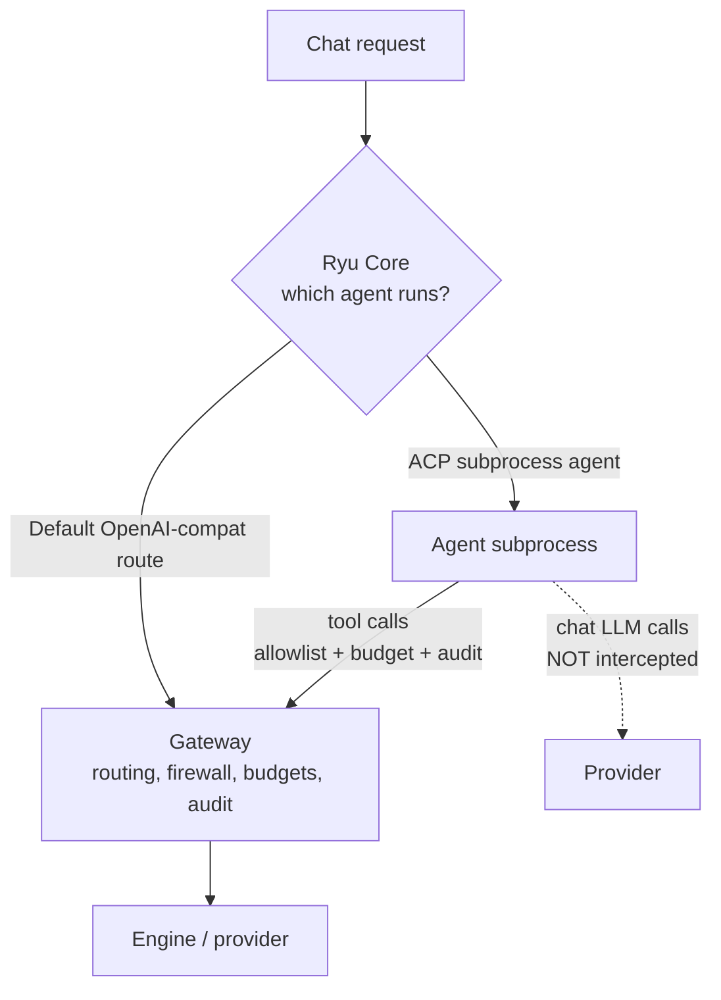

Everything in Ryu sorts into one of two layers, and getting this distinction right is the whole game.

- **Core decides what runs**: which agent, which session, which workflow, which tool.
- **Gateway decides what is allowed, shared, measured, and paid for**: security, routing, the registry, budgets, evals, organization policy, and audit.

The rule that follows from this is strict: Core must never enforce policy inline. Instead, Core routes every model call through the Gateway. That keeps the policy in one place, owned by the person responsible for it, rather than scattered through the code that runs agents.

## Why the split matters

The Gateway is the shared part. A team adopts it because it gives them one control point over many agents. An enterprise buys it because it is where governance, spend, and audit actually live. If policy leaked into Core, every agent would re-implement it differently and there would be no single source of truth.

## What the Gateway actually is

The Gateway is an OpenAI-compatible LLM gateway. It exposes a `/v1/chat/completions` endpoint and adds the control surfaces on top:

- Routing and fallback between providers and models.
- Rate limiting and a circuit breaker.
- Exact and semantic caching.
- A firewall and data-protection guardrails.
- Evals and audit.

It is already on the default chat path, so the default route is governed without any extra wiring. Open the **Gateway** dialog in the desktop from the command palette (Ctrl+K or Cmd+K) to reach these surfaces.

<Callout type="info">
  Because the Gateway speaks the OpenAI format, anything that can talk to OpenAI can talk to the Gateway by swapping its base URL. That is the foundation for BYOA, covered later in this course.
</Callout>

## An honest limit

Some agents run as their own subprocess (ACP agents such as Claude Code). They make their own provider calls internally, so their chat LLM calls cannot be intercepted by the Gateway. Be clear-eyed about that. Their tool calls, however, are governed: tool execution is allowlist-gated and emits budget and audit records on both planes. So even for a subprocess agent, what tools it can reach and what it spends running them is still under your control.

## Knowledge check

First, the reflection prompts. Answer them in your own words.

- If code decides which workflow to run, is that Core or Gateway?
- What is the rule about Core enforcing policy, and why does it exist?
- For an ACP subprocess agent, which calls does the Gateway govern and which can it not intercept?

Then confirm the details with a quick self-test.

<Quiz
  questions={[
    {
      q: "Code that decides which agent, session, or workflow runs belongs to which layer?",
      options: ["Core", "Gateway", "Neither, it is shared equally"],
      answer: 0,
      explain:
        "Core decides what runs: which agent, which session, which workflow, which tool.",
    },
    {
      q: "What is the strict rule about Core and policy?",
      options: [
        "Core enforces policy inline so it is fast",
        "Core must never enforce policy inline; it routes every model call through the Gateway",
        "Core and the Gateway both enforce policy redundantly",
      ],
      answer: 1,
      explain:
        "Core never enforces policy inline. It routes every model call through the Gateway so policy lives in one place.",
    },
    {
      q: "For an ACP subprocess agent such as Claude Code, what can the Gateway NOT intercept?",
      options: [
        "Its tool calls",
        "Its chat LLM calls, which it makes internally",
        "Nothing, the Gateway intercepts everything",
      ],
      answer: 1,
      explain:
        "An ACP subprocess makes its own provider calls internally, so its chat LLM calls cannot be intercepted, though its tool calls are still governed.",
    },
    {
      q: "Why is the Gateway the part a team adopts and an enterprise buys?",
      options: [
        "It is faster than Core",
        "It is the shared control point where governance, spend, and audit live",
        "It runs the agents directly",
      ],
      answer: 1,
      explain:
        "The Gateway is the shared part: one control point over many agents, and where governance, spend, and audit actually live.",
    },
  ]}
/>

Next: learn how the Gateway picks a model for each request in [Routing](/docs/academy/governing/routing).
