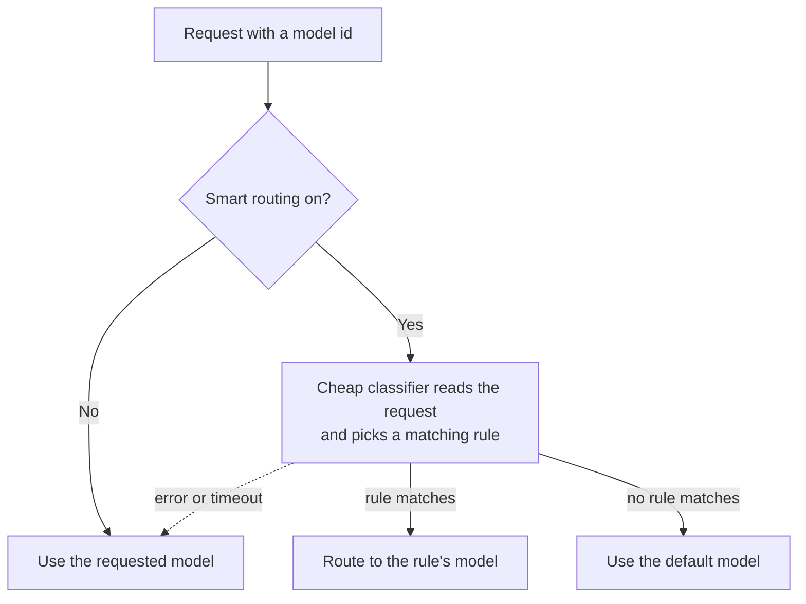

Model routing decides which provider and model serves each request. The ordinary router does the basic job: it resolves a model id to a provider. On top of that sits a more powerful surface called smart routing.

## Smart routing

Smart routing is a classifier-driven router. Instead of pinning every request to one model, you write plain-language rules and a cheap classifier picks the right model per request. For example:

- "Coding questions go to Claude."
- "Casual chat goes to a local model."

You configure it under **Gateway, Routing, Smart routing**. It is off by default. To use it you set:

- A cheap **classifier model** that reads the request and chooses a rule.
- An ordered list of **rules**, each a description plus a target model.
- An optional **default** model for when no rule matches.

## It fails open

Smart routing never blocks a request. If the classifier errors or times out, the originally requested model is used. This is deliberate - routing should improve outcomes, never become a single point of failure.

<Callout type="info">
  The routed model is surfaced on a response header, so you can always see which model actually served a request.
</Callout>

## Nothing is hardcoded

Targets are any routable model id, including local models and openrouter slugs. There is no provider lock in the routing layer.

<Callout type="warn">
  There is no Google provider in the Gateway, so route Gemini through an openrouter slug rather than naming Google directly.
</Callout>

## When changes take effect

Routing changes (like all Gateway routing config) take effect on the next gateway restart, not instantly. Plan a restart when you change rules.

## Knowledge check

First, the reflection prompts. Answer them in your own words.

- What does smart routing use to choose a model for each request?
- What happens to a request if the classifier times out?
- How would you route a Gemini request given there is no Google provider?

Then confirm the details with a quick self-test.

<Quiz
  questions={[
    {
      q: "How does smart routing pick a model for each request?",
      options: [
        "It always uses the cheapest available model",
        "A cheap classifier reads the request and chooses a matching rule",
        "It rotates evenly across all configured providers",
      ],
      answer: 1,
      explain:
        "Smart routing is classifier-driven: a cheap classifier reads the request and picks the rule whose target model should serve it.",
    },
    {
      q: "If the classifier errors or times out, what happens to the request?",
      options: [
        "The request is blocked and an error is returned",
        "The originally requested model is used",
        "The default model is always used instead",
      ],
      answer: 1,
      explain:
        "Smart routing fails open: on a classifier error or timeout, the originally requested model serves the request.",
    },
    {
      q: "Given there is no Google provider in the Gateway, how do you route a Gemini request?",
      options: [
        "Name Google directly as the provider",
        "Route it through an openrouter slug",
        "Gemini cannot be routed at all",
      ],
      answer: 1,
      explain:
        "There is no Google provider, so you route Gemini through an openrouter slug rather than naming Google directly.",
    },
    {
      q: "When do routing config changes take effect?",
      options: [
        "Instantly, as soon as you save",
        "On the next gateway restart",
        "Only after the classifier is retrained",
      ],
      answer: 1,
      explain:
        "Like all Gateway routing config, routing changes take effect on the next gateway restart, so plan a restart when you change rules.",
    },
  ]}
/>

Next: protect requests and egress with the [Guardrails](/docs/academy/governing/guardrails) surfaces.
