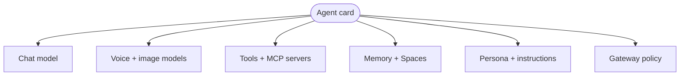

The most useful mental model for a Ryu agent is a trading card. Each card has a set of slots, and every slot is filled independently. No two cards have to be alike.

An agent's slots are:

- A chat model.
- Optional voice and image models.
- The tools and MCP servers it may call.
- Its memory and Spaces.
- Its persona and instructions.
- A slice of Gateway policy.

Because the slots are independent, you can give one agent a small local model with no tools for quick drafting, and another a large model wired to a research toolset and a private Space. Same app, different cards.

## The Agents page

<TryInRyu page="agents" />

Open the **Agents** page from the sidebar (or jump there from the command palette with Ctrl+K). From here you can:

- Browse the installed set of agents.
- Create a new agent on a single page, filling its slots as you go.
- Edit an existing agent's slots.

Each agent supports per-agent instructions, a list of rules you add and remove, and schedule presets for recurring runs.

## The agents catalog

Only the default **Ryu** agent is installed out of the box. Everything else is opt-in through the agents catalog.

During onboarding, Ryu detects which agent CLIs you already have on your PATH and offers to add the matching agents. Supported ones include Claude Code, Codex, Gemini CLI, bare Pi, OpenClaw, Hermes, and more. You stay in control of what gets added.

<Callout type="info">
  The catalog only lists agents whose runtime it can reach. If an agent you expect is missing, it usually means its CLI is not yet on your PATH.
</Callout>

## The locked Ryu agent

The default **Ryu** agent is a locked built-in, so you cannot rewire all of its slots freely. You can still change the part that matters most - its model and provider - through a dedicated config panel (the Ryu Pi config) that appears only when you edit the Ryu agent. Other agents are edited through the normal agent editor.

## Talking to several at once

Council, or team, chat lets you bring more than one agent into a single conversation. Use an @mention to address a specific agent, and you can pull several cards into the same thread to compare answers or split a task.

<Callout type="warn">
  Adding an agent from the catalog only makes it available. Its slots still start from defaults, so review its model, tools, and memory before relying on it.
</Callout>

## Knowledge check

First, the reflection prompts. Answer them in your own words.

- Name three of the independent slots that make up an agent card.
- Which single agent is installed by default, and how do you add others?
- Why does the Ryu agent have its own config panel instead of the normal editor?

Then confirm the details with a quick self-test.

<Quiz
  questions={[
    {
      q: "What is the mental model for a Ryu agent in this lesson?",
      options: [
        "A trading card with independently filled slots",
        "A single fixed model you cannot change",
        "A folder of conversation history",
      ],
      answer: 0,
      explain:
        "Each agent is a card whose slots (model, voice, tools, memory, persona, policy) are filled independently, so no two cards have to be alike.",
    },
    {
      q: "Which agent is installed out of the box?",
      options: [
        "Claude Code",
        "Only the default Ryu agent",
        "Every detected CLI agent",
      ],
      answer: 1,
      explain:
        "Only the default Ryu agent is installed by default. Everything else is opt-in through the agents catalog.",
    },
    {
      q: "Why does the Ryu agent use its own config panel?",
      options: [
        "It has no model slot to edit",
        "It is a locked built-in, so its model and provider are changed through the dedicated Ryu Pi config",
        "All agents share that same panel",
      ],
      answer: 1,
      explain:
        "The default Ryu agent is a locked built-in, so you change its model and provider through a dedicated config panel rather than the normal editor.",
    },
    {
      q: "What does adding an agent from the catalog do to its slots?",
      options: [
        "Copies the Ryu agent's slots",
        "Leaves the slots starting from defaults, so you review them before relying on it",
        "Auto-configures the best model and tools",
      ],
      answer: 1,
      explain:
        "Adding a catalog agent only makes it available. Its slots still start from defaults, so review its model, tools, and memory first.",
    },
  ]}
/>

Next: pick what fills the most important slot in [Models and engines](/docs/academy/operator/models-and-engines).
