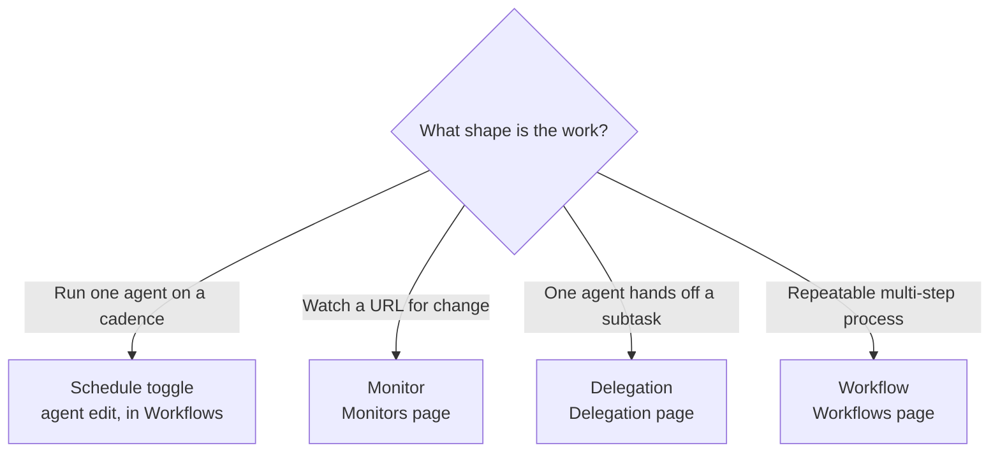

So far every action has been something you triggered by hand. This lesson is about getting Ryu to act without you in the loop. There are four tools for it, each suited to a different shape of work.

## Scheduled runs

<TryInRyu page="automations">Open Workflows in Ryu</TryInRyu>

Ryu can run an agent on a recurring schedule. You set this up per-agent: open the agent's edit page and turn on the **run on a schedule** toggle. Under the hood that mints a small backing **Workflow** (Input → Prompt(agent) → Output) that fires on its own cadence, no prompt needed each time. Automations merged into Workflows, so the scheduler lives there.

## Monitors

The **Monitors** page watches a URL on a schedule and alerts you when something changes. You can monitor for:

- Price changes.
- Content diffs.
- Stock availability.
- Keyword presence or absence.
- Uptime.

The key behavior is that a monitor alerts only on a transition into the alert state, so you are not spammed every interval. You hear about it when something actually changes, then again only when it changes back.

When an alert fires, it fans out across:

- Desktop toast.
- Native OS notification.
- Mobile push.
- A per-monitor webhook (Slack or Discord).
- Telegram.

<Callout type="info">
  Pick the smallest check that captures what you care about. A keyword check on a single phrase is cheaper and quieter than a full content diff of the whole page.
</Callout>

## Delegation

Sub-agent delegation, on the **Delegation** page, lets one agent hand work to another. This is how a coordinating agent can pass a focused subtask to a specialist card rather than doing everything itself.

## Workflows

Workflows, on the **Workflows** page, are multi-step DAGs (directed graphs of steps). A workflow can call tools and agents as steps, chaining them into a repeatable process.

Workflows also support human-in-the-loop resume. When a run reaches a point where it is awaiting input, it pauses and waits for you to provide what it needs, then continues.

<Callout type="warn">
  A workflow that is awaiting input is paused, not failed. Check the run and supply the requested input to let it continue.
</Callout>

## Choosing the right tool

- Recurring run of one agent - use the **run on a schedule** toggle on the agent's edit page (it lives in Workflows).
- Watch an external page for change - use a Monitor.
- One agent passing a subtask to another - use Delegation.
- A repeatable multi-step process across tools and agents - use a Workflow.

## Knowledge check

First, the reflection prompts. Answer them in your own words.

- Why does a monitor only alert on a transition rather than every interval?
- Name three places a monitor alert can be delivered.
- What does it mean for a workflow run to be "awaiting input"?

Then confirm the details with a quick self-test.

<Quiz
  questions={[
    {
      q: "Why does a monitor alert only on a transition into the alert state?",
      options: [
        "To save bandwidth on the URL fetch",
        "So you are not spammed every interval, only when something actually changes",
        "Because monitors run only once per day",
      ],
      answer: 1,
      explain:
        "A monitor alerts only on a transition into the alert state, so you hear about it when something changes, not every interval.",
    },
    {
      q: "Which of these can a monitor alert fan out to?",
      options: [
        "Only a desktop toast",
        "Desktop toast, native notification, mobile push, a webhook, and Telegram",
        "Email only",
      ],
      answer: 1,
      explain:
        "When an alert fires it fans out across desktop toast, native OS notification, mobile push, a per-monitor webhook, and Telegram.",
    },
    {
      q: "What does it mean for a workflow run to be awaiting input?",
      options: [
        "The run has failed and must be restarted",
        "The run is paused, waiting for you to provide what it needs before it continues",
        "The run is finished and saving output",
      ],
      answer: 1,
      explain:
        "An awaiting-input workflow run is paused, not failed. Supply the requested input and it continues.",
    },
    {
      q: "Which tool fits one agent passing a focused subtask to another?",
      options: [
        "A Monitor",
        "Delegation",
        "The scheduler",
      ],
      answer: 1,
      explain:
        "Sub-agent delegation lets one agent hand a focused subtask to a specialist card rather than doing everything itself.",
    },
  ]}
/>

Next: govern all of this - routing, guardrails, budgets, and audit - in the [Governing Ryu](/docs/academy/governing) track.
