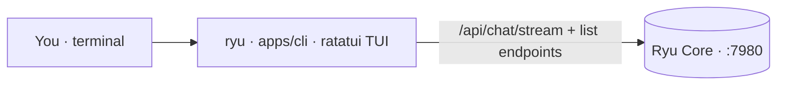

The CLI (`apps/cli`) is a Rust [ratatui](https://ratatui.rs) terminal UI that reaches the **same
Core** the desktop app uses (the local backend on `:7980`, addressed through the active node). It is
not a separate backend: a chat you start in the CLI is the same [conversation](/docs/core/conversations-sessions)
you open in the desktop app, because both persist under the same `conversation_id` on the same Core.

That framing is the whole design. Because the CLI talks to the same Core, parity is mostly a matter
of surfacing endpoints that already exist, not new backend work. The binary is `ryu` (the crate is
`ryu-cli`, built with `cargo build -p ryu-cli`).

<Callout type="info">
The CLI builds green (`cargo build -p ryu-cli`), but live round-trips need a running Core and a TTY.
Treat every behavior here as compile-verified and runtime-unverified until you exercise it against a
live Core.
</Callout>

## Chat

Chat routes through Core's `POST /api/chat/stream` with a conversation id minted per chat
(`apps/cli/src/chat.rs`, `apps/cli/src/main.rs`). Sending that id on every turn is what makes the
chat-side features work: Core persists the turns under it, so the goal, sessions, and review
endpoints all key off the same conversation. With no agent selected, Core picks its default agent
(the legacy bare-model path is not used by the TUI).

The typed slash commands (confirmed in the status bar, `apps/cli/src/ui.rs`) are:

| Command | What it does |
|---|---|
| `/goal` | Set or clear a persistent completion condition, then run a client-driven judge loop (capped, with a goal status bar). |
| `/check` | Arm the per-turn double-check review; the result lands in an overlay after the next turn. |
| `/model <id>` | Override the model for the turn (sent as `acp_model`); ignored when the bound agent does not advertise model selection. |
| `/team <id>` | Route the turn to an agent team instead of a single agent (sent as `team_id`). |
| `/sessions` | Open the run history for the current conversation in an overlay. |
| `/btw` | Ask a quick side question (`POST /api/btw`); ephemeral, it never enters the conversation history. |

The tool-call loop is surfaced inline: tool-input and tool-output frames render in the stream as the
agent works.

## The command palette is the IA

A 20-column sidebar cannot hold every surface, so a fuzzy **command palette** opens with `Ctrl+P`
(`apps/cli/src/ui.rs`). It is the terminal analog of the desktop Cmd+K: fuzzy-jump to any tab plus
chat and global actions (new chat, sessions, toggle double-check, switch node). Two more chords are
confirmed: `Ctrl+A` opens the agent picker and `Ctrl+N` opens the node picker.

## The seven list tabs

Seven data-driven list tabs read live from Core through one shared fetcher
(`api::fetch_feature_list` plus `render_feature_tab` over a single `SimpleListTab`). Each tab is a
thin view over one Core endpoint:

| Tab | Core endpoint |
|---|---|
| Models | `/api/models/catalog` |
| Skills | `/api/skills/catalog` |
| Tools | `/api/tools/search` |
| Monitors | `/api/monitors` |
| Teams | `/api/teams` |
| Meetings | `/api/meetings` |
| Recipes | `/api/recipes` |

Some tabs carry actions beyond browsing: Models can install (Enter) and set active (`a`), Skills can
install and activate, Monitors can run a check now, and Recipes can replay.

## GitOps config and node discovery

Beyond chat and the tabs, the CLI covers authentication (login, whoami, sessions, plan, account),
sidecar, engine, app, gateway, workflow, space, and schedule management, and the config-as-code
(GitOps) commands `apply`, `diff`, and `config` for validating and applying a scope's `gateway.yaml`.

It also discovers other Core nodes on the LAN automatically (`apps/cli/src/nodes.rs`): a bounded
sweep probes the Core port on local hosts, and the in-TUI node picker (`Ctrl+N`) plus the `node`
subcommands let you point any invocation at a specific node (locally or, over the mesh, through a
node's SOCKS5 proxy).

## Next

<Cards>
  <DocCard href="/docs/cli/getting-started" />
  <DocCard href="/docs/cli/parity" />
  <DocCard href="/docs/core/conversations-sessions" />
  <Card title="Desktop" description="The primary surface the CLI mirrors, also over the same Core" href="/docs/desktop" />
</Cards>
