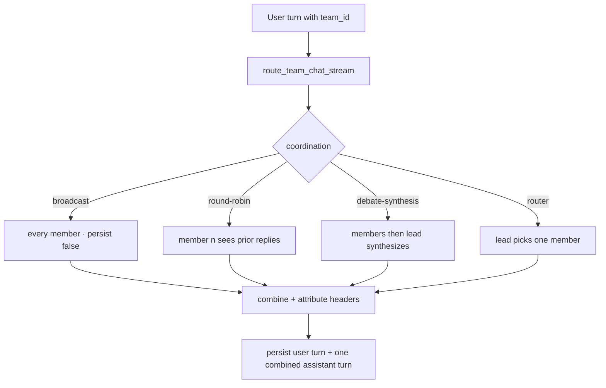

A team is a persisted, ordered collection of agent ids plus a coordination strategy. It is addressed as one unit (an `@team` mention in chat, or a `team_id` on a chat request), so a single user turn fans out to every member and their replies are merged into one attributed answer.

A team is not an agent. It is a thin record (`apps/core/src/teams/mod.rs`) over a list of agent ids; the orchestration that interprets the strategy lives in Core's chat path (`apps/core/src/sidecar/adapters/mod.rs`). Because Core is the layer that decides what runs, teams live in Core, not the Gateway.

For the desktop how-to (creating a team, dragging agents in, `@team` mentions), see [Teams (user guide)](/docs/using-ryu/user-guide/teams). This page is the reference for the store, the strategies, and the dispatch.

## TeamStore

`TeamStore` (`apps/core/src/teams/mod.rs`) is a SQLite-backed store at `~/.ryu/teams.db`. It owns only persistence and typed records, mirroring the agent store. A `TeamRecord` has these fields.

| Field | Type | Notes |
|---|---|---|
| `id` | `string` | Server-assigned, `team_<uuid>`. |
| `name` | `string` | Display name. |
| `description` | `string?` | Optional. |
| `members` | `string[]` | Ordered agent ids. Order is meaningful for `round-robin` (turn order) and is the default lead source for `debate-synthesis`. |
| `coordination` | enum | One of `broadcast`, `round-robin`, `debate-synthesis`, `router`. Stored kebab-case; an unknown or legacy value parses back to `broadcast` so a bad row never breaks listing. |
| `lead_agent_id` | `string?` | The synthesizer for `debate-synthesis` and the classifier for `router`. Falls back to the first member when unset. |
| `created_at` / `updated_at` | `string?` | RFC 3339. |

## Routes

Teams expose plain CRUD plus two member endpoints for incremental add/remove (the desktop uses these for drag-and-drop).

```
GET    /api/teams
POST   /api/teams
GET    /api/teams/:id
PUT    /api/teams/:id
DELETE /api/teams/:id
POST   /api/teams/:id/members
DELETE /api/teams/:id/members/:agent_id
```

`PUT /api/teams/:id` is a partial patch: absent fields are left unchanged. `lead_agent_id` is tri-state - send a value to set it, `null` to clear it, omit it to leave it unchanged. `members` on the patch replaces the full ordered list; use the member endpoints when you only want to add or remove one agent.

## Coordination strategies

The strategy is a per-team, swappable enum. A team can be re-configured at any time with no code change. All four are dispatched by `route_team_chat_stream` (streaming, the chat path) and its non-streaming sibling `run_team_reply_text` (channels), which share the same `run_member_text` primitive.

| Strategy | Stored value | What happens |
|---|---|---|
| Broadcast | `broadcast` | Every member answers the same prompt independently. No member sees another's reply. The default. |
| Round-robin | `round-robin` | Members answer in member order. Each member after the first sees the prior members' replies, folded into its prompt. |
| Debate synthesis | `debate-synthesis` | Every member answers independently (round one), then the lead agent reads all replies and produces one merged answer. |
| Router | `router` | The lead classifies the user message, picks the single best-suited member by id, and only that member answers. |

The cross-member context (the round-robin transcript, the debate brief, the router instruction) is injected by `messages_with_preamble`, which prepends the context to the last user message. ACP agents only forward the last user message, so folding context into that message reaches every engine, ACP and OpenAI-compat alike, without threading history.

For `router`, the lead is invoked with no `conversation_id` (the routing decision is a side query) and is asked to reply with only the chosen member's id. If the reply does not match any member, dispatch falls back to the first member rather than failing.

## Dispatch and persistence

When a chat request carries a non-empty `team_id`, the handler routes to `route_team_chat_stream` instead of the single-agent path.

Each member's reply is produced by `run_member_text`, which builds a minimal `ChatStreamRequest` and runs it through the full `route_chat_stream` path with `persist: false`, so members never write to history themselves. The orchestrator then persists exactly two turns: the user message once (attributed to the user), and one combined assistant turn attributed to the team id. A later reload of the conversation renders the same merged content that streamed.



In the merged output, each member block is prefixed with a bold `**Name**` markdown header (and a qualifier such as `(synthesis)`, `(routed)`, for those strategies). An empty member reply renders as `_(no response)_` and an errored member as `_(error: ...)_`, so one member failing never aborts the whole team turn.

Team members run with auto-recall off: one user message fanned out to N members would otherwise trigger N redundant retrievals on the same query. See [Search and recall](/docs/using-ryu/user-guide/search-and-recall) for where recall is wired (the single-agent chat handler).

<Callout type="info">
A team turn invokes each member through the standard chat path, so a member's own engine, tools, skills, and Gateway routing all apply. Full member replies require a running engine or Gateway; CRUD and dispatch are verified headlessly, but the model output of a member is the normal ACP / OpenAI-compat path.
</Callout>

## Related

<Cards>
  <DocCard href="/docs/using-ryu/user-guide/teams" />
  <DocCard href="/docs/core/conversations-sessions" />
  <DocCard href="/docs/core/delegation" />
  <DocCard href="/docs/gateway/channels" />
</Cards>
