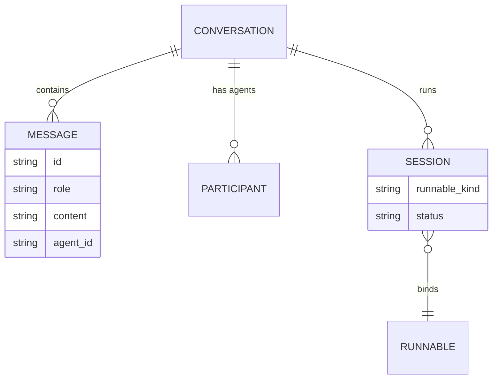

A conversation is Core's unit of chat history: an ordered list of messages plus the metadata that
drives the desktop sidebar, the runs list, and multi-agent attribution. Everything here is owned by
`ConversationStore` (`apps/core/src/server/conversations.rs`), backed by SQLite at
`~/.ryu/conversations.db`. Message bodies and titles are sealed at rest; the search index is a
separate database that never stores message text.

This page is the reference for the conversation data model, sessions, runs, participants, and the
`pinned` / `archived` / `fork` operations. The coordinator that drives those operations from one
agent over many worker conversations lives on its own page.

<Callout type="info">
A conversation is the same primitive a coordinator calls a "thread". The
[coordinator threads](/docs/core/coordinator-threads) page documents the agent-facing tool surface
(`create_thread`, `fork_thread`, `set_thread_pinned`, `set_thread_archived`) that wraps the store
methods described below.
</Callout>

## Data model



### ConversationSummary

The list shape returned by `GET /api/conversations` (`ConversationSummary`,
`apps/core/src/server/conversations.rs`).

| Field | Type | Meaning |
|---|---|---|
| `id` | string | Conversation id (UUID) |
| `title` | string? | Display title; sealed at rest, decrypted for the summary |
| `agent_id` | string? | The owning agent |
| `created_at`, `updated_at` | i64 | Unix milliseconds |
| `message_count` | i64 | Number of stored messages |
| `folder_path` | string? | Active working folder for the run (git-native parity) |
| `branch` | string? | Git branch active at run start |
| `worktree_path` | string? | Per-run worktree path, when a dedicated worktree was created |
| `run_status` | string? | `running`, `completed`, `failed`, or absent |
| `participants` | string[] | Every agent id that has taken a turn (multi-agent) |
| `pinned` | bool | Pinned to stay surfaced; defaults `false` |
| `archived` | bool | Hidden as a finished worker; defaults `false` |

`participants`, `pinned`, and `archived` are `#[serde(default)]`, so older clients and older stored
rows deserialize unchanged. The git fields (`folder_path`, `branch`, `worktree_path`) are documented
on [Git workspace](/docs/desktop/user-guide/git-workspace).

### StoredMessage

Each message has an `id`, a `role` (`user` / `assistant`), the `content`, an optional `agent_id`
(absent for user messages, set to the responding agent otherwise), and a `created_at` in Unix
milliseconds. `ConversationStore::append_message` writes one message and, when the
`llamacpp-embed` sidecar is reachable, indexes its plaintext for semantic search on a spawned task
before the body is sealed. The index write is best-effort and fail-open: a down embedder never
blocks or slows the chat write. See [Search and recall](/docs/desktop/user-guide/search-and-recall)
for the index itself.

## Conversations

| Route | Purpose |
|---|---|
| `GET /api/conversations` | List `ConversationSummary` rows |
| `GET /api/conversations/:id` | Full `ConversationDetail` with all messages and participants |
| `DELETE /api/conversations/:id` | Remove a conversation and its messages |
| `POST /api/conversations/:id/fork` | Branch a conversation (see [Fork](#fork)) |

`GET /api/conversations/:id` returns a `ConversationDetail` (id, title, agent_id, timestamps, the
ordered `messages`, and `participants`).

## Multi-agent participants

A conversation can have more than one agent. This is what powers council chat, where several agents
share one thread, and it is why `agent_id` is carried per message rather than per conversation.

| Route | Purpose |
|---|---|
| `GET /api/conversations/:id/participants` | List the agent ids in the thread |
| `POST /api/conversations/:id/participants` | Add an agent |
| `DELETE /api/conversations/:id/participants/:agent_id` | Remove an agent |

On the chat path, routing a turn to a specific agent adds it to the participant set if it is not
already present, so `participants` accumulates every agent that has actually answered.

## Sessions

A session binds a conversation to a Runnable and tracks the status of a single run. Sessions are how
Core models background and parallel work without forking history: message CRUD stays on the
conversation, and the session adds run-ownership on top.

A `Session` has an `id`, a `conversation_id`, a `runnable_id`, a `runnable_kind`, and a `status`.
`SessionStatus` is one of:

| Value | Meaning |
|---|---|
| `idle` | Created, no run started yet (the default) |
| `running` | A run is in progress |
| `completed` | The most recent run finished successfully |
| `failed` | The most recent run ended with an error |

| Route | Purpose |
|---|---|
| `POST /api/sessions` | Create a session bound to a runnable |
| `GET /api/sessions/:id` | Fetch one session |
| `POST /api/sessions/:id/status` | Update the run status |
| `GET /api/conversations/:id/sessions` | List every session (run) for a conversation |

## Runs

A run is a conversation with `run_status` set. The runs surfaces give a cross-conversation view of
background work that the per-conversation session list does not.

| Route | Purpose |
|---|---|
| `GET /api/runs` | List conversations that have a `run_status`, newest first |
| `GET /api/runs/:id/trace` | Ordered span list for a run |

The trace is documented on [Observability](/docs/core/observability).

## Fork

Forking copies history up to a chosen message into a new, independent conversation. Conversations
stay linear: there is no message tree, and the fork carries over the source's metadata (title, agent,
folder, branch, worktree, participants), titling the copy with a `(branch)` suffix.

```
POST /api/conversations/:id/fork
```

The body's optional `up_to_message_id` is the cut point. With it, the fork includes messages through
that id; without it, the whole conversation is copied. A cut-point id that is not in the source
returns no fork. On the desktop, each message's hover toolbar has a branch button that forks at that
message and opens the copy in a new tab.

## Pinned and archived

`pinned` keeps a conversation surfaced; `archived` hides a finished one. These are store operations
(`set_pinned`, `set_archived`, `set_title` on `ConversationStore`) rather than dedicated HTTP routes.
They are driven by a coordinator agent through the `threads` tool server: `set_thread_pinned`,
`set_thread_archived`, and `set_thread_title`. Both flags ride `ConversationSummary` as additive,
serde-default JSON.

<Callout type="warn">
The coordinator surface is agent-facing today: there is no desktop pinned/archived view yet. Because
`pinned` and `archived` already ship on `ConversationSummary`, a desktop view is a cheap follow-on.
See [coordinator threads](/docs/core/coordinator-threads) for how an agent spawns, pins, and archives
worker conversations.
</Callout>

## Related

<Cards>
  <DocCard href="/docs/core/coordinator-threads" />
  <DocCard href="/docs/desktop/user-guide/search-and-recall" />
  <DocCard href="/docs/core/observability" />
  <DocCard href="/docs/desktop/user-guide/git-workspace" />
</Cards>
