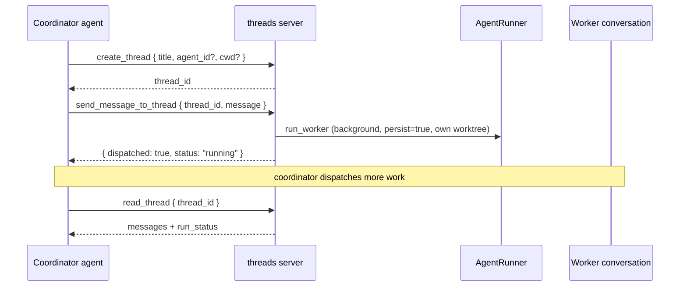

A single coordinator agent can spin up and manage worker threads: create a thread, list and read
threads, send a message that runs a worker's agent (optionally in the background, in its own git
worktree), and pin, archive, or title threads. This is Codex-style cross-thread orchestration.

In Ryu a Codex "thread" is a [conversation](/docs/core/conversations-sessions), so workers are
durable, searchable, and resumable exactly like any chat. The capability ships as the built-in
`threads` registry server (`apps/core/src/sidecar/mcp/threads.rs`), a reserved server like
`search_conversations` and `spider`, so the `<server>__<tool>` id scheme, per-agent allowlist,
catalog search, and the single `call_tool` entry all work for free. It is allowlist-gated and
audited on both the ACP and openai-compat planes, so coordination is opt-in: only an agent whose
allowlist grants `threads__*` can spawn workers.

<Callout type="warn">
This is an agent-facing capability with no desktop coordinator UI yet. The `pinned` and `archived`
flags ride `ConversationSummary` (additive JSON), so a desktop pinned/archived view is a cheap
follow-on. Live multi-worker parallel runs need a running Core plus a git-repo `cwd`; the unit
tests cover the tool surface, not a live fan-out.
</Callout>

## The eight tools

Every tool is dispatched through the shared registry, so its id is fully qualified as
`threads__<name>` and it is governed by the same allowlist and audit as any other tool. See
[Unified Tool Catalog](/docs/core/unified-tool-catalog) for how built-in servers register.

| Tool | Job | Required args |
|---|---|---|
| `threads__create_thread` | Create a new worker thread (conversation). Returns its `thread_id`. | none |
| `threads__list_threads` | List threads with status, title, message count, and pinned/archived flags. Pinned sort first. | none |
| `threads__read_thread` | Read the most recent messages plus the thread's `run_status`. | `thread_id` |
| `threads__send_message_to_thread` | Send an instruction and run the worker's agent. | `thread_id`, `message` |
| `threads__set_thread_title` | Set a thread's title. | `thread_id`, `title` |
| `threads__set_thread_pinned` | Pin or unpin a thread to keep it surfaced. | `thread_id` |
| `threads__set_thread_archived` | Archive or unarchive a thread to hide a finished worker. | `thread_id` |
| `threads__fork_thread` | Fork a thread into a new independent thread, copying history. Returns the new `thread_id`. | `thread_id` |

`fork_thread` delegates to `ConversationStore::fork_conversation`; see
[Conversations and Sessions](/docs/core/conversations-sessions) for the fork semantics it inherits.

## The load-bearing tool: send_message_to_thread

`send_message_to_thread` is what makes this an orchestrator rather than a notebook. It appends the
instruction to a worker conversation and runs that conversation's configured agent with
`persist = true`, so both the user instruction and the assistant reply land in the worker's
history. The coordinator reads them back later with `read_thread`.

### Arguments

| Arg | Type | Default | Behavior |
|---|---|---|---|
| `thread_id` | string | required | The worker thread to instruct. |
| `message` | string | required | The instruction to send. |
| `wait` | boolean | `false` | When `false` it runs in the background and returns immediately so you can dispatch more work. When `true` it blocks and returns the reply. |
| `isolate` | boolean | `true` | Run in a dedicated git worktree when `cwd` is a repo, so parallel workers never collide. |
| `cwd` | string | thread's folder | Override the thread's working directory for this turn. |

### How a turn runs

The worker's agent and working folder are resolved from its stored conversation row
(`folder_path`), then the call routes through `AgentRunner::run_worker`
(`apps/core/src/sidecar/agent_runner.rs`) into `adapters::run_text_turn_in`. The worktree is
created lazily and reused across turns by `route_chat_stream`'s persistent-session logic, keyed on
`conversation_id`, so a worker keeps the same checkout across instructions. See
[Git Workspace](/docs/desktop/user-guide/git-workspace) for how per-conversation worktrees work.

### Background vs blocking

By default a turn runs in the background and returns `{ ok: true, thread_id, dispatched: true,
status: "running" }` immediately. The whole point is to work on more at once, so the coordinator
fans out and then polls each worker with `read_thread`. The chat path persists both turns and sets
the terminal `run_status`; the tool only sets `"failed"` defensively when an early error never
reached the persist path.

Pass `wait: true` to block and get the reply inline as `{ ok: true, thread_id, reply }`.

Background concurrency is bounded by a process-global semaphore (`MAX_CONCURRENT_WORKERS`, 8
permits, mirroring the scheduler's `MAX_CONCURRENT_JOBS`). Excess background turns queue for a
permit rather than being rejected.

<Callout type="info">
If no agent runner is published on the node (for example a headless instance), the tool degrades
gracefully: it returns `{ ok: false, available: false }` instead of erroring, so the coordinator
can adapt.
</Callout>

## Reading and listing behavior

`read_thread` returns the most recent messages and the thread's `run_status`. The `limit` argument
defaults to 20 and is clamped to a maximum of 100. Each message body is truncated to 2000
characters with a trailing ellipsis, so a long worker turn never blows the coordinator's context.

`list_threads` hides archived threads by default; pass `include_archived: true` to see them. Pinned
threads always sort first, otherwise the store's most-recently-updated order is preserved. Each row
surfaces `thread_id`, `title`, `agent_id`, `run_status`, `message_count`, `pinned`, `archived`,
`folder_path`, `worktree_path`, and `updated_at`.

## Storage

Threads are backed by `ConversationStore`, which gained two idempotent columns for this feature:
`pinned` and `archived`. The `create_thread` tool mints a UUID `thread_id` and calls
`ensure_conversation`; when a `cwd` is supplied it is recorded as run metadata so `list_threads`
surfaces the working folder, while the worktree itself is created lazily on the first
`send_message_to_thread`.

## Related

<Cards>
  <DocCard href="/docs/core/conversations-sessions" />
  <DocCard href="/docs/desktop/user-guide/git-workspace" />
  <DocCard href="/docs/core/unified-tool-catalog" />
  <DocCard href="/docs/core/agent-teams" />
</Cards>
