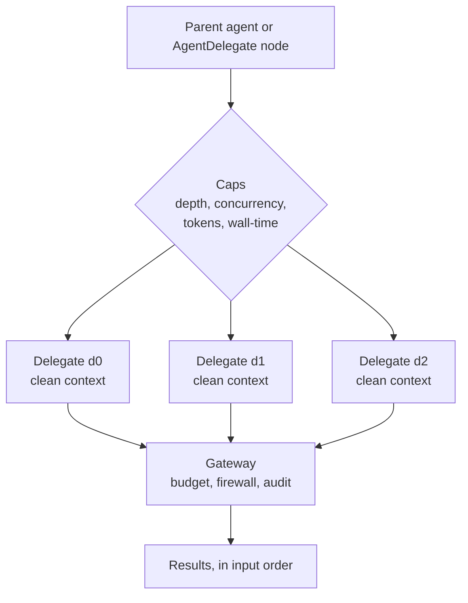

Delegation lets a parent agent or workflow node hand one or more self-contained tasks to
**sub-agents** that run in parallel, each with a clean context, and collect their results in input
order. The engine lives in `apps/core/src/workflow/delegation.rs`; it is exposed three ways: as the
agent-native `delegate__fanout` tool, as the `AgentDelegate` workflow node, and as a streaming
endpoint (`POST /api/delegate/stream`).

Per the Core-vs-Gateway rule this is **Core** logic: it decides *what runs* (which sub-agent, with
what task, how deep, how many at once). Every model call a delegate makes still routes through the
Gateway, where budgets, firewall, and audit apply. See [Core vs Gateway](/docs/start-here/architecture/core-vs-gateway).

## As an agent tool (`delegate__fanout`)

Delegation is **built into the agents themselves** - it is not a page a human drives. Any agent can
fan work out mid-task by calling the built-in `delegate__fanout` tool (`apps/core/src/sidecar/mcp/delegate.rs`),
the same way Hermes and OpenClaw expose subagents. It is registered as a reserved registry server
(`delegate`), so it is allowlist-gated and audited on both planes (ACP and openai-compat) like every
other built-in. With the default (empty) allowlist it is offered directly, so an agent delegates with
**no configuration** - automatic by default.

`delegate__fanout` takes a `tasks` array (each `{ task, agent_id? }`) plus optional `max_concurrent` /
`wall_time_secs`, runs the tasks in parallel in clean contexts, and returns all results in one call.
Each task whose `agent_id` is omitted routes to the node's **default agent** (`ryu`) rather than a bare
LLM, so a delegate is a *real* agent with its own tools, Gateway routing, and persona. (Because every
delegate routes to a real agent, the `PermissionPreset` below is not exposed on this tool - it only
governs the bare-LLM path of the lower-level engine.)

Because the tool is default-on and a delegated sub-agent can itself hold it, a process-global semaphore
(`MAX_CONCURRENT_FANOUTS = 4`) bounds how many fan-outs run at once across the whole process; combined
with the per-fan-out concurrency cap this bounds the worst-case number of simultaneous sub-agents and
starves runaway re-entrant delegation.

For durable, long-running workers a coordinator checks back on over time, use the
[coordinator threads](/docs/core/coordinator-threads) (`threads__*`) tools instead - `delegate__fanout`
is for ephemeral, parallel subtasks; `threads` is for persistent workers.

<Callout type="info">
  There is no standalone "Delegation" page in the desktop app. Delegation is a capability agents use,
  surfaced through the chat tool loop - not a screen a person fills in. The `AgentDelegate` workflow
  node and the `POST /api/delegate/stream` endpoint remain for declarative orchestration and headless
  callers.
</Callout>

## How it works

Each sub-agent receives **only its task prompt** - the parent's conversation history is deliberately
excluded, so a delegate starts from a clean slate. Same-depth delegates run concurrently behind a
semaphore, and each completed result streams back as it lands.



There are two execution paths inside `call_sub_agent`:

- If a delegate sets `agent_id` and a runner is published (`global_agent_runner()`), the real agent
  runs through the chat path so its own engine binding, Gateway routing, tools, and system prompt
  govern the sub-task. On this path the per-delegate `max_tokens` cap and the synthetic preset system
  message do **not** apply - the chosen agent's own config takes over. The `run_one` wall-time timeout
  still bounds it.
- Otherwise the engine sends a single non-streaming `POST /v1/chat/completions` to the Gateway with a
  fresh system message describing the preset plus the task as the only user turn. The model is
  resolved from `RYU_DEFAULT_LLM_MODEL` (falling back to `gpt-4o-mini`).

## The endpoint

```
POST /api/delegate/stream
```

The request body is a `DelegateBody`:

| Field | Type | Default | Meaning |
|---|---|---|---|
| `delegates` | array of `DelegateSpec` | `[]` | The sibling delegates to fan out, run concurrently |
| `caps` | `DelegationCaps` | engine defaults | Optional caps override; concurrency clamped to the hard max |
| `depth` | integer | `1` | Depth of these delegates (a top-level parent delegating is depth 1) |

The response is a Server-Sent Events stream. Each event is one JSON object on a `data:` line:

| Event | Shape | When |
|---|---|---|
| `started` | `{ event, id, preset }` | A delegate is admitted past the concurrency gate |
| `finished` | `{ event, result }` | A delegate finishes (success or failure carried in `result`) |
| `done` | `{ event, results }` | Terminal: the ordered result array for every delegate |
| `error` | `{ event, error }` | Terminal: the fan-out itself failed validation |

A delegate that fails (gateway unreachable, wall-time exceeded, or a panic) still produces a
`DelegateResult`, so a partial fan-out always returns one result per spec rather than aborting the
whole batch.

## DelegateSpec

Each delegate names a task and, optionally, an agent and a permission preset.

| Field | Type | Default | Meaning |
|---|---|---|---|
| `id` | string | required | Stable id within the fan-out, echoed in progress events |
| `task` | string | required | The self-contained task prompt, the only context the sub-agent sees |
| `agent_id` | string | none | Route to a configured agent (clean-context plain LLM if omitted) |
| `preset` | `PermissionPreset` | `code_read` | The intent label for the delegate's capabilities |

### Permission presets

Presets are a closed set of intent labels. Core attaches the preset's tool allowlist as a hint; the
Gateway enforces the matching policy. The default, `code_read`, is the safest non-trivial choice (read
but never mutate).

| Preset | Allowed tools | Mutates? |
|---|---|---|
| `research` | `web_search`, `web_fetch`, `read_memory` | no |
| `code_read` | `read_file`, `list_files`, `grep`, `read_memory` | no |
| `code_write` | the read set plus `write_file`, `apply_patch`, `run_command` | yes |
| `summarise` | none | no |

## Caps

`DelegationCaps` bound a fan-out so it cannot run away. The constants are defined in
`apps/core/src/workflow/delegation.rs`.

| Cap | Field | Default | Hard limit |
|---|---|---|---|
| Per-delegate token budget | `max_tokens` | `4096` (`DEFAULT_MAX_TOKENS`) | - |
| Per-delegate wall-time (seconds) | `wall_time_secs` | `120` (`DEFAULT_WALL_TIME_SECS`) | - |
| Concurrent delegates | `max_concurrent` | `5` (`MAX_CONCURRENT_DELEGATES`) | clamped to 5 |
| Nesting depth | (the `depth` argument) | `1` | `3` (`MAX_DELEGATION_DEPTH`) |

`max_concurrent` is clamped to the range 1 to 5 by `effective_concurrency()`, so a request asking for
99 still runs at most 5 at a time and a request asking for 0 runs 1. A `depth` above 3 is rejected
before any delegate runs (`DelegationError::DepthExceeded`), and an empty `delegates` array is rejected
(`DelegationError::Empty`).

## The AgentDelegate workflow node

The same engine backs a first-class workflow node. `NodeKind::AgentDelegate { delegates, caps }`
(`apps/core/src/workflow/mod.rs`) fans out concurrently and sets the node's output to the JSON array
of per-delegate results. Each delegate gets the node input appended to its `task`, so an upstream node
feeds the delegates as clean input. The executor (`executor.rs`, `run_agent_delegate`) calls
`run_fanout_with_checkpoint` so the fan-out participates in workflow durability. See
[Workflows](/docs/core/workflows) for the canvas and node model.

<Callout type="info">
  Delegation runs unrelated sub-agents in parallel from a clean slate. To assemble a standing group of
  agents that see each other and coordinate by strategy, use [Agent teams](/docs/core/agent-teams)
  instead.
</Callout>

## Durable fan-out

When `run_fanout` is given a checkpoint key (`FanoutCheckpointKey` of `run_id` plus `node_id`), each
completed delegate's result is persisted to `~/.ryu/fanout-checkpoints/<run_id>/<node_id>/<delegate_id>.json`.
On resume with the same key, delegates whose checkpoint file exists are skipped and their recorded
result reused, so input-order results are preserved without re-running completed work. Writes are
atomic (temp file then rename) so a mid-write crash never leaves a partial checkpoint that resume would
mistake for complete. All path segments are validated against directory traversal.

## Failure model

| Condition | Behavior |
|---|---|
| Gateway unreachable | Fail-closed: the delegate returns an error mentioning the gateway |
| `RYU_ALLOW_GATEWAY_FALLBACK=1` | Opt-in fallback to a direct provider POST (legacy env vars) |
| Wall-time exceeded | The delegate result carries a `wall-time limit ... exceeded` error |
| Delegate task panics | Replaced with a failed `DelegateResult` so the batch still completes |

<Callout type="warn">
  Fail-closed is the default: if the Gateway cannot be reached, a delegate errors rather than calling a
  provider directly. The `RYU_ALLOW_GATEWAY_FALLBACK=1` escape hatch exists mainly for tests that point
  the gateway at a blackhole address; in normal operation leave it unset so all delegate egress stays
  governed.
</Callout>

## Related

<Cards>
  <DocCard href="/docs/core/agent-teams" />
  <DocCard href="/docs/core/workflows" />
  <DocCard href="/docs/core/coordinator-threads" />
  <DocCard href="/docs/gateway/governance" />
</Cards>
