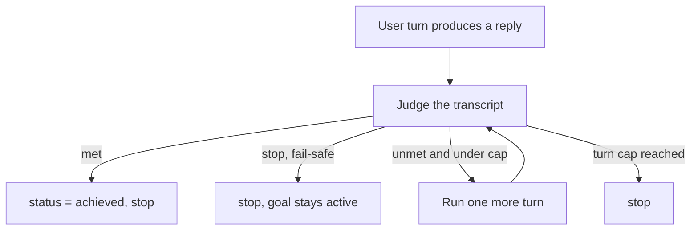

A goal is a plain-language completion condition attached to a conversation (for example
"refactor the auth module and make the tests pass"). After every turn a separate judge model reads
the transcript and decides whether the condition is met. If it is not, another turn runs. The loop
stops when the judge says the goal is achieved, when a verdict cannot be parsed (fail-safe), or when
a turn cap is reached. The pattern is modeled on Claude Code's goal-pursuit behavior.

Core owns two things: the durable goal state on the conversation, and the judge primitive that
produces one yes/no verdict. The continuation loop (run a turn, judge, repeat) runs in two places -
client-side on the desktop and, since the server-driven loop landed, inside Core itself for clients
that do not stream their own UI.

## Goal state

The goal lives on the conversation row in `apps/core/src/server/conversations.rs` across five added
columns (idempotent `ALTER TABLE`): `goal`, `goal_status`, `goal_started_at`, `goal_last_reason`,
and `goal_turns`. It is surfaced as `GoalState`:

| Field | Type | Meaning |
|---|---|---|
| `goal` | `string?` | The completion condition. `null` when no goal is set. |
| `status` | `string?` | `"active"` while the loop runs, `"achieved"` once met, `null` when unset. |
| `started_at` | `int?` | Unix milliseconds the goal was set; drives the elapsed timer. |
| `last_reason` | `string?` | The judge's most recent reason for its verdict. |
| `turns` | `int` | Number of turns the judge has evaluated so far. |

Setting a goal resets the bookkeeping: `set_goal` flips `goal_status` to `active`, stamps
`goal_started_at`, and zeroes `goal_turns` and `goal_last_reason`. A forked conversation does not
carry the goal forward (the copy leaves `run_status` and goal columns unset).

## Routes

| Method + path | Purpose |
|---|---|
| `GET /api/conversations/:id/goal` | Read `GoalState`. Returns an empty goal when none is set. |
| `PUT /api/conversations/:id/goal` | Set or replace the goal; resets judge bookkeeping. |
| `DELETE /api/conversations/:id/goal` | Clear the goal (user ran `/goal clear`, or it was achieved). |
| `POST /api/conversations/:id/goal/judge` | Run one judge evaluation. Returns `{ met, reason, turns, stop }`. |
| `POST /api/conversations/:id/goal/run` | Server-driven pursuit loop: judge, run a continuation turn while unmet, re-judge. |

The handlers live in `apps/core/src/server/mod.rs` (`get_goal_handler`, `set_goal_handler`,
`clear_goal_handler`, `judge_goal_handler`, `run_goal_handler`). Calling `judge` or `run` on a
conversation with no goal returns `400`.

## The judge

One judge call evaluates the recent transcript against the condition. The shared primitive is
`judge_goal_once` in `apps/core/src/server/mod.rs`; both the single-shot `goal/judge` endpoint and
the `goal/run` loop call it.

The judge model is never hardcoded to a remote provider. It resolves in order, the first non-empty
wins:

1. Preference `goal-judge-model` (set in desktop Settings under Goals)
2. Env `RYU_GOAL_JUDGE_MODEL`
3. Env `RYU_DEFAULT_LLM_MODEL`
4. A literal default - the auto-installed local chat model (Gemma 4 E2B)

Because the default is the bundled local model, goals judge on the cheap local engine with no API
key and no setup. The judge runs through the Gateway like every other model call. Reasoning effort
is taken from the `goal-judge-effort` preference and forwarded as `reasoning_effort` on the gateway
call.

### Verdict parsing (fail-safe)

The judge is instructed to answer with a single line of the form `MET: yes - <reason>` or
`MET: no - <reason>`. Parsing in `parse_goal_verdict` is deliberately defensive: only an explicit
`yes` verdict counts as met. Anything that cannot be read as a clear verdict is treated as
not-met-and-stop, so the loop never spins on garbage. Any transport or parse failure (or a missing
goal) yields `stop = true` for the same reason.

The judge endpoint returns `stop` separately from `met`: `stop` is true when the loop should halt
regardless of the verdict (fail-safe stop, or the cap was reached).

## The continuation loop

There are two loops over the same judge primitive.

**Client-side (desktop).** `apps/desktop/src/pages/ChatPage.tsx` intercepts `/goal <condition>` and
`/goal clear` in the composer. After each assistant turn it calls `goal/judge`; while the goal is
unmet and `stop` is false it sends one more turn, bounded by a hard cap `MAX_GOAL_TURNS = 25`. The
Stop button halts the loop. This is what drives the live-streaming UX, so it stays on the client.
The desktop CLI (`apps/cli`) carries the same `/goal` flow and the same 25-turn cap.

**Server-driven.** `POST /api/conversations/:id/goal/run` runs the loop inside Core so it works for
clients that do not stream their own UI. Call it after the initial user turn has produced an
assistant reply: it judges, and while the goal is unmet and under the cap runs a persisted
continuation turn via `run_reply_text`, re-judging each round. It stops on met, a fail-safe judge
stop, or the turn cap, and returns the final verdict plus how it stopped. The optional body
(`GoalRunBody`) accepts `max_turns` (clamped to the server cap) and an `agent_id` to pin the agent.

<Callout type="warn">
  The server-driven `goal/run` loop is newer than the client-side loop. The repo ground truth still
  notes that the client loop is the primary path and that goals were "desktop only for now"; the
  server loop closes the gap for the CLI and channel bots but live multi-turn runs through Core have
  not been broadly verified. Treat `goal/run` as the path that lets non-desktop clients pursue a
  goal, and the desktop client loop as the verified one.
</Callout>

## Using goals from the composer

Goals are driven from chat with `/goal <condition>` and `/goal clear`. The composer shows an active
goal chip and a goal bar above the input with the editable condition, a live elapsed timer, and the
judge's latest reason. The full composer how-to lives on the chat page.

<TryInRyu page="chat" />

<Cards>
  <DocCard href="/docs/using-ryu/user-guide/chat" />
  <DocCard href="/docs/core/double-check" />
  <DocCard href="/docs/core/side-questions" />
  <DocCard href="/docs/core/conversations-sessions" />
</Cards>
