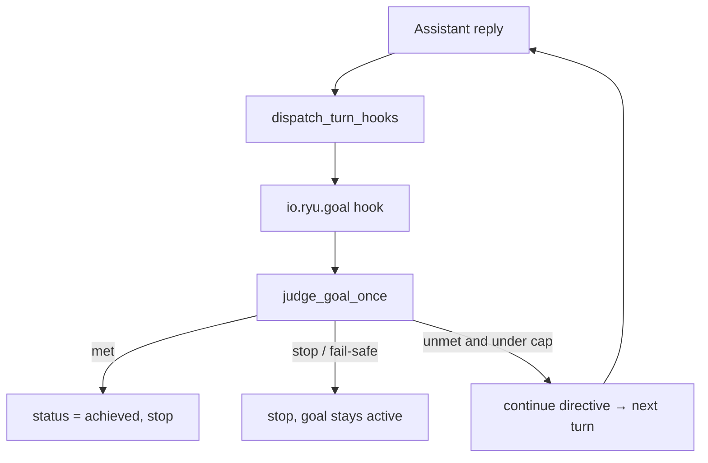

A goal is a plain-language completion condition attached to a conversation (for example
"refactor the auth module and make the tests pass"). After every turn a separate judge model reads
the transcript and decides whether the condition is met. If it is not, another turn runs. The loop
stops when the judge says the goal is achieved, when a verdict cannot be parsed (fail-safe), or when
a turn cap is reached.

<Callout type="info">
  Goals are implemented as an installable plugin turn-hook (`io.ryu.goal`), not as Core HTTP
  endpoints. The judge primitive lives in `apps/core/src/server/mod.rs`; the continuation loop runs
  in the plugin host (`apps/core/src/plugin_host/mod.rs`) after each assistant turn via
  `dispatch_turn_hooks`.
</Callout>

## Goal state

The goal lives on the conversation row in `apps/core/src/server/conversations.rs` across five added
columns (idempotent `ALTER TABLE`): `goal`, `goal_status`, `goal_started_at`, `goal_last_reason`,
and `goal_turns`. It is surfaced as `GoalState`:

| Field | Type | Meaning |
|---|---|---|
| `goal` | `string?` | The completion condition. `null` when none is set. |
| `status` | `string?` | `"active"` while the loop runs, `"achieved"` once met, `null` when unset. |
| `started_at` | `int?` | Unix milliseconds the goal was set; drives the elapsed timer. |
| `last_reason` | `string?` | The judge's most recent reason for its verdict. |
| `turns` | `int` | Number of turns the judge has evaluated so far. |

Setting a goal resets the bookkeeping: the goal plugin flips `goal_status` to `active`, stamps
`goal_started_at`, and zeroes `goal_turns` and `goal_last_reason`.

## How it runs

Goals are delivered as a `post_assistant_turn` hook. After each assistant reply the plugin host
calls `dispatch_turn_hooks` with a `HookContext`. The goal hook reads the conversation's
`goal_status`, runs `judge_goal_once` over the recent transcript, and returns one of:

- `note` with a `continue` directive - goal not yet met, emit a continuation turn
- `note` with no directive - goal achieved or loop should stop

The judge is the same `judge_goal_once` primitive used by the desktop client-side loop; the hook
runs it server-side so any client (CLI, channel bots, mobile) can pursue a goal without
implementing the loop itself.

## The judge

One judge call evaluates the recent transcript against the condition. The model resolves in order,
first non-empty wins:

1. Preference `goal-judge-model` (set in Settings under Goals)
2. Env `RYU_GOAL_JUDGE_MODEL`
3. Env `RYU_DEFAULT_LLM_MODEL`
4. The auto-installed local model (Gemma 4 E2B)

Because the default is the bundled local model, goals judge cheaply with no API key or setup.
The judge call routes through the Gateway like every other model call. Reasoning effort comes from
the `goal-judge-effort` preference.

### Verdict parsing (fail-safe)

The judge answers `MET: yes - <reason>` or `MET: no - <reason>`. Parsing is deliberately defensive:
only an explicit `yes` counts as met. Anything unreadable is treated as not-met-and-stop, so the
loop never spins on garbage.

## Using goals from the composer

Goals are driven from chat with `/goal <condition>` and `/goal clear`. The composer shows an active
goal chip and a goal bar above the input with the editable condition, a live elapsed timer, and the
judge's latest reason.

<TryInRyu page="chat" />

<Cards>
  <DocCard href="/docs/desktop/user-guide/chat" />
  <DocCard href="/docs/core/double-check" />
  <DocCard href="/docs/core/side-questions" />
  <DocCard href="/docs/core/conversations-sessions" />
</Cards>
