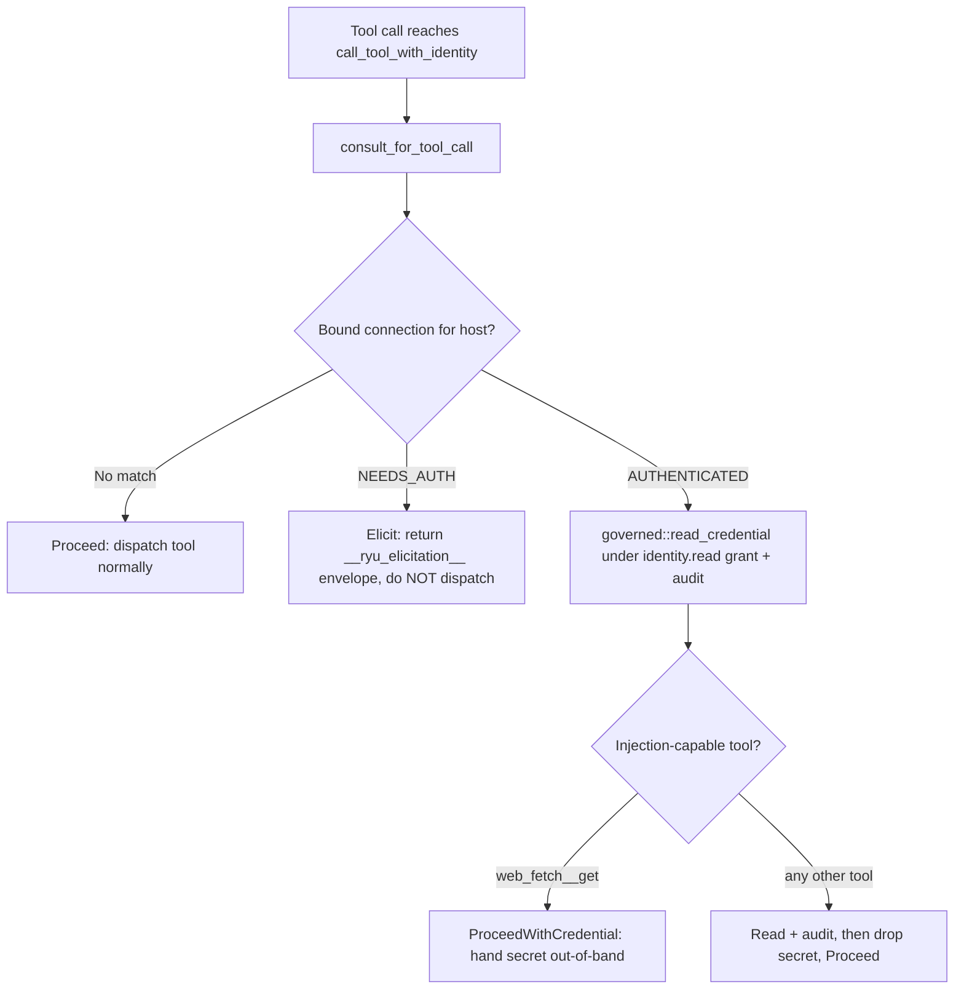

The Identity Vault lets an agent act as a logged-in user on specific web domains without ever
exposing the underlying credential to the model. Core owns storage and encryption, the Gateway
owns scope and audit (the Core-vs-Gateway rule), and one hard invariant runs through the whole
design: a credential is decrypted only at tool-dispatch time, used server-side, and never reaches
the LLM, the response stream, or a log line.

It is modeled on kernel.sh Managed Auth Connections and lives in `apps/core/src/identity/`
(`mod.rs`, `store.rs`, `source/`, `elicitation.rs`, `governed.rs`, `health.rs`, `consult.rs`).

For the desktop how-to (creating a profile, importing a cookie, binding it to an agent) see
[Identities](/docs/using-ryu/identities). For the grant + audit half see
[Governance](/docs/gateway/governance).

<Callout type="warn">
  Only the `ManualImport` credential source is live end to end (paste a cookie or token, it seals
  to `AUTHENTICATED`). The `Composio` and `BrowserTool` capture backends are `NotImplemented`
  stubs, so there is no automated browser-cookie capture yet. The tool-path wiring and the
  `web_fetch__get` consumer are unit-tested (9 + 7 tests green) but **not yet live-verified**
  against a running Core and a real logged-in site. v1 matches domains by **exact host only** (no
  public-suffix / registrable-domain fuzzing).
</Callout>

## The object model

```
Agent card ──binds──▶ Profile (1) ──▶ Connection (N, one per domain)
```

| Object | Where it lives | What it is |
|---|---|---|
| **Profile** | grouping key in `identities.db` | Aggregates many per-domain connections. An agent bound to a profile is "logged in to every connected domain" at once. |
| **Connection** | one row in `connections` (`store.rs`) | One per-domain login: `profile_id`, `domain`, `status`, `flow_status`, `source`, `encrypted_state`. |
| **Binding** | `AgentRecord.identity_profile_ids` (`agents.db` column) | The list of profile ids an agent may use. Empty means the agent has no vault access. |

A connection carries two status fields:

| Field | Values | Meaning |
|---|---|---|
| `status` (`ConnectionStatus`) | `AUTHENTICATED`, `NEEDS_AUTH` | Whether a usable credential is stored. |
| `flow_status` (`FlowStatus`) | `IDLE`, `IN_PROGRESS`, `DONE`, `FAILED` | The state of an in-progress login. |

Connections are stored in `~/.ryu/identities.db` (`apps/core/src/identity/store.rs`). New
connections start `NEEDS_AUTH` / `IDLE` with no credential state.

## Routes

The connection lifecycle is exposed under `/api/identities/*`
(`apps/core/src/server/identity_api.rs`).

| Method + path | Purpose |
|---|---|
| `GET /api/identities` | List every profile with its per-domain connections. |
| `POST /api/identities/connections` | Create a per-domain connection (starts `NEEDS_AUTH`). |
| `POST /api/identities/connections/{id}/login` | Begin a login flow for a connection. |
| `GET /api/identities/connections/{id}` | Poll a connection's status. |
| `POST /api/identities/connections/{id}/import` | Seal a user-provided credential and flip the connection to `AUTHENTICATED`. |
| `DELETE /api/identities/connections/{id}` | Remove a connection and its sealed state. |

## The 3-layer invariant

A credential never reaches the model. This is enforced three independent ways so no single bug
can leak it (`apps/core/src/identity/mod.rs`, `store.rs`):

1. **Type-level.** `SealedState` and `SecretState` are not `Serialize`, and their `Debug` is
   redacted - an accidental `{:?}` prints nothing useful.
2. **Serde-level.** `ConnectionRecord.encrypted_state` is `#[serde(skip)]`, so it never rides an
   API response even when the record itself is serialized. Handlers hand-build flow responses and
   never call `open_state`.
3. **Access-level.** Plaintext is reachable only through `governed::read_credential`, which
   validates the `identity.read` grant against the Gateway (fail-closed) and audits the access
   before decrypting.

Credential state is sealed with Core's `FieldCipher` (`enc:v1:` envelope) before it touches disk.
The store exposes exactly two crossing points - `import_state` seals and persists,
`open_state` decrypts - and `open_state`'s own doc comment forbids logging or returning its
result.

## Consult at the tool-dispatch chokepoint

Every tool call (across both planes - the ACP MCP bridge and the PTC invoker - plus the HTTP
`call_mcp_tool` handler) passes through one chokepoint, `McpRegistry::call_tool_with_identity`.
That chokepoint calls `consult_for_tool_call` (`apps/core/src/identity/consult.rs`), which:

1. Extracts the target host from a `url` or `domain` argument (`extract_domain`; exact host,
   lowercased).
2. Looks up that host among the calling agent's bound profiles' connections.
3. Decides one of three outcomes.



The decision is the `ConsultOutcome` enum (`consult.rs`). It is internal to Core's dispatch path,
never serialized, returned, or logged:

| Variant | When | Effect |
|---|---|---|
| `Proceed` | No bound host matched, or an authenticated credential was read for a non-consuming tool. | Dispatch the tool normally. |
| `Elicit(Value)` | A bound connection is `NEEDS_AUTH`. | Do not dispatch. Return the `__ryu_elicitation__` envelope (the same shape Composio returns) so the caller pauses for login. PTC turns this into a `Suspend`; the chat/ACP plane surfaces it as the tool-result text. |
| `ProceedWithCredential(SecretState)` | A bound connection is `AUTHENTICATED` and the tool is credential-consuming. | Dispatch, handing the decrypted secret to the tool out-of-band so it can act as the user. |

For an `AUTHENTICATED` match the credential is read through `governed::read_credential` (which
exercises the `identity.read` grant and emits a `CredentialRead` audit event) regardless of
whether the tool consumes it. The read matters even when the secret is dropped: it proves the
governed path on every authenticated tool hit. If the grant read is **denied** (for example an
unreachable dev gateway), the call proceeds without the credential rather than hard-failing - the
tool then returns its own auth error instead of every browsing call dying on a gateway blink.

Composio tool ids (`composio__…`) are skipped here: Composio owns its own connection-required
path (`mcp::composio::detect_elicitation`), and running both would collide.

## The credential consumer: `web_fetch__get`

A consult that only read and dropped the secret could prove the governed path but never use it.
The `web_fetch` builtin closes that seam. `web_fetch__get`
(`apps/core/src/sidecar/mcp/web_fetch.rs`, reserved server `web_fetch`) is the one tool listed in
`INJECTION_CAPABLE_TOOLS`, so it is the only tool for which the consult returns
`ProceedWithCredential`.

When the calling agent has an `AUTHENTICATED` connection for the requested URL's host, the
dispatch chokepoint threads the decrypted `SecretState` out-of-band into `web_fetch::dispatch` -
never into the model-authored `arguments`, never logged. `credential_to_headers` converts it to
request headers (a raw string becomes a `Cookie` header, or a JSON `{headers, cookies}` envelope
maps to explicit headers), and the request is sent via the SSRF-guarded
`server::guarded_fetch_text_with_headers`:

- HTTPS only.
- Resolve, screen, and pin IPs (no SSRF rebind).
- Redirects off.
- 5 MB body cap.
- Invalid headers are skipped.

Only the fetched page reaches the LLM. Every other authenticated tool still reads, audits, and
**drops** the credential, keeping the secret's blast radius limited to known consumers.

## Swappable knobs

Nothing is hardcoded (`apps/core/src/identity/`):

| Env var | Default | Controls |
|---|---|---|
| `RYU_IDENTITY_DEFAULT_SOURCE` | `manual` | The credential-source backend for new connections. |
| `RYU_IDENTITY_HEALTH_INTERVAL` | `1h` | How often the health loop (`health.rs`) re-checks connections, flipping stale ones back to `NEEDS_AUTH`. |

Credential-source backends (`source/`): `ManualImport` works end to end; `Composio` and
`BrowserTool` are `NotImplemented` stubs.

## Remaining gaps

These are open by design and tracked, not silently missing:

- **Connector capture backend.** Only `ManualImport` paste is live. A real `BrowserTool`
  cookie-capture path needs a live browser or ghost session and is device-dependent greenfield.
- **Per-action HITL approval** is already covered by existing primitives, not duplicated here:
  the ACP plane has interactive per-tool allow/reject and the PTC plane has elicitation pause and
  resume.
- **Org / admin RBAC** is out of scope - the data model is single-tenant and local-first. The
  local analog is the per-agent `browser.connect` / `identity.read` grants enforced by the
  Gateway.

## Related

<Cards>
  <DocCard href="/docs/using-ryu/identities" />
  <DocCard href="/docs/gateway/governance" />
  <DocCard href="/docs/core/mcp-registry" />
  <DocCard href="/docs/core/programmatic-tool-calling" />
</Cards>
