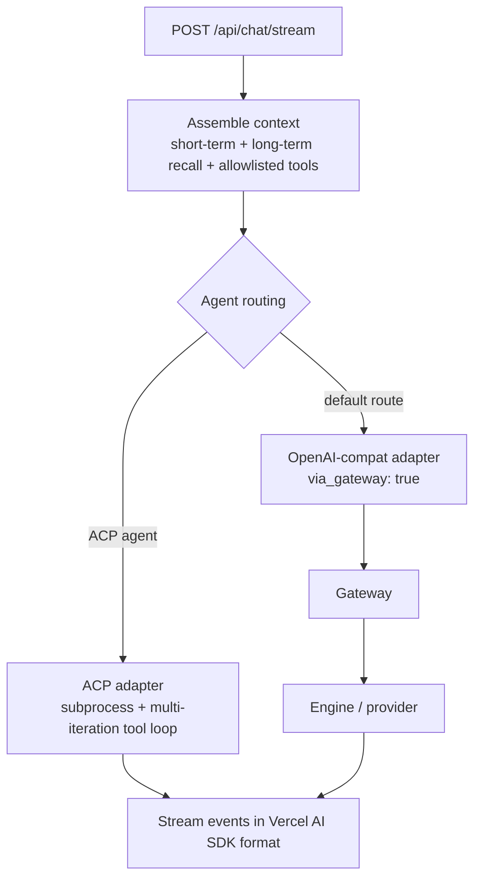

**Ryu Core** (`apps/core`) is the local Rust backend. It runs on `127.0.0.1:7980` by default, with no
UI and no cloud required. Core owns the **what runs** half of the system: it manages engine
processes, routes chat to the right agent, keeps conversations and memory on your machine, and hands
every model call to the Gateway. The split between Core and Gateway is the
[one design rule](/docs/start-here/architecture/core-vs-gateway); everything Core activates is a
[Runnable](/docs/start-here/architecture/runnable-model).

Core is headless-first. The desktop, CLI, web, island, and mobile clients are all thin surfaces over
the same HTTP API. For the full route list see the [API reference](/docs/develop/api-reference).

## How a chat request flows

The real chat path is `POST /api/chat/stream`. The body (`ChatStreamRequest` in
`apps/core/src/sidecar/adapters/mod.rs`) carries the messages, the `agent_id`, an optional
`conversation_id`, memory and retrieval options, and the git workspace fields (`cwd`,
`worktree_isolation`). Core assembles context (recent turns plus recalled long-term memory and
allowlisted tools), then picks an adapter by the agent's routing.

The **ACP adapter** (`apps/core/src/sidecar/adapters/acp.rs`) spawns coding agents as subprocesses and
runs the closed tool loop via the MCP bridge. The **OpenAI-compat adapter**
(`adapters/openai_compat.rs`) makes a single Gateway-routed call and always sets `via_gateway: true`.
State lives under `~/.ryu/` (SQLite for conversations, memory, traces, agents; JSON for workflow runs
and scheduled jobs). See [Conversations & Sessions](/docs/core/conversations-sessions) for the chat
path and storage detail.

## Subsystems

<AutoCards url="/docs/core" />
