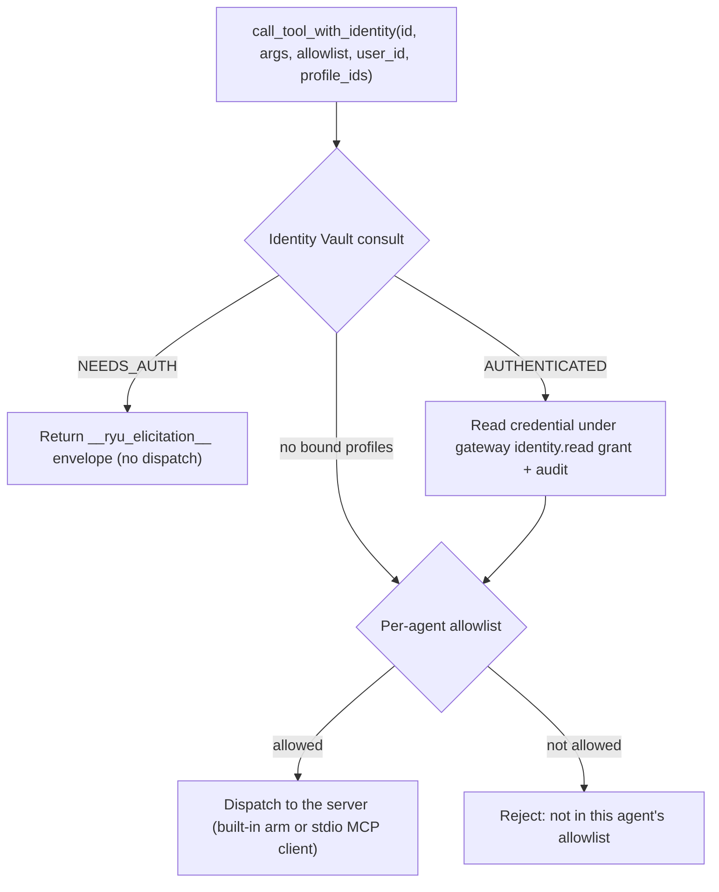

The MCP registry (`apps/core/src/sidecar/mcp/mod.rs`, `McpRegistry`) is Core's catalog of tool
servers available to agents. It speaks the Model Context Protocol, merges built-in servers with
user-configured ones, and dispatches every call through a per-agent allowlist. It is the single
tool-dispatch chokepoint: chat (ACP and openai-compat), workflows, monitors, recipes, and
programmatic tool calling all reach tools through this registry.

This page covers the registry mechanics, the built-in servers, and the governed call path. For the
search and execution layer built on top of it (the gateway tool-search front and `POST /v1/exec/tool`),
see [Unified tool catalog](/docs/core/unified-tool-catalog). For model-authored fan-out across many
tools, see [Programmatic tool calling](/docs/core/programmatic-tool-calling).

## How servers are registered

The registry always starts from the built-in servers, then overlays the user's config from
`~/.ryu/mcp.json` on top (`load_merged_servers`). A user entry with the same `name` as a config-file
built-in wins, so you can repoint or disable one. The config file uses the common `mcpServers` map
shape, so an existing MCP host config can be pasted in.

| Action | Route |
|---|---|
| List registered servers | `GET /api/mcp/servers` |
| Register a server | `POST /api/mcp/servers` |
| List tools (optionally per agent) | `GET /api/mcp/tools?agent=<id>` |
| Call a tool | `POST /api/mcp/tools/call` |

User servers are hot-reloaded with no process restart (`McpRegistry::reload` re-derives built-ins,
re-overlays `mcp.json`, and clears the tool cache). A worked registration example lives in
[Register an MCP server](/docs/develop/extensions/mcp-server).

### Tool ids

Every tool has a fully-qualified id of the form `<server>__<tool>` (`TOOL_ID_SEP = "__"`). Because
`__` is the separator, a server `name` must not contain it. The id is the unit of allowlisting and the
unit of dispatch end to end.

## Built-in servers

Two kinds of built-in exist. **Ghost** is a real config-file server (`builtin_servers`) spawned per
request. The rest are **reserved providers** synthesized only in `server_summaries()` and
`list_all_tools()` and dispatched by a name-matched arm in `call_tool_with_identity` (they are not in
the `servers` map; `contains_server` checks them by name). Most degrade gracefully when their backend
is absent.

| Server | What it does | Backend / availability |
|---|---|---|
| `ghost` | Desktop automation: screen perception + input control (about 30 tools) | Spawned per request as `~/.ryu/bin/ghost mcp`. Windows-first; unavailable until the `ghost` sidecar is installed |
| `shadow` | Screen/audio/input capture + semantic search | HTTP to the Shadow sidecar on `:3030`. Windows-first; reports unavailable when Shadow is not running |
| `spider` | Web crawling / scraping | Shells out to the `spider` binary. Degrades gracefully when not installed |
| `exa` | Neural web search | HTTP, BYOK via `RYU_EXA_API_KEY`. Degrades gracefully when the key is absent |
| `web_fetch` | Authenticated web fetch over HTTPS | Built-in. Injects the user's [Identity Vault](/docs/core/identity-vault) session for the URL's host server-side (acts as the user; the credential never reaches the model) |
| `search_conversations` | Semantic search over the user's past chat messages | Built-in. Backed by the message index; see [Search and recall](/docs/desktop/user-guide/search-and-recall) |
| `threads` | Coordinator threads: spin up and manage worker threads (8 tools) | Built-in. See [Coordinator threads](/docs/core/coordinator-threads) |
| `sandbox` | Run WASM/WASI modules with default-deny capabilities | Built-in wasmtime. Toggleable; available only when compiled with the `sandbox-wasmtime` feature. See [Sandbox](/docs/core/sandbox) |
| `notify` | Show a native desktop notification | Built-in, in-process |
| `channel` | Post a message to a Slack/Discord incoming-webhook URL | Built-in, HTTP |
| `composio` | Searchable-not-listed catalog of Composio actions | Dispatched by the `composio__<slug>` id prefix; see [Unified tool catalog](/docs/core/unified-tool-catalog) |

<Callout type="warn">
  Ghost and Shadow are Windows-first and many built-ins are opt-in or require a sidecar/key. A server
  that fails to start is logged and skipped, so one unavailable built-in never hides the rest. Live
  desktop-automation (the actual click/capture against a real window) is not exercised in CI; it needs
  a display.
</Callout>

## The governed call path

`call_tool_with_identity` is the boundary every plane funnels through. `call_tool` and
`call_tool_with_user` delegate to it; the chat/ACP and PTC planes call it directly so they can pass
the caller's bound [Identity Vault](/docs/core/identity-vault) profiles.

1. **Identity Vault consult.** For a bound agent, a call targeting a domain that is `NEEDS_AUTH`
   returns the `__ryu_elicitation__` envelope as its result (the caller pauses for login, no
   dispatch). An `AUTHENTICATED` domain reads the credential through the gateway-governed
   `identity.read` grant plus audit at this boundary, never exposing it to the LLM. No-op when the
   agent has no bound profiles.
2. **Allowlist.** The call is dispatched only if the tool passes the agent's allowlist.
3. **Dispatch.** A built-in reserved provider routes to its name-matched arm; a config server routes
   through a short-lived stdio MCP client.

## The per-agent allowlist

The allowlist is the governance boundary. Registering a server grants no agent access to it; you must
allowlist its tools for the agents that should use them. The MCP bridge filters every registered tool
through the agent's allowlist before injecting it into a session, and an empty allowlist means no
tools are offered.

`tool_allowed` matches a list entry against the tool's fully-qualified id, its bare name, or its
owning server name, so an entry of `exa` allowlists every Exa tool while `exa__search` allowlists just
one.

<Callout type="info">
  Two paths are deliberately stricter and match the fully-qualified id only (no bare name or server
  fallback): Composio (`composio__<slug>`) and the `app__`-namespaced app tools. This closes a
  cross-plane allowlist bypass where a broad server-name entry could reach a tool the author never
  intended.
</Callout>

## Behavior and guarantees

- **One chokepoint, both planes.** Tool execution on the ACP and openai-compat planes is allowlist-gated
  and audited through this same dispatch, closing the ACP/registry tool-egress bypass (epic #473). The
  ACP subprocess's own LLM provider calls still bypass the gateway; only tool egress is governed here.
- **No lock held across an await.** Server config is extracted under a short read lock that is dropped
  before any `.await`, so a slow or hung server can never poison the registry lock.
- **Cached tool lists.** Per-server `tools/list` results are cached and cleared on `reload`, so newly
  registered servers advertise their tools on the next `GET /api/mcp/tools`.

## Related

<Cards>
  <DocCard href="/docs/core/unified-tool-catalog" />
  <DocCard href="/docs/core/programmatic-tool-calling" />
  <DocCard href="/docs/core/identity-vault" />
  <DocCard href="/docs/develop/extensions/mcp-server" />
</Cards>
