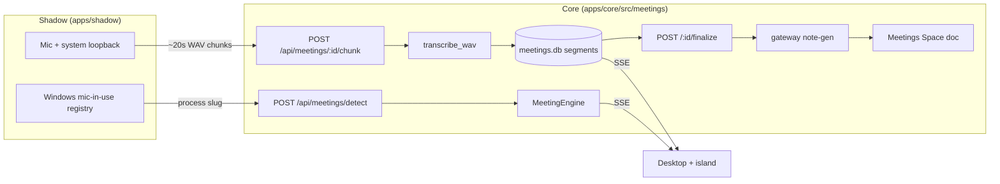

The meetings engine records a call, builds a live transcript chunk by chunk, and turns it into
structured notes (summary, key points, action items, decisions). Core owns the brain
(`apps/core/src/meetings/`); the device-bound audio capture and mic-in-use detection live in
Shadow (`apps/shadow/src/capture/`); finalized notes are written into a hidden Spaces document so
viewing, editing, and RAG reuse the existing editor.

For the desktop how-to (start a recording, open the notes), see
[/docs/using-ryu/productivity/meetings](/docs/using-ryu/productivity/meetings).

<Callout type="warn">
Detection and full-fidelity capture are **Windows-first**. The mic-in-use detector
(`apps/shadow/src/capture/detect.rs`) reads a Windows registry key and is inert on macOS/Linux;
the loopback capture (`apps/shadow/src/capture/meeting.rs`) falls back to mic-only off Windows.
The chunked-transcription, note-generation, and Spaces paths were exercised against a live Core,
but cpal loopback capture and the registry mic-in-use detection are **not yet runtime-verified**
(they need a display and a real call).
</Callout>

## Where the work happens

Audio capture is a sensor bound to the local machine, but Core may run on a remote node, so the
two responsibilities are split.



| Concern | Owner | Reason |
|---|---|---|
| Mic + loopback capture | Shadow `capture/meeting.rs` | Sensor is bound to the local device |
| Mic-in-use detection | Shadow `capture/detect.rs` | Reads a local OS registry key |
| Transcription, notes, storage | Core `meetings/` | "What runs" lives in Core (see [/docs/start-here/architecture/core-vs-gateway](/docs/start-here/architecture/core-vs-gateway)) |
| Note generation (the model call) | Gateway, via Core | "What is measured/paid" routes through the Gateway |

## Data model

The engine (`MeetingEngine`, a process-global `OnceLock`) persists to SQLite at `~/.ryu/meetings.db`
(`apps/core/src/meetings/store.rs`), with two tables.

| Type | Fields | Notes |
|---|---|---|
| `Meeting` | `id`, `title`, `app`, `status`, `source`, `space_id`, `doc_id` | `app` is the detected meeting app slug (e.g. `zoom`, `teams`) when known |
| `Segment` | per-chunk transcript text + timestamp | Appended as each WAV chunk is transcribed |

`MeetingStatus` moves `Recording -> Processing -> Done` (with a transient `Detected` state for an
auto-detected meeting before the user starts notes). `MeetingSource` records whether a meeting was
started manually or from auto-detection.

## Routes

All routes live under `/api/meetings` (`apps/core/src/server/meetings_api.rs`).

| Method + path | Purpose |
|---|---|
| `GET /api/meetings` | List meetings, newest first |
| `POST /api/meetings` | Start a meeting (best-effort begins Shadow capture) |
| `GET /api/meetings/:id` | One meeting (without the transcript body) |
| `DELETE /api/meetings/:id` | Remove a meeting and its transcript |
| `POST /api/meetings/:id/chunk` | Ingest one captured WAV chunk (multipart `file`), transcribe, append |
| `GET /api/meetings/:id/transcript` | The full transcript (segments + text) |
| `POST /api/meetings/:id/finalize` | Stop capture, generate notes, mark done, save to a Space |
| `GET /api/meetings/stream` | SSE feed of meeting events |
| `POST /api/meetings/detect` | Shadow's mic-in-use detection hook |
| `GET/PUT /api/meetings/detection-config` | Read/edit the detect-enabled flag + meeting-app list |

The chunk route takes an optional `?engine=` selector mirroring the voice transcribe route. A silent
chunk is reported softly rather than returning a 5xx.

## Live transcription

There is no streaming STT. Each ~20 second WAV chunk Shadow posts to `POST /api/meetings/:id/chunk`
is transcribed by reusing the extracted helper `server::voice::transcribe_wav` (whisper by default,
parakeet selectable). The resulting text is appended as a `Segment` and broadcast over SSE, so the
desktop transcript updates as the call proceeds.

## Note generation

`POST /api/meetings/:id/finalize` turns the accumulated transcript into structured notes. This is a
model call, so it goes through the Gateway via the same `call_side_model` path that
[goals](/docs/core/goals), [side questions](/docs/core/side-questions), and
[double-check](/docs/core/double-check) use (the transcript stays on the Core/Gateway path, never a
hardcoded third party). The reply is parsed into:

```json
{
  "summary": "a short paragraph",
  "key_points": ["..."],
  "action_items": ["... ideally naming an owner ..."],
  "decisions": ["..."]
}
```

Nothing is hardcoded. The model, effort, and system prompt resolve from preferences
(`meeting-notes-model`, `meeting-notes-effort`, `meeting-notes-prompt`) then env then
`DEFAULT_LLM_MODEL`; the default prompt is `DEFAULT_NOTES_PROMPT` in
`apps/core/src/meetings/notes.rs`. An empty transcript skips the model call entirely. Parsing is
fail-soft: if the reply contains no parseable JSON, the whole reply is kept as the `summary` rather
than discarding the model's work.

## Mic-in-use detection

Detection is not foreground-app matching. Shadow's poller
(`apps/shadow/src/capture/detect.rs::spawn_poller`) watches the OS for a process actively holding the
microphone and posts the owning process to `POST /api/meetings/detect`. On Windows it reads the
`CapabilityAccessManager\ConsentStore\microphone` registry hive via `winreg` and treats a subkey as
in-use when its `LastUsedTimeStop == 0`.

Core does the filtering, not Shadow. On `detect`, Core checks the `meeting-detection-enabled`
preference, then matches the reported app against the `meeting-detection-apps` list (a swappable
default editable through `GET/PUT /api/meetings/detection-config`), debounces, and broadcasts a
`detected` event over SSE. The island surfaces this on its suggestion chip behind a consent gate.

<Callout type="warn">
`microphone_in_use()` is compiled only for Windows (`#[cfg(windows)]`); on macOS/Linux it returns
`None` and the detection pipeline is inert. macOS CoreAudio polling is future work.
</Callout>

## Notes reuse Spaces

On `finalize`, Core writes the notes plus transcript as a markdown document into an auto-created,
**hidden** Meetings Space (`save_notes_to_space` / `ensure_meetings_space` in `meetings_api.rs`,
calling `spaces.ingest_document`). The meeting record gains `space_id` / `doc_id`, so the desktop's
"Open notes" button opens the document in the standard Spaces editor and the notes are RAG-indexed
like any other Space. A second meeting reuses the same Space (one Space, N documents). The Meetings
Space is filtered out of the Spaces list, though its documents remain openable by id. See
[/docs/core/spaces-rag](/docs/core/spaces-rag) for the storage and retrieval model.

## Related

<Cards>
  <DocCard href="/docs/using-ryu/productivity/meetings" />
  <DocCard href="/docs/core/spaces-rag" />
  <DocCard href="/docs/core/website-monitoring" />
</Cards>
