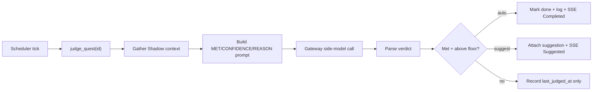

The quests engine (`apps/core/src/quests/`) is a todo list where each item carries a natural-language
*completion condition*. On a schedule, the engine gathers what you have recently been doing from
Shadow's always-on context and asks a judge model whether the task looks finished. Depending on the
configured detection mode it either *suggests* completion (a chip you confirm) or *auto-completes*
the quest outright. A quest decides what runs and when, so it lives in Core; the judge model call
routes through the Gateway like every other model call.

This is the [website monitoring](/docs/core/website-monitoring) pattern applied to personal tasks
instead of URLs: a SQLite store holds the cross-run state, each open quest rides the shared
[scheduler](/docs/core/scheduler) tick loop, and every transition into a "done" verdict is broadcast
over SSE (the desktop quests page + the island completion chip).

<Callout type="warn">
Detection depends on Shadow. `gather_context` (`apps/core/src/quests/mod.rs`) calls the
`shadow__recent_context` and `shadow__semantic_search` MCP tools; when Shadow is unavailable or has
captured nothing, a judge pass is skipped (no judging on an empty context). Shadow's own capture is
Windows-first (see [Meeting Notes](/docs/core/meeting-notes) for that caveat), so on a machine
without a working Shadow surface, quests degrade to a plain manual todo list.
</Callout>

## Where the work happens



| Concern | Owner | Reason |
|---|---|---|
| The detection loop (what runs, when) | Core `quests/` | Orchestration lives in Core |
| Recent-activity + semantic evidence | Shadow, via the [MCP registry](/docs/core/mcp-registry) | The sensor is bound to the local device |
| The judge model call | Gateway, via Core | "What is measured / paid" routes through the Gateway |

## Detection modes

`DetectionMode` (`apps/core/src/quests/mod.rs`, serde `snake_case`) controls how aggressively the
engine acts on a "done" verdict. It is stored under the `quest-detection-mode` preference and read on
every pass.

| `mode` | Behavior |
|---|---|
| `off` | No auto-detection; quests are a plain manual todo list |
| `suggest` | Only ever suggest completion (a chip you confirm); never auto-complete |
| `auto_high` | Auto-complete on a high-confidence verdict, otherwise suggest |
| `auto_all` | Auto-complete on any verdict above the confidence floor |

<Callout type="info">
When the preference is unset, the engine's runtime default is `auto_high` (`DetectionMode::default()`
in `detection_mode()`), so a fresh install auto-completes tasks it is confident about and falls back
to a suggestion for the rest. Note the parser is separately lenient: `DetectionMode::from_pref` maps
any unrecognized string to `suggest`, so only a stored garbage value (never an absent one) lands on
`suggest`.
</Callout>

The thresholds are constants in `mod.rs`, listed below.

| Constant | Value | Meaning |
|---|---|---|
| `CONFIDENCE_FLOOR` | 50 | Below this, a "done" verdict is ignored as noise |
| `HIGH_CONFIDENCE` | 85 | At/above this, `auto_high` auto-completes rather than suggests |
| `CONTEXT_MINUTES` | 15 | Minutes of recent activity the judge sees |
| `DISMISS_SNOOZE_SECS` | 3600 | After a dismissed suggestion, skip judging this quest for an hour |
| `MAX_EVIDENCE_CHARS` | 4000 | Cap on gathered evidence handed to (and stored with) the judge |

## Data model

The `Quest` struct (`apps/core/src/quests/mod.rs`) carries the task plus its rollup / detection
state.

| Field | Notes |
|---|---|
| `id`, `title`, `detail` | Identity and description |
| `completion_condition` | The natural-language condition the judge evaluates; empty falls back to `title` (see `Quest::condition`) |
| `status` | `QuestStatus` - `open` (judged each tick), `done`, or `dismissed` (never judged again) |
| `completion_source` | `manual` or `detected`, set when the quest is completed |
| `last_judged_at`, `completed_at` | Timestamps |
| `snoozed_until` | While set, judging is skipped until it elapses (set on a dismissed suggestion) |
| `suggestion` | The current pending `Suggestion` (confidence, reason, evidence snippet), if awaiting your confirmation |

`Suggestion` and the completion event carry a 0-100 `confidence`, a one-line `reason`, and a short
evidence snippet so you can sanity-check what the judge saw.

## The judge

One detection pass (`QuestEngine::judge_quest`) is a no-op (returns `Ok(None)`) when the quest is not
open, is snoozed, detection is `off`, or there is no context to judge. Otherwise it:

1. Gathers evidence from Shadow - a `shadow__recent_context` summary of the last 15 minutes plus a
   `shadow__semantic_search` keyed on the quest condition - combined and truncated to
   `MAX_EVIDENCE_CHARS`. The `available: false` graceful-degrade envelope is treated as no context.
2. Resolves the judge model (pref `quest-judge-model` → env `RYU_QUEST_JUDGE_MODEL` →
   `RYU_DEFAULT_LLM_MODEL` → the bundled local default) and effort (pref `quest-judge-effort` → env
   `RYU_QUEST_JUDGE_EFFORT`). Nothing is hardcoded to a remote provider.
3. Calls the Gateway (`POST /v1/chat/completions`, non-streaming) with a strict prompt asking for
   exactly three lines. This is the same side-model path [goals](/docs/core/goals),
   [side questions](/docs/core/side-questions), and [double-check](/docs/core/double-check) use.
4. Parses the reply into a `Verdict` of met + confidence + reason, then acts per the detection mode.

The judge is asked to answer in a fixed three-line shape:

```
MET: yes or no
CONFIDENCE: an integer from 0 to 100
REASON: one short sentence citing the evidence
```

`parse_verdict` is defensive - an unreadable reply is treated as not-met with zero confidence, so the
engine never auto-completes on garbage. A messy line like `CONFIDENCE: 130%` is clamped to 100.

### Acting on a verdict

A verdict that is not met, or is below `CONFIDENCE_FLOOR`, only updates `last_judged_at`. A met
verdict above the floor either auto-completes or suggests:

- `auto_all` always auto-completes; `auto_high` auto-completes only at/above `HIGH_CONFIDENCE`;
  `suggest` never auto-completes.
- Auto-complete sets `status = done`, `completion_source = detected`, appends a `detections` row with
  disposition `auto_completed`, and broadcasts `QuestEvent::Completed { auto: true }`.
- A suggestion attaches to the quest and broadcasts `QuestEvent::Suggested`, but re-broadcast is
  suppressed when an equivalent suggestion (same confidence + reason) already exists, so a repeating
  verdict does not re-spam the chip each tick.

## Storage

The `QuestStore` (`apps/core/src/quests/store.rs`) persists to SQLite at `~/.ryu/quests.db` with two
tables.

| Table | Holds |
|---|---|
| `quests` | The quest definitions (the full `Quest` as embedded JSON, plus `created_at` / `updated_at`) |
| `detections` | An append-only log of every judge "looks done" event: `confidence`, `reason`, a short evidence snippet, and a `disposition` (`suggested` / `auto_completed`) so the history of *why* a quest was flagged survives |

A Tokio broadcast channel fans freshly-changed quests out to SSE subscribers, mirroring
[monitors](/docs/core/website-monitoring) and [meetings](/docs/core/meeting-notes).

## Scheduler tie-in

A quest does not run its own loop. Each *open* quest is mirrored by a scheduled job with the
deterministic id `quest-<id>` and target `JobTarget::Quest` (`apps/core/src/server/quests_api.rs`,
`sync_backing_job`), so it rides the same tick loop as monitors and workflows. The job is enabled
only while the quest is open; completing, dismissing, or deleting a quest re-syncs or removes it. When
the job fires, the scheduler reads the process-global engine (`crate::quests::global_engine()`) and
calls `judge_quest`.

The interval resolves from the `quest-detection-interval` preference → env `RYU_QUEST_INTERVAL` → the
`2m` default, and must parse as a humantime duration. See [Scheduler](/docs/core/scheduler) for the
tick loop itself.

## Routes

All routes are under `/api/quests` (`apps/core/src/server/quests_api.rs`).

| Method + path | Purpose |
|---|---|
| `GET /api/quests` | List all quests, newest first |
| `POST /api/quests` | Create a quest and its backing detection job |
| `GET /api/quests/:id` | One quest |
| `PUT /api/quests/:id` | Edit title / detail / completion condition |
| `DELETE /api/quests/:id` | Remove a quest, its detection history, and its job |
| `POST /api/quests/:id/judge` | Run one detection pass immediately |
| `POST /api/quests/:id/complete` | Mark done (manual check-off) |
| `POST /api/quests/:id/dismiss` | Abandon the quest entirely (never judged again) |
| `POST /api/quests/:id/suggestion/accept` | Confirm a pending detection (completes it as `detected`) |
| `POST /api/quests/:id/suggestion/dismiss` | Reject the pending suggestion but keep the quest open (snoozes judging for an hour) |
| `GET /api/quests/events` | SSE feed of quest events (suggested / completed / updated / deleted) |
| `GET /api/quests/detection-config` | Read the detection mode, judge model, effort, and interval |
| `PUT /api/quests/detection-config` | Set the detection mode + judge model + effort + interval |

## Related

<Cards>
  <DocCard href="/docs/core/website-monitoring" />
  <DocCard href="/docs/core/approvals" />
  <DocCard href="/docs/core/scheduler" />
</Cards>
