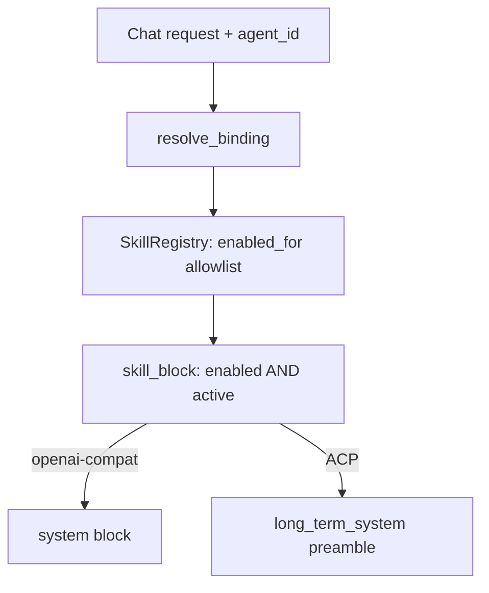

Skills are Agent Skills (a `SKILL.md` plus optional resource files) that inject
instructions into a chat turn. Core owns the whole pipeline in
`apps/core/src/skills_catalog/` and `apps/core/src/skills/`: it browses the public
[skills.sh](https://skills.sh) directory, installs into the universal Agent Skills
layout shared with Claude Code, tracks which skills are active, and injects the
filtered skill block into every request on both chat planes.

This page is the reference for the catalog, the install layout, the installed-vs-active
model, and the per-agent allowlist. For the desktop walkthrough, see
[Skills](/docs/using-ryu/skills).

## Routes

| Route | Purpose |
|---|---|
| `GET /api/skills/catalog` | Search skills.sh (`query`, `limit`, `installed_only`); featured-merged default |
| `GET /api/skills/catalog/detail` | Detail by `id=owner%2Frepo%2Fslug`: `SKILL.md` docs, front-matter description, file list |
| `POST /api/skills/catalog/install` | Install `{ id }` into the universal layout, hot-reload, mark active |
| `POST /api/skills/install-from-source` | Install `{ source }` from a direct source reference |
| `GET /api/skills` | List installed skills with their enabled state |
| `POST /api/skills/activate` | Toggle injection: `{ id, active }` |

The catalog uses the **anonymous** endpoints the official CLI uses
(`GET https://skills.sh/api/search`, `/api/download/<owner>/<repo>/<slug>`). The
documented `/api/v1` path needs a Vercel OIDC token and is deliberately not used.

## Install layout (shared with Claude Code)

Install writes the skill in the universal Agent Skills layout under
`~/.claude/skills/<slug>/SKILL.md`, plus any bundled resource files
(path-traversal guarded). This is the same directory Claude Code and the skills CLI
read, so a Ryu-installed skill is usable by those agents too, and any skill they
install shows as installed in Ryu.

The install directory is the "nothing hardcoded" knob - default `~/.claude/skills`,
overridable via `RYU_SKILLS_DIR`.

`SkillRegistry::scan_skill_dir` (`apps/core/src/skills/mod.rs`) is the single source
of truth for what is on disk. It loads both the universal layout and the legacy flat
`<slug>.md` form. `SkillRegistry::load` runs a one-time best-effort migration of any
old `~/.ryu/skills/*.md` file into the standard layout.

<Callout type="info">
Because `~/.claude/skills` is shared, "installed" in Ryu means "present on disk for
any agent that reads this directory", not "Ryu downloaded it".
</Callout>

## Installed is not active

The openai-compat default route injects every enabled skill body into one system
block with no cap, and the shared directory can hold dozens of skills. Injecting all
of them would overflow a local model's context, so a Ryu-owned activation set gates
injection.

- The activation set lives in `~/.ryu/skills-active.json` (override
  `RYU_SKILLS_ACTIVE_FILE`).
- Skills installed through Ryu, plus migrated legacy skills, are **active**.
- Bulk-discovered shared-directory skills are visible and installed but **inactive**
  until toggled via `POST /api/skills/activate { id, active }`.
- `SkillRegistry::reload()` sets `SkillRecord.enabled = front_matter_enabled && active`,
  so a skill injects only when its front matter enables it **and** it is active.

The desktop surfaces this as a Switch on the Skills page (`SkillsCatalogSection`),
backed by `GET /api/skills` and `POST /api/skills/activate`.

## Per-agent allowlist

Each agent carries a `skills: Vec<String>` allowlist (`AgentRecord.skills` in
`~/.ryu/agents.db`):

- **Empty allowlist** - all enabled skills inject.
- **Non-empty allowlist** - the intersection with the globally enabled set injects. The
  allowlist never re-activates a skill that is globally inactive.

`SkillRegistry::{enabled_for, skill_block, inject_into_messages_filtered}`
(`apps/core/src/skills/mod.rs`) is the shared source of truth, resolved per request
from the agent record via `resolve_binding` (`apps/core/src/sidecar/adapters/mod.rs`).
Edit the allowlist in the desktop AgentEditPage skill picker (an empty selection means
all enabled).

## Both-plane injection

Injection runs on both chat planes from the same filtered skill block:

| Plane | Where it injects |
|---|---|
| openai-compat | A filtered system block prepended to the request |
| ACP | The same filtered block folded into the prompt preamble via `long_term_system` in `build_acp_prompt` |

This means the flagship `ryu` (acp:pi) agent and other ACP agents get skills too, not
just the openai-compat route. `long_term_system` is the same seam memory recall and
auto-recall use, so both planes inherit it.

<Callout type="warn">
Known tradeoff: an ACP agent that self-reads `~/.claude/skills` (for example Claude
Code) now also receives the injected preamble, so an active skill can appear twice for
it. The flagship Pi does not self-read, so for `ryu` injection is the only path and
there is no doubling. Skipping injection for self-reading ACP agents is a tracked
follow-up.
</Callout>

## Related

<Cards>
  <DocCard href="/docs/using-ryu/skills" />
  <DocCard href="/docs/core/memory" />
  <DocCard href="/docs/using-ryu/user-guide/agents" />
  <DocCard href="/docs/core/model-catalog" />
</Cards>

<TryInRyu page="skills" />
