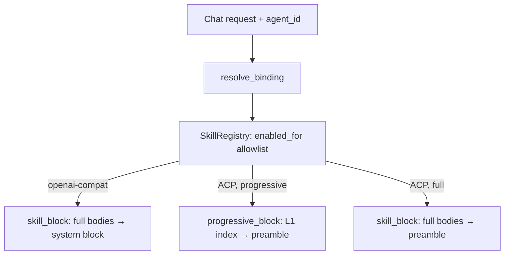

Skills are Agent Skills (a `SKILL.md` plus optional resource files) that inject
instructions into a chat turn. Core owns the whole pipeline in
`apps/core/src/skills_catalog/` and `apps/core/src/skills/`: it browses the public
[skills.sh](https://skills.sh) directory, installs into the universal Agent Skills
layout shared with Claude Code, tracks which skills are active, and injects the
filtered skill block into every request on both chat planes.

This page is the reference for the catalog, the install layout, the installed-vs-active
model, and the per-agent allowlist. For the desktop walkthrough, see
[Skills](/docs/desktop/skills).

## Routes

| Route | Purpose |
|---|---|
| `GET /api/skills/catalog` | Search skills.sh (`query`, `limit`, `installed_only`); featured-merged default |
| `GET /api/skills/catalog/detail` | Detail by `id=owner%2Frepo%2Fslug`: `SKILL.md` docs, front-matter description, file list |
| `POST /api/skills/catalog/install` | Install `{ id }` into the universal layout, hot-reload, mark active |
| `POST /api/skills/install-from-source` | Install `{ source }` from a direct source reference |
| `GET /api/skills` | List installed skills with their enabled state |
| `POST /api/skills/activate` | Toggle injection: `{ id, active }` |

The catalog uses the **anonymous** endpoints the official CLI uses
(`GET https://skills.sh/api/search`, `/api/download/<owner>/<repo>/<slug>`). The
documented `/api/v1` path needs a Vercel OIDC token and is deliberately not used.

## Install layout (shared with Claude Code)

Install writes the skill in the universal Agent Skills layout under
`~/.claude/skills/<slug>/SKILL.md`, plus any bundled resource files
(path-traversal guarded). This is the same directory Claude Code and the skills CLI
read, so a Ryu-installed skill is usable by those agents too, and any skill they
install shows as installed in Ryu.

The install directory is the "nothing hardcoded" knob - default `~/.claude/skills`,
overridable via `RYU_SKILLS_DIR`.

`SkillRegistry::scan_skill_dir` (`apps/core/src/skills/mod.rs`) is the single source
of truth for what is on disk. It loads both the universal layout and the legacy flat
`<slug>.md` form. `SkillRegistry::load` runs a one-time best-effort migration of any
old `~/.ryu/skills/*.md` file into the standard layout.

<Callout type="info">
Because `~/.claude/skills` is shared, "installed" in Ryu means "present on disk for
any agent that reads this directory", not "Ryu downloaded it".
</Callout>

## Installed is not active

The openai-compat default route injects every enabled skill body into one system
block with no cap, and the shared directory can hold dozens of skills. Injecting all
of them would overflow a local model's context, so a Ryu-owned activation set gates
injection. (On the ACP plane this is further reduced by
[progressive disclosure](#progressive-disclosure), which injects only a short index
and loads bodies on demand.)

- The activation set lives in `~/.ryu/skills-active.json` (override
  `RYU_SKILLS_ACTIVE_FILE`).
- Skills installed through Ryu, plus migrated legacy skills, are **active**.
- Bulk-discovered shared-directory skills are visible and installed but **inactive**
  until toggled via `POST /api/skills/activate { id, active }`.
- `SkillRegistry::reload()` sets `SkillRecord.enabled = front_matter_enabled && active`,
  so a skill injects only when its front matter enables it **and** it is active.

The desktop surfaces this as a Switch on the Skills page (`SkillsCatalogSection`),
backed by `GET /api/skills` and `POST /api/skills/activate`.

## Per-agent allowlist

Each agent carries a `skills: Vec<String>` allowlist (`AgentRecord.skills` in
`~/.ryu/agents.db`):

- **Empty allowlist** - all enabled skills inject.
- **Non-empty allowlist** - the intersection with the globally enabled set injects. The
  allowlist never re-activates a skill that is globally inactive.

`SkillRegistry::{enabled_for, skill_block, inject_into_messages_filtered}`
(`apps/core/src/skills/mod.rs`) is the shared source of truth, resolved per request
from the agent record via `resolve_binding` (`apps/core/src/sidecar/adapters/mod.rs`).
Edit the allowlist in the desktop AgentEditPage skill picker (an empty selection means
all enabled).

## Both-plane injection

Injection runs on both chat planes from the same filtered skill set:

| Plane | Where it injects | What it injects |
|---|---|---|
| openai-compat | A filtered system block prepended to the request | Full skill bodies (always — its default fast path has no tool loop) |
| ACP | Folded into the prompt preamble via `long_term_system` in `build_acp_prompt` | The L1 index by default ([progressive disclosure](#progressive-disclosure)); full bodies in `full` mode or for `always-on` skills |

This means the flagship `ryu` (acp:pi) agent and other ACP agents get skills too, not
just the openai-compat route. `long_term_system` is the same seam memory recall and
auto-recall use, so both planes inherit it.

<Callout type="warn">
Known tradeoff: an ACP agent that self-reads `~/.claude/skills` (for example Claude
Code) now also receives the injected preamble, so an active skill can appear twice for
it. The flagship Pi does not self-read, so for `ryu` injection is the only path and
there is no doubling. Skipping injection for self-reading ACP agents is a tracked
follow-up.
</Callout>

## Progressive disclosure

Injecting every enabled skill's full instructions into every prompt is the heaviest
cost on a low-context local model. Progressive disclosure follows the Agent Skills
standard instead: only a skill's name and description are in context up front (L1), and
the model loads a skill's full instructions (L2) on demand, when it decides the skill is
relevant. This is **on by default**.

### The `skills` tool server

A built-in tool server (`apps/core/src/sidecar/mcp/skills_tool.rs`, a reserved server
like `web_fetch` and `threads`) exposes two tools through the same catalog and
`tool_search` plumbing as every other tool:

| Tool | Purpose |
|---|---|
| `skills__search { query }` | Find skills by task. Returns ranked `{ id, name, description }`. |
| `skills__load { id }` | Return a skill's full `instructions`. |

A loaded skill's instructions come back as the **tool result** — the result *is* the
injection. The model reads it and follows it for the rest of the turn, the same
mechanism as Claude Code's Skill tool. A skill stays instruction text, not a callable
function; the tool server only borrows the discovery mechanism.

### What gets injected up front

In progressive mode, instead of `skill_block`'s full bodies, the ACP preamble carries
the **L1 index** built by `SkillRegistry::progressive_block`
(`apps/core/src/skills/mod.rs`): one `- <id> — <name>: <description>` line per
enabled-and-allowed skill (capped at 20; beyond that the model is pointed at
`skills__search`), plus a one-line instruction to call `skills__load` before using a
skill.

### ACP only, by design

Progressive disclosure is applied on the **ACP plane only**, because that is the one
plane with a guaranteed tool loop (the MCP bridge) where the model can actually call
`skills__load`. The **openai-compat plane keeps full injection** — its default fast path
offers no tools, so on-demand loading there would leave the model with no way to reach a
skill. The plane is the signal; there is no separate capability probe. The flagship
low-context target, `ryu` (acp:pi), is an ACP agent, so it gets the benefit.

### Mode and the always-on escape hatch

- Global mode is the `skills-disclosure` preference (`progressive`, the default, or
  `full`), with env seed `RYU_SKILLS_DISCLOSURE` and the process-global flag
  `skills::is_progressive_disclosure()` set per chat request from the pref.
- Desktop toggle: **Settings → Memory → "Load skills on demand"**.
- A skill can opt out of progressive loading with front-matter `always-on: true`
  (`SkillRecord.always_on`): its full body is injected up front regardless of mode — the
  escape hatch for a critical skill or a model you do not trust to self-load.

<Callout type="warn">
v1 limits: `skills__load` and `skills__search` operate over the globally-enabled skill
set — the per-agent allowlist scopes what the model *sees* in the L1 index, not what the
tool can load. An agent that carries a restricted tool allowlist must include `skills__*`
in it. The per-skill always-on control is front-matter only (no desktop toggle yet).
</Callout>

## Autonomous skill authoring

An agent can write its own skill. The `skills__author` tool
(`apps/core/src/sidecar/mcp/skills_tool.rs`, the same reserved server as `skills__search` and
`skills__load`) renders a structured `SKILL.md` with four fixed sections (Purpose, Procedure,
Failure modes, Verification) into the universal layout at `~/.claude/skills/<slug>/SKILL.md`. The
self-authored skill is immediately discoverable by the existing `skills__search` / `skills__load`
plumbing and the per-agent allowlist, and calling `author` again on the same slug refines it in
place.

`do_author` is fail-closed at every step:

1. `sanitize_slug` reduces the name to a single safe path segment and fails closed on `../`,
   absolute, UNC, or drive-qualified inputs.
2. `render_skill_md` serializes quoted YAML front matter (via `serde_yml`) plus the four body
   sections.
3. The rendered document is pre-parsed through `crate::skills::parse_skill_md` as a round-trip
   guard: if it does not parse back, nothing is written.
4. The file is written atomically (temp file plus rename, mirroring the catalog installer), then the
   skill is activated (`set_active(slug, true)`) and the registry reloads.

The result is `{ ok, id, path, refined }`.

<Callout type="warn">
  Authoring is gated **off by default** behind `RYU_SKILLS_AUTHOR` (truthy `1`/`true`/`yes`/`on`),
  matching the module's existing `RYU_SKILLS_DIR` / `RYU_SKILLS_ACTIVE_FILE` env idiom. When unset,
  `skills__author` is neither listed by `tools()` nor callable: `do_author` returns
  `{ ok: false, available: false }` and writes nothing. The read-only `skills__search` and
  `skills__load` stay ungated; only `author` has file side effects, so only `author` is opt-in.
</Callout>

## Related

<Cards>
  <DocCard href="/docs/desktop/skills" />
  <DocCard href="/docs/core/unified-tool-catalog" />
  <DocCard href="/docs/core/memory" />
  <DocCard href="/docs/desktop/user-guide/agents" />
  <DocCard href="/docs/core/model-catalog" />
</Cards>

<TryInRyu page="skills" />
