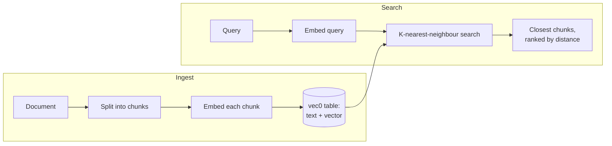

A **Space** is a document collection used for retrieval-augmented generation (RAG). Attach a Space to
an agent and it can pull relevant passages from your documents to ground its answers, instead of
relying on the model's training alone. Spaces live entirely in Core
(`apps/core/src/server/spaces.rs`), backed by sqlite-vec.

## Retrieval modes

Each Space has a `retrieval_mode`, and nothing is hardcoded.

- **Vector** (default) - K-nearest-neighbour search over embeddings stored in a `vec0` virtual
  table. Results are ranked by distance, lower being closer.
- **Graph** (GraphRAG) - on ingest, Core extracts entities and relations into graph tables; on
  search, it matches entities and traverses the graph.

## Embeddings

Embeddings are a swappable default. Core can embed in two ways
(`apps/core/src/server/retrieval.rs`):

- **Local** - a deterministic, dependency-free embedder, or the local llama.cpp embedding sidecar
  (`llamacpp-embed` on `:8081`, see [Engines](/docs/desktop/engines/chat-engines)) which serves the bundled
  nomic embedding model for real semantic vectors.
- **Remote** - any OpenAI-compatible embeddings endpoint, configured through the registry
  (`RYU_EMBED_BASE_URL` and related fields).

`Embedder::from_registry` resolves the strategy, defaulting to the local embedding server so RAG
works on install with no setup.

## Working with Spaces

| Action | Endpoint |
|---|---|
| List Spaces | `GET /api/spaces` |
| Create a Space | `POST /api/spaces` |
| Delete a Space | `DELETE /api/spaces/:id` |
| List documents | `GET /api/spaces/:id/documents` |
| Ingest a document | `POST /api/spaces/:id/documents` |
| Search within a Space | `POST /api/spaces/:id/search` |

Ingesting a document splits it into chunks, embeds each chunk, and stores both the text and the
vector. A search embeds the query and returns the closest chunks (`ChunkMatch`), each with its
`chunk_id`, `document_id`, `content`, and `distance`.

## Unified retrieval

Beyond per-Space search, Core exposes one retrieval endpoint that spans both Spaces and encrypted
[memory](/docs/core/memory).

- `POST /api/retrieval/index` adds a chunk to retrieval.
- `POST /api/retrieval/search` searches across memory and selected Spaces, with options for
  `top_k`, `space_ids`, `include_memory`, and a `min_score` threshold.

This is the path the desktop and other clients use to surface relevant context during a chat.
