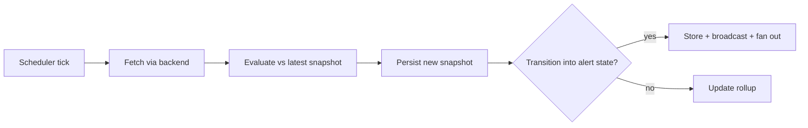

The monitors engine (`apps/core/src/monitors/`) watches a URL on a schedule and alerts when a
watched signal *transitions* into an alert state. A monitor decides what runs and when, so it lives
in Core. Each check fetches the page, extracts one signal, and compares it against the latest
**snapshot** - the cross-run state that makes a monitor more than a one-shot fetch.

For the desktop how-to (creating a monitor, choosing a check type, wiring notifications), see
[Monitors](/docs/using-ryu/productivity/monitors). This page documents the engine internals.

<TryInRyu page="monitors" />

## Pipeline

Each scheduled tick (or a manual `POST /api/monitors/:id/run`) runs `MonitorEngine::run_monitor`
(`apps/core/src/monitors/mod.rs`):

The load-bearing idea is the **transition**: a check only alerts on the *change* into the alert
state, never every interval it remains there. A site that has been down for an hour fires one
"Site down" alert, not one per tick.

## Check types

`CheckType` (`apps/core/src/monitors/mod.rs`, serde tag `type`) is the extensible check-type
registry. Adding a type is a new variant plus a match arm.

| `type` | Watches | Key fields | Snapshot `value` |
|---|---|---|---|
| `uptime` | Reachability | `expect_status` (empty = any 2xx/3xx counts as up) | `up` / `down` |
| `keyword` | A substring or regex in page text | `pattern`, `is_regex`, `case_sensitive`, `alert_when_present` | `present` / `absent` |
| `content_diff` | Any change to (optionally scoped) page text | `region_regex` (capture group 1 scopes the watched region) | char count (hash stored separately) |
| `price` | A numeric value crossing a rule | `extract_regex` (group 1 is the number), `comparator`, `threshold` | the parsed number |
| `stock` | Availability by phrase | `in_stock_pattern`, `is_regex`, `alert_when_in_stock` | `in_stock` / `out_of_stock` |

### Price comparators

`price` checks compare the extracted number against the previous snapshot via `NumComparator`:

| `comparator` | Alerts when | Uses `threshold` |
|---|---|---|
| `changed` | The value differs from the previous one | no |
| `less_than` | The value crosses below `threshold` | yes |
| `greater_than` | The value crosses above `threshold` | yes |
| `drops_by_pct` | The value drops by at least `threshold` percent | yes |
| `rises_by_pct` | The value rises by at least `threshold` percent | yes |

The number parser (`parse_number`) strips currency symbols and thousands separators, keeping
digits, a single `.` decimal point, and a leading minus.

<Callout type="warn">
The price parser treats `.` as the decimal point and is not locale-aware: a European
comma-decimal value (`1.299,00`) is not handled in v1. Use an `extract_regex` that captures a
dot-decimal number.
</Callout>

## Fetch backends

`FetchBackend` (`apps/core/src/monitors/mod.rs`) selects where the page comes from. The default is
`http`.

| `backend` | How it fetches | Notes |
|---|---|---|
| `http` | A plain `reqwest` GET (30s timeout) | Fast; no JavaScript rendering |
| `spider` | The Spider crawler via `mcp.call_tool("spider__crawl", ...)` | For sites that need a real crawl |
| `agentbrowser` | Not integrated | Returns a clear error so the surface exists without pretending to work |

<Callout type="warn">
The `agentbrowser` backend is a deliberate stub - it returns an error directing you to `http` or
`spider`. The `spider` backend requires the Spider tool to be available in the
[MCP registry](/docs/core/mcp-registry); when it is not, the check fails with the tool's own reason.
</Callout>

`uptime` is special: a fetch failure *is* the signal (it means "down"), so it evaluates the fetch
result directly rather than short-circuiting to an `error` status. Every other check type returns
`error` (no alert) when the fetch fails.

## Snapshots and storage

Every check persists a `Snapshot` row (`apps/core/src/monitors/store.rs`, `~/.ryu/monitors.db`),
and the next check reads back the latest one as its baseline. Four tables back the engine:

| Table | Holds |
|---|---|
| `monitors` | The watched-site definitions (url, check type, interval), each stored as JSON |
| `snapshots` | One row per check: status, http status, latency, value, content hash, note |
| `alerts` | Change events surfaced to the user |
| `push_tokens` | Expo push tokens registered by mobile devices |

Each snapshot carries a `CheckStatus` of `ok` (checked, no alert), `triggered` (an alert condition
was met), or `error` (the check could not complete). For `content_diff`, the comparison baseline is
the SHA-256 `content_hash` of the normalized text, not the `value`. The monitor row also keeps a
rollup (`last_check_at`, `last_status`, `last_value`) updated after each check.

## Notification fan-out

When a check trips an alert, the alert is inserted and broadcast over a Tokio broadcast channel
that the SSE endpoint subscribes to (the desktop in-app feed plus OS toast). On top of that,
`notify::notify_all` (`apps/core/src/monitors/notify.rs`) sends to every per-monitor
`NotifyTarget`, plus all globally registered Expo push tokens.

| `NotifyTarget` (`kind`) | Sends to | Mechanism |
|---|---|---|
| `webhook` | Slack / Discord incoming webhooks or any HTTP endpoint | A JSON POST carrying both `text` and `content` plus the structured `alert` |
| `telegram` | A Telegram chat | `sendMessage` via the Bot API (`bot_token`, `chat_id`) |
| `expo_push` | A specific Expo push token | The Expo push API, in addition to globally registered devices |

Every send is best-effort: a failing target logs a warning and never blocks the check or the other
targets. The `NotifyTarget` enum is extensible - adding a Slack or Discord bot-token target later is
the same shape.

## Scheduler tie-in

A monitor does not run its own loop. Creating or updating a monitor writes a backing scheduled job
(`apps/core/src/server/monitors_api.rs`, `sync_backing_job`) with the deterministic id
`monitor-<id>` and `JobTarget::Monitor`, so it rides the same tick loop as workflows and agents.
The interval string maps to a scheduler `Schedule`: a humantime duration (`5m`, `1h`) becomes
`Every`, otherwise it is treated as a cron expression. Disabling a monitor disables (keeps) the job;
deleting a monitor removes the job, its snapshots, and its alerts.

When the job fires, the scheduler reads the process-global engine
(`crate::monitors::global_engine()`, published once in `main.rs`) and calls `run_monitor`. See
[Scheduler](/docs/core/scheduler) for the tick loop itself.

## Routes

All routes are under `/api/monitors` (`apps/core/src/server/monitors_api.rs`).

| Method + path | Purpose |
|---|---|
| `GET /api/monitors` | List all monitors (newest first) |
| `POST /api/monitors` | Create a monitor and its backing job |
| `GET /api/monitors/:id` | One monitor |
| `PUT /api/monitors/:id` | Replace a monitor's definition |
| `DELETE /api/monitors/:id` | Remove a monitor, its history, and its job |
| `POST /api/monitors/:id/run` | Run one check immediately, return the status |
| `GET /api/monitors/:id/snapshots?limit=N` | Recent check history |
| `GET /api/monitors/:id/alerts` | Alerts for one monitor |
| `GET /api/monitors/alerts?limit=N` | The global alert feed |
| `GET /api/monitors/alerts/stream` | SSE feed of new alerts as they fire |
| `POST /api/monitors/alerts/:id/ack` | Acknowledge an alert |
| `POST /api/monitors/push-tokens` | Register a mobile Expo push token |
| `DELETE /api/monitors/push-tokens/:token` | Unregister a push token |

## Caveats

<Callout type="warn">
The mobile notification path uses Expo push tokens registered by the native app
(`POST /api/monitors/push-tokens`). The native screen lists monitors and alerts and registers the
token, but it needs `expo-notifications` / `expo-device` installed and a device build, per ground
truth. Desktop and webhook/Telegram delivery do not depend on it.
</Callout>

<Callout type="info">
The engine path (real fetch -> snapshot -> transition alert -> SSE event -> rollup, plus backing
job create/delete) is verified end-to-end against a live Core. Use `POST /api/monitors/:id/run` to
exercise a check without waiting for the next tick.
</Callout>

## Related

<Cards>
  <DocCard href="/docs/using-ryu/productivity/monitors" />
  <DocCard href="/docs/core/scheduler" />
  <DocCard href="/docs/core/mcp-registry" />
</Cards>
