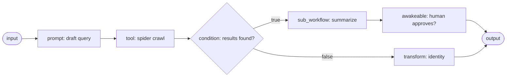
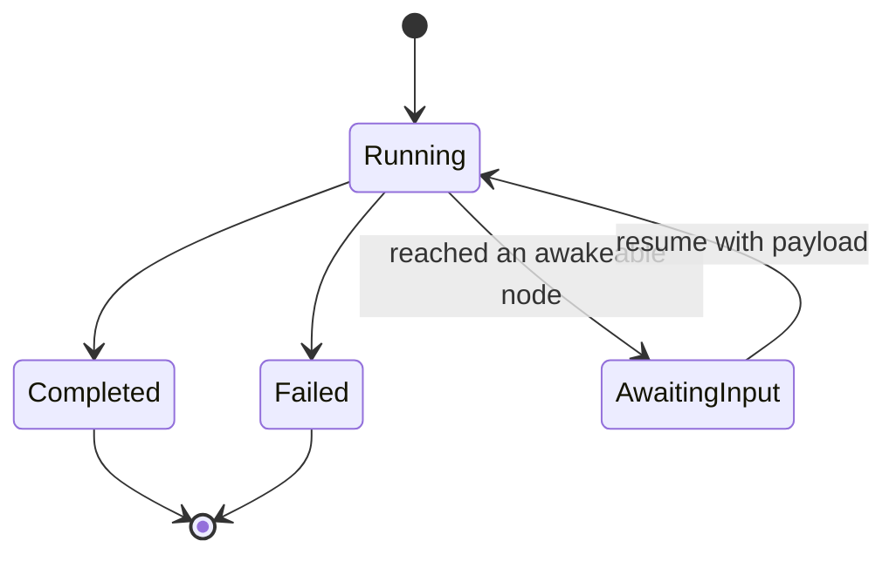

A **workflow** is a directed acyclic graph (DAG) of typed nodes that Core executes in process
(`apps/core/src/workflow/`). Workflows are Runnables (see [The Runnable model](/docs/start-here/architecture/runnable-model)):
an agent can invoke a workflow as a named tool, and a workflow can call agents as steps. The engine
is file backed and resumable: every node and every loop iteration is checkpointed to disk, so a run
survives a Core restart.

This page is the engine reference. To build a workflow visually or record desktop steps into one,
see [Recipes and the canvas](/docs/desktop/productivity/recipes). To author a workflow as a
Runnable in code, see [Authoring workflows](/docs/develop/extensions/author-workflows).

## Node kinds

A workflow is a set of `WorkflowNode` entries connected by `WorkflowEdge` edges
(`apps/core/src/workflow/mod.rs`). An edge can carry an optional `branch` label, so a `Condition`
or one-shot `While` routes down a true or false path. `NodeKind` is a tagged enum (`type`,
snake_case) with 22 variants:

| Node (`type`) | What it does | Key fields |
|---|---|---|
| `input` | Reads the run's input value | - |
| `output` | Writes the run's output value | - |
| `prompt` | Calls a model with a template, optionally routed to an `agent_id`; the Agent node in the canvas wires to this kind | `prompt`, `agent_id?` |
| `condition` | Branches on a boolean expression, following the true or false edge | `expr` |
| `transform` | A pure data op (uppercase, lowercase, trim, json_parse, template, identity) | `op`, `template?` |
| `tool` | Invokes a Core tool by its fully qualified id `<server>__<tool>` (for example `spider__crawl`) | `name`, `args` |
| `mcp` | The explicit two-field form of `tool` - names an MCP `server` and `tool` separately, joined into `<server>__<tool>` before the call | `server`, `tool`, `args` |
| `webhook` | POSTs the resolved value to an external URL | `url` |
| `set_state` | Writes a resolved template into the run's `state` map, then passes input through unchanged | `key`, `value` |
| `delay` | Pauses for `ms` milliseconds (a durable timer, see below) | `ms` |
| `note` | A documentation-only annotation that forwards its input unchanged | `text` |
| `while` | A bounded loop or a one-shot branch gate (see [While loops](#while-loops)) | `expr`, `body_workflow_id?` |
| `guardrails` | Routes the incoming text through the Gateway firewall and fails the run on a block | `checks` |
| `sub_workflow` | Runs another persisted workflow by id and forwards its output (max depth 8) | `workflow_id` |
| `agent_delegate` | Fans out to sub-agents with caps (see [Delegation](/docs/core/delegation)) | - |
| `agent` | Runs one installed agent on a task as a single in-context step (the first-class alternative to a raw `prompt`) | `agent_id`, `task?` |
| `skill` | Applies an installed Agent Skill (its `SKILL.md` body) to the input, under an optional `agent_id` or the default gateway LLM | `skill`, `agent_id?`, `task?` |
| `plugin` | Runs a Runnable an installed plugin bundles, dispatched to that kind's path (tool, agent, workflow, or skill) | `plugin_id`, `runnable_id`, `args` |
| `awakeable` | A durable pause for human-in-the-loop input | - |
| `recipe` | Replays a whole recorded ghost desktop automation by name | `recipe`, `params` |
| `ghost_action` | Runs a single recorded desktop action (click, type, scroll, ...) | `action`, `target`, `params` |
| `notify_user` | Pings org/team/members across devices, optionally suspending as a HITL ack gate (see [Notify and provider steps](#notify-and-provider-steps)) | `target`, `title`, `body`, `ack_mode`, `ack_timeout_ms?` |

The `guardrails` `checks` field names the firewall categories to enforce (`pii`, `jailbreak`,
`moderation`), mapped to the Gateway firewall's scan categories server side. The `recipe` and
`ghost_action` nodes drive recorded desktop automations through the ghost engine.

### Notify and provider steps

Five of the kinds are the object-model bridge - a workflow step that runs any peer Runnable
(`AGENTS.md` Runnable union), so the graph is not limited to prompts and raw tools. `agent`, `skill`,
and `plugin` each decide *what runs* (Core), while every model call they make stays gateway-governed.
`mcp` is the two-field sibling of `tool` - an author picks a `server` and a `tool` separately instead
of hand-assembling the compound `<server>__<tool>` id, and the executor reuses the `tool` path so the
idempotency key and `input` folding behave identically
(`apps/core/src/workflow/executor.rs`, the `Mcp` arm).

`notify_user` pings one or more org members, a team, or an explicit member set across their devices
(the app inbox, the desktop OS toast, and mobile push). Its `target` is a tagged `NotifyTargetSpec`
with three forms:

| `target.kind` | Pings | Extra field |
|---|---|---|
| `org` | Every member of the node's bound organization | - |
| `team` | Every member of one team in the org | `team_id` |
| `members` | A hand-picked set of member user ids (no roster lookup) | `user_ids` |

The `ack_mode` field decides the node's shape (`AckMode` in `apps/core/src/workflow/mod.rs`). Absent
or `none` is fire-and-forget - deliver, emit a JSON receipt as the node output, and continue
downstream. Any of `first`, `all`, or `quorum` (with `n`) turns the node into a human-in-the-loop
gate - it delivers, then suspends the run to `AwaitingInput` until the ack policy is met, exactly like
an `awakeable`. Each acking member's inbox resumes the run once the threshold is reached; an optional
`ack_timeout_ms` auto-fails a stalled gate. Membership is resolved over the gateway key against the
node's bound org (the control plane owns *who is a member*).

<Callout type="warn">
  `recipe` and `ghost_action` are Windows-first and no-op with a clear error until the ghost sidecar
  is installed. See [Recipes](/docs/desktop/productivity/recipes).
</Callout>

Every node also carries two optional, orthogonal fields that any kind may use: a `retry` policy and
a `timeout_ms`. Both default to absent (run once, unbounded) and are covered under
[Reliability and durable execution](#reliability-and-durable-execution).

A graph wires these node kinds together. A `Condition` routes down a true or false path:

## Template variables

String fields can reference run data with `{{...}}` tokens, resolved just before the node runs
(`apps/core/src/workflow/template.rs`). The resolver is deliberately tiny: everything is a string,
JSON passes through verbatim, and any unknown token or missing key resolves to the empty string.

| Token | Resolves to |
|---|---|
| `{{input}}` | The node's incoming value |
| `{{nodes.<id>}}` | The output string of an upstream node |
| `{{state.<key>}}` | A value from the run's `state` map (written by `set_state`) |
| `{{trigger.<field>}}` | A dotted JSON path into the trigger payload, for example `{{trigger.body.email}}` |

The resolver runs in `prompt`, `transform` (the template op), `tool` args, `webhook` url,
`set_state`, `recipe` and `ghost_action` params, and the `condition` and `while` expression
evaluator.

## Execution and resume

The executor (`apps/core/src/workflow/executor.rs`) runs nodes in topological order, persisting each
node's state to disk after every step. Runs are stored as JSON under
`~/.ryu/workflow-runs/<id>.json`.

A run carries a `RunStatus` of `Running`, `Completed`, `Failed`, or `AwaitingInput`. When an
`awakeable` node is reached (or a `notify_user` node whose `ack_mode` requires waiting), the run
suspends to `AwaitingInput` and waits for a human or an external signal. Because node state is
persisted, a resumed run skips already-completed nodes and reuses their output.

## While loops

The `while` node has two forms, distinguished by whether `body_workflow_id` is set
(`apps/core/src/workflow/mod.rs`).

A **bounded loop** (`body_workflow_id` set) re-executes the named body workflow as long as `expr`
holds, up to `MAX_WHILE_ITERATIONS` (100, `apps/core/src/workflow/executor.rs`,
`run_while_loop`). Iteration is implemented as recursion: each iteration runs as its own
`WorkflowRun` through the same path as a `sub_workflow`, so the outer DAG never gains a cycle and DAG
validation is untouched. The loop variable, the carry, is seeded with the node's incoming value; the
condition is evaluated against the carry (use the `input` keyword, for example `input < 10`), and
each iteration's body output replaces the carry. On exit the node produces the final carry as a plain
data value. The iteration counter persists to the run `state` and is checkpointed after every
iteration, so a loop survives a Core restart and resumes from the persisted iteration.

A **one-shot branch gate** (`body_workflow_id` absent) evaluates `expr` once and activates only the
matching true or false outgoing edge, behaving like a `condition`. This is the back-compatible form.

<Callout type="warn">
  Loops are at-least-once, not exactly-once: a side-effecting body node (`tool`, `webhook`,
  `ghost_action`, `prompt`) interrupted mid-call re-runs on resume. An `awakeable` gate inside a loop
  body is rejected in v1 with a clear error; propagating a mid-loop suspend is future work. The
  on-canvas back-edge form (drawing a body to `while` edge directly) is also deferred, so v1 authors
  the loop body as a separate sub-workflow named by `body_workflow_id`.
</Callout>

## Reliability and durable execution

Durable execution lives directly on this engine (`apps/core/src/workflow/durable.rs`). The Restate
spike was evaluated and dropped: the in-process `FallbackEngine` already gives crash-recoverable,
resumable runs without an extra sidecar, and the petgraph executor owns the loop and HITL semantics.
A `DurableEngine` seam is retained so a future backend can slot in without changing the server
handler, but there is one engine today.

Every node and every loop iteration rewrites the full run state to disk through an atomic, fsync'd
temp-then-rename write (`apps/core/src/workflow/store.rs`, `save_run`), so a crash mid-write can never
leave a torn run file and a resumed run skips already-completed nodes.

On top of that checkpointing, nodes opt into Temporal- and Restate-style durability features. All are
opt-in with serde-default back-compat, so existing run and workflow JSON loads unchanged.

| Feature | Field | Behavior |
|---|---|---|
| Per-node retry | `retry` (`RetryPolicy`) | Re-runs a failed attempt with exponential backoff `min(initial * coeff^(n-1), max)` plus optional decorrelated jitter. `attempts` persists in `NodeRunState`, so the budget is total across a Core restart, per node per run |
| Per-node timeout | `timeout_ms` | Wraps one attempt in a wall-clock timeout (the Temporal `StartToClose` analogue). A timeout is a retryable error, so it composes with retry |
| Idempotency keys | (automatic) | A stable `<run_id>:<node_id>` key, identical across crash and resume, is threaded into `tool` args as `__ryu_idempotency_key` (never clobbering an author-set value) and into the `webhook` `Idempotency-Key` header |
| Durable timers | `delay` `ms` | A `delay` computes and persists a `wake_at` instant and checkpoints before sleeping, so a crash mid-sleep resumes with only the remaining time |

The `RetryPolicy` fields are `max_attempts` (default 1, so a bare `"retry": {}` is inert until
raised), `initial_interval_ms` (100), `backoff_coefficient` (2.0), `max_interval_ms` (60000),
`jitter_fraction` (0.0), and `non_retryable_errors`. An `awakeable` suspend is never treated as a
retryable error.

The `guardrails` node is the exception to Core's no-policy rule: it routes the incoming text to the
Gateway firewall (`POST /v1/firewall/check`) and fails the run on a block, because deciding what is
allowed is a [Gateway](/docs/start-here/architecture/core-vs-gateway) concern. It fails closed when
the gateway is unreachable, unless `RYU_ALLOW_GATEWAY_FALLBACK=1` is set.

In the desktop canvas, retry and timeout are edited through a shared **Reliability** section
(`ReliabilityFields` in `apps/desktop/src/components/workflows/WorkflowCanvas.tsx`): a "Retry on
failure" toggle plus the full policy editor and a "Timeout (ms)" field, shown for the fallible node
kinds (prompt, tool, webhook, agent_delegate, ghost_action, recipe, sub_workflow, guardrails, delay,
while). The fields ride the node's `extra` spread, so there is no separate API.

<Callout type="warn">
  The durability features are unit-tested (62 workflow tests green), but live crash and resume and
  the HITL `awakeable` round-trip have not been exercised against a running Core.
</Callout>

## Triggers and schedules

A workflow declares zero or more triggers in its `triggers` array (`apps/core/src/workflow/mod.rs`,
`WorkflowTrigger`). On every save, `create_workflow` reconciles those declarations into the external
resources that actually fire the workflow, idempotently, so a re-save converges to the declared set
(`apps/core/src/workflow/triggers.rs`).

| Trigger | Fires when | Reconciles into |
|---|---|---|
| `manual` | The "Run now" button or `POST /workflows/:id/run` | Nothing (no external resource) |
| `schedule` | A cron expression or `every` interval | A scheduler job with a deterministic id `wf-sched-<workflow_id>-<idx>` and target `JobTarget::Workflow` |
| `webhook` | An HTTP POST hits the workflow's public ingress URL | A status surface on the webhook-ingress seam; `secret` is the HMAC signing secret |
| `composio` | A Composio event fires | A Composio trigger subscription whose `target_kind` is `workflow` |

For a `schedule` trigger, `cron` wins when both `cron` and `every` are present, and a trigger with
neither is skipped. Stale scheduler jobs no longer backed by a trigger are deleted on reconcile, and
all of a workflow's jobs and subscriptions are torn down when the workflow is deleted. The scheduler
runs fired jobs with bounded concurrency (`MAX_CONCURRENT_JOBS = 8`), so one slow run never stalls
the tick. See [Scheduler](/docs/core/scheduler) for the job loop.

When a Composio trigger fires, the event payload is seeded into the run's reserved `state["trigger"]`
key before execution (`apps/core/src/composio_triggers/mod.rs`, `run_workflow_for_trigger`), so
`{{trigger.<field>}}` tokens resolve against the live event. Triggers are configured in the desktop
canvas through `TriggerConfig` (`apps/desktop/src/components/workflows/TriggerConfig.tsx`).

<Callout type="info">
  Composio webhook delivery depends on the public webhook-ingress backend reaching a Core node. See
  [Node and presence](/docs/core/node-and-presence) for the ingress seam.
</Callout>

## Version history

Every workflow keeps a bounded, server-backed history of past definitions under
`~/.ryu/workflow-versions/<workflow_id>/<version_id>.json` (`apps/core/src/workflow/store.rs`,
`save_workflow_version`). A version wraps a full `Workflow` snapshot plus light metadata (a `label`,
`created_at`), and lists load metadata only so the graph is not re-read for a picker. Snapshots are
created manually with a "Save version" call or automatically just before a restore.

A restore re-persists the captured definition through the shared `persist_workflow` write path, so
triggers reconcile and `updated_at` is re-stamped. Before overwriting, the restore handler first
snapshots the *current* definition as a version labelled `Before restore`
(`apps/core/src/server/mod.rs`, `restore_workflow_version`), so a restore is itself undoable. History
is capped at 50 versions per workflow (`MAX_WORKFLOW_VERSIONS`); the oldest beyond that are pruned on
each new snapshot.

| Action | Endpoint |
|---|---|
| List a workflow's versions (newest first) | `GET /workflows/:id/versions` |
| Snapshot the current definition | `POST /workflows/:id/versions` |
| Fetch one version in full | `GET /workflows/:id/versions/:version_id` |
| Restore a version (snapshots current first) | `POST /workflows/:id/versions/:version_id/restore` |

This is the same snapshot / diff / restore shape Spaces documents use through `document_versions`
(`apps/core/src/spaces.rs`); see [Spaces and RAG](/docs/core/spaces-rag) for that surface.

## Natural-language builder

A workflow can be assembled by chat instead of by hand on the canvas. The builder meta-agent (the
left pane of the desktop Workflows page) drives three in-process tools exposed through the MCP
registry (`apps/core/src/runnable/workflow_builder.rs`): `workflow_builder__get_workflow`,
`workflow_builder__create_workflow`, and `workflow_builder__configure_workflow`. This is the workflow
analog of the agent builder - describe a flow in natural language and the model authors the DAG.

`configure_workflow` applies a partial patch, so the model edits incrementally rather than rewriting
the whole graph - `nodes_upsert` (add or replace nodes by id), `nodes_remove` (with automatic incident
-edge cascade), `edges_add`, and `edges_remove`. A DAG-validation failure returns a **soft**
`{ success: false, error }` value rather than a hard tool error, so the model reads the message and
self-corrects within the same turn.

Every save routes through the shared `persist_workflow` path - the same write path the REST
`POST /workflows` handler uses - so a chat edit and a canvas save behave identically, including DAG
validation, id minting, and trigger reconciliation.

<Callout type="warn">
  The builder reads and writes the **persisted** definition, and the React Flow canvas is a second
  editor with its own Save button. Unsaved canvas edits are clobbered when the builder writes and the
  canvas reloads, so save canvas edits before driving the chat.
</Callout>

## Working with workflows

These routes are mounted under the Core API at `/api`.

| Action | Endpoint |
|---|---|
| List workflows | `GET /workflows` |
| Create or persist a workflow | `POST /workflows` |
| Fetch a workflow | `GET /workflows/:id` |
| Delete a workflow | `DELETE /workflows/:id` |
| Run a workflow | `POST /workflows/:id/run` |
| Fetch a run's state | `GET /workflows/runs/:run_id` |
| Resume a suspended run | `POST /workflows/runs/:run_id/resume` |

Creating a workflow validates the DAG before persisting it. Running one executes end to end and
returns the run with its status and outputs. Resuming supplies the payload an `awakeable` was waiting
for.

## Related

<Cards>
  <DocCard href="/docs/desktop/productivity/recipes" />
  <DocCard href="/docs/develop/extensions/author-workflows" />
  <DocCard href="/docs/core/delegation" />
  <DocCard href="/docs/core/scheduler" />
</Cards>
