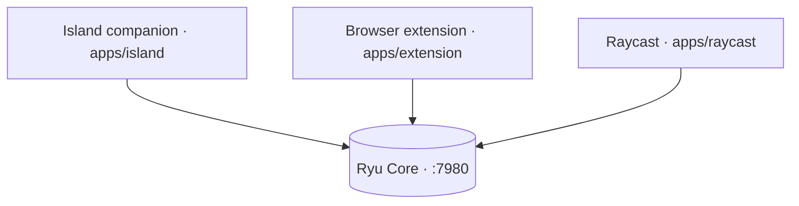

The desktop app is the primary surface; these companions ride alongside it on the same machine. Every
one talks to the same Core (`:7980`), so they share your conversations, agents, and Gateway routing.
Switching surfaces never switches context: a chat you start in the extension is the same conversation
you open in the desktop app.

The CLI and Mobile surfaces now have their own realms: see [CLI](/docs/cli) and [Mobile](/docs/mobile).

## Other surfaces

<Cards>
  <Card title="CLI" description="The Rust terminal UI: chat, command palette, list tabs, and GitOps from your shell." href="/docs/cli" />
  <Card title="Mobile" description="The Expo app: chat and a drawer of screens over the same Core, through the active node." href="/docs/mobile" />
</Cards>

## At a glance

| Client | Path | Stack | Reaches Core | Maturity |
|---|---|---|---|---|
| Browser extension | `apps/extension` | WXT / TS | background-worker fetch bridge | Partial (new-tab home + smart bar shipped) |
| Raycast | `apps/raycast` | `ray` CLI / TS | direct (no CORS) | Built (source syntax-verified) |
| Island companion | `apps/island` | Electron | mini chat + command transport | Built (live summon unverified) |

## Browser extension

The browser extension (`apps/extension`) is a [WXT](https://wxt.dev) build with a popup, a
dashboard, and in-page actions.

- A **Dia-style new-tab home** (`apps/extension/entrypoints/newtab`) puts a smart bar, recent
  conversations, and an agent picker on every new tab.
- The **omnibox keyword** `ryu` routes address-bar input through the shared pure smart-bar engine
  (`apps/extension/lib/smart-bar.ts`): an AI prompt opens the dashboard chat, a navigation or search
  query opens the URL.
- In-page browser features add **Ask about a selection**, **quick-ask on a selection**, and **Save
  page to a Ryu Space**, plus a bridge that mirrors page context to the Island.
- All Core calls go through a **background-worker fetch bridge** rather than from the page directly,
  because Core's CORS is a fixed allowlist that does not include the extension origin.

<Callout type="warn">
  The extension builds, but many surfaces are still coming soon and live round-trips need a running
  Core. The new-tab home, smart bar, and the browser features are shipped but not live-verified.
</Callout>

## Raycast extension

The Raycast extension (`apps/raycast`) is a `ray` extension for macOS and Windows that pipes Ryu into
an existing Raycast setup. It hits Core **directly**: Raycast commands run in a Node context with no
browser Origin header, so CORS is a non-issue. The base URL, optional bearer token, and default agent
come from the extension preferences, defaulting to `http://localhost:7980`.

- **Ask Ryu** answers a one-shot question, streamed into a Detail view.
- **Chat with Ryu** is a multi-turn List view.
- **Search Conversations** browses past conversations.

The extension is **fenced out of the Bun/Turbo workspace** (`!apps/raycast`) and carries its own
`ray` toolchain.

<Callout type="warn">
  The Raycast source is syntax-verified, but `ray build` and the runtime have not been exercised here:
  they need the user's local Raycast install.
</Callout>

## Island companion

The Island (`apps/island`) is an Electron dynamic-island overlay that also **hosts the command bar**
(the former standalone `apps/command` launcher was merged in).

- It runs **Shadow** context monitoring (`:3030`) plus a **local-model proactive engine** that
  surfaces suggestion chips, and a **mini chat** onto Core (`:7980`).
- A global hotkey expands the resting pill into a **command palette / mini-chat** (the `command`
  expanded view) over a `window.island` transport (`apps/island/src/renderer/command-transport.ts`),
  reusing the `@ryu/blocks` command-bar shell and the island's `island-agents` voice-agent pref.
- Every capability the companion uses is behind a **per-capability consent gate**, so nothing reads
  your screen or audio until you allow it. Consent mirrors the Core `island-consent` pref, so a
  desktop grant opens the Shadow gate without a first-run card.

<Callout type="warn">
  The Island is built, but its live hotkey summon, focus handling, and context loop are unverified:
  they need a real display to exercise. Shadow context capture is Windows-first.
</Callout>

### System-wide dictation

The Island also hosts **system-wide dictation** - a separate global shortcut (default
`CommandOrControl+Shift+D`) that captures speech and types the transcript straight into whatever
native app has OS focus. This is distinct from the Island's voice input, which drops what you say
into the Island chat to run an agent; dictation just types.

Insertion goes through **Ghost** (`apps/island/src/main/services/dictation.ts`): the transcript is
sent to Core's tool call endpoint as a `ghost__ghost_type` action with no target app, so it lands in
the currently focused window. Paste mode uses the clipboard plus a Ghost hotkey instead, and an
optional post-process step can clean the transcript up first. The shortcut deliberately never
focuses the Island - stealing focus would break typing into your target app.

<Callout type="warn">
  Dictation is a companion feature that needs a display, a microphone, and the Ghost sidecar to
  exercise, so it is not yet live-verified. The preference lives at `DICTATION_PREF_KEY`
  (`apps/island/src/shared/dictation.ts`); configure it in the desktop under the Island settings.
</Callout>

## See also

<Cards>
  <DocCard href="/docs/start-here/architecture/core-vs-gateway" />
  <DocCard href="/docs/core/conversations-sessions" />
  <DocCard href="/docs/core/node-and-presence" />
  <DocCard href="/docs/desktop/user-guide/deep-links" />
</Cards>
