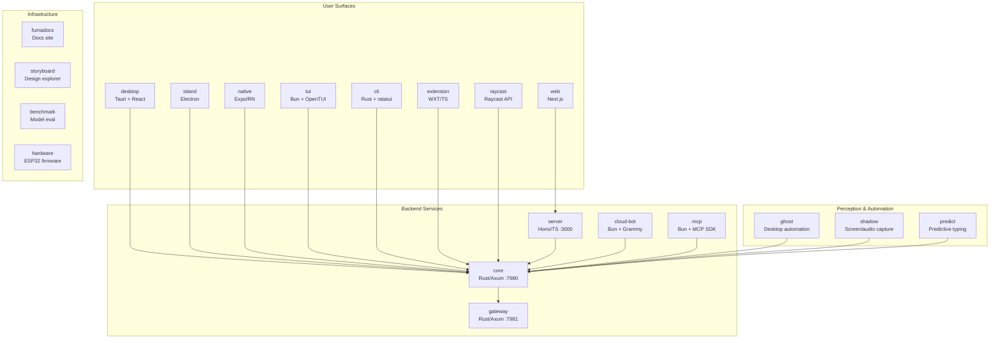

Ryu ships **46 applications** across Rust, TypeScript, Python, and embedded firmware. Each app is a
standalone binary or service that connects to Core via HTTP/WebSocket.

## The app landscape

---

## Apps-Store Feature Apps (24)

These are the manifest-driven feature apps that ship with Ryu. Most serve their `/api/*` surface
out-of-process as sidecars.

### Productivity

| App | ID | Type | Description |
|---|---|---|---|
| **Activity** | `com.ryu.activity` | UI companion | Unified cross-subsystem activity feed: monitor alerts, finished tasks, runs, approvals, meetings, notes. Read-only timeline |
| **Approvals** | `com.ryu.approvals` | UI companion | Human-in-the-loop approval queue: accept/reject agent-proposed actions, self-healing patches, learned skills, workflow steps |
| **Calendar** | `com.ryu.calendar` | UI companion | Scheduled-runs calendar: Month/Week/Day/Agenda views of agent and workflow scheduled jobs + "New automation" dialog |
| **Quests** | `com.ryu.quests` | Backend + UI | Auto-detecting todo list: tasks with NL completion conditions, judged by Shadow context on schedule |
| **Dashboards** | `com.ryu.dashboards` | Backend | Home surface: customizable widget grid over monitors, meetings, quests. Desktop-native canvas-tier UI |

### Communication & Collaboration

| App | ID | Type | Description |
|---|---|---|---|
| **Mail** | `com.ryu.mail` | Backend + UI | Email-as-a-service for agents: receive, store, send email. First fully manifest-driven out-of-process sidecar |
| **Teams** | `com.ryu.teams` | Backend | Agent teams: persisted named ordered collection of agents + coordination strategy, addressable as `@team` in chat |
| **Meetings** | `com.ryu.meetings` | Backend + sidecar + UI | Meeting notes (Granola/Notion-AI style): record, transcribe live, generate AI notes. Auto-detection of in-progress meetings from mic |

### Research & Learning

| App | ID | Type | Description |
|---|---|---|---|
| **Research** | `com.ryu.research` | Backend + sidecar | Deep/auto-research: multi-step experiment runs with git-versioned workspaces, scalar metric optimization, keep-if-improved ledger |
| **Learning** | `com.ryu.learning` | UI companion | Learning loop: turn chats/runs into reusable skills, gated by approval Inbox, with experience log |
| **Skill Editor** | `com.ryu.skill-editor` | UI companion | Author user-owned Agent Skills (SKILL.md): front-matter editor, markdown body, debounced autosave, version history |

### Monitoring & Automation

| App | ID | Type | Description |
|---|---|---|---|
| **Monitors** | `com.ryu.monitors` | Backend + UI | Website watches: price/stock/keyword/content/uptime checks on schedule with cross-device notification fan-out |
| **Recipes** | `com.ryu.recipes` | Backend | Parameterized, replayable native-desktop automation: frontier model records UI action sequence, small model replays |
| **Healing** | `com.ryu.healing` | Backend | Self-healing loop for failed runs: diagnose → propose → approve/apply |
| **Workflows** | `com.ryu.workflows` | UI companion | petgraph DAG automation: build multi-node workflows with triggers (schedule/webhook/Composio), durable execution, NL workflow builder |

### Media & Capture

| App | ID | Type | Description |
|---|---|---|---|
| **Clips** | `com.ryu.clips` | Backend | Agent-native Loom/Jam: capture and browse screen/timeline clips. Backend proxies to Shadow sidecar over loopback |
| **Voice** | `com.ryu.voice` | Sidecar + manifest | Voice data path: STT (whisper.cpp) + TTS (OuteTTS + universal Ryu TTS sidecar with kokoro/kitten/pocket engines) |
| **Timeline** | `com.ryu.timeline` | UI companion | Activity replay timeline: CapCut-style scrubber over Shadow's screen/input/window/audio/AX/clipboard/git lanes |
| **Canvas** | `com.ryu.canvas` | UI companion | ComfyUI-style node board: wire image/video/chat/tts/stt/upload/note nodes and run through Ryu's media/agent bridges |

### Fine-tuning & Intelligence

| App | ID | Type | Description |
|---|---|---|---|
| **Fine-tuning** | `com.ryu.finetune` | Backend + sidecar + UI | LoRA/QLoRA training studio: launch fine-tune jobs on local GPU, track durably, merge adapter to GGUF, register as local model |
| **Predict** | Predict | Standalone Rust crate | System-wide predictive-typing companion: inline ghost text in any text field (Win32/UIA), accepted with Tab |

### Web & Integrations

| App | ID | Type | Description |
|---|---|---|---|
| **Browser** | `com.ryu.browser` | Sidecar + manifest | Real-Chromium (Electron) browser sidecar: `browser.control` capability for tab management, screenshot, JS eval |
| **Webhooks** | `com.ryu.webhooks` | UI companion | Inbound webhook endpoint registry: resolved public URLs, secret presence, last-delivery times, ingress backend status |
| **Whiteboard** | `com.ryu.whiteboard` | UI companion | Excalidraw whiteboard: draw freely, persist as Space documents, Mermaid-to-Excalidraw import |

---

## Backend Services (5)

The core infrastructure services.

### core

**Stack:** Rust / Axum (:7980)

The orchestration engine and local backend. Everything flows through Core.

| Capability | What it owns |
|---|---|
| Chat routing | ACP + OpenAI-compat adapters, agent resolution |
| Plugin lifecycle | Install, enable, disable, update, dependency graph |
| Tool registry | Unified tool catalog, MCP registry, tool search |
| Workflow engine | Petgraph DAG, 17 node kinds, durable execution |
| Sessions | Conversation history, run state, forks |
| Memory | Long-term memory, spaces, RAG |
| Sidecar management | ~16 managed processes |
| Onboarding | Default agent, local model stack |

**Build on it:** All capability crates (`crates/core/*`, `crates/gateway/*`) are consumed by Core via the `*Host`
trait pattern. Add new capabilities by creating a crate, defining a `*Host` trait, and
implementing it in Core's boot sequence.

### gateway

**Stack:** Rust / Axum (:7981)

The LLM control layer. Every model call goes through the Gateway.

| Pipeline stage | What it does |
|---|---|
| Authentication | API key validation |
| Budget | Per-key/org/agent budget enforcement |
| Firewall | PII/DLP, prompt injection, custom patterns |
| Routing | Model → provider resolution |
| Cache | Exact + semantic cache |
| Providers | OpenAI, Anthropic, local, OpenRouter, etc. |
| Audit | Append-only request log |
| Evals | Inline evaluation |

**Build on it:** Extend via new `Provider` impls in `ryu-gw-providers`, new firewall patterns in
`ryu-gw-firewall`, or new channel adapters in `ryu-gw-channels`.

### server

**Stack:** Hono / Bun (:3000)

Identity and content plane.

| Capability | What it owns |
|---|---|
| Auth | Better Auth, OAuth, device, 2FA, OTP, magic-link |
| Billing | Polar integration |
| Content | Notion-backed blog/help/changelog |
| Playground | `/ai` guest chat (hardcoded Gemini, by design) |

**Build on it:** Add new API routes via `@ryu/api`, new auth providers via `@ryu/auth`.

### cloud-bot

**Stack:** Bun + Grammy (Telegram) + discord.js

Hosted bot service routing platform users to their nodes, with a chat-only Pi front-door for unrouted users.

**Build on it:** Add new bot commands or adapters.

### mcp

**Stack:** Bun + MCP SDK

MCP server exposing a running Core node to any MCP host (Claude Desktop, Cursor, etc.).

**Build on it:** Extend the MCP tool/resource set.

---

## User Surfaces (8)

The client applications users interact with directly.

### desktop

**Stack:** Tauri v2 + React + Vite

The flagship desktop app. Connects to Core via HTTP/WebSocket.

| Surface | What it covers |
|---|---|
| Chat | Core via ACP, council chat, agent creation |
| Engines | Gateway/engines configuration |
| Spaces | Memory, spaces, RAG management |
| Tools | Tools, MCP, skills stores |
| Workflows | Workflow builder and runs |
| Monitors | Website monitoring, meetings, quests |
| Marketplace | App, skill, and model stores |

**Build on it:** Add new pages in `apps/desktop/src/`, consume shared `@ryu/*` packages.

### island

**Stack:** Electron

Dynamic-island companion: Shadow context monitoring + proactive suggestions + mini chat onto Core, consent-gated. Hosts the hotkey command bar (`@ryu/blocks` shell).

**Build on it:** Add overlay components or command-bar actions.

### web

**Stack:** Next.js (:3001)

Marketing, auth flows, dashboard/billing, Notion blog/help/changelog, `/ai` playground, `/chat` (proxied to Core), `/marketplace` store, programmatic SEO pages.

**Build on it:** Add new pages in `apps/web/src/app/`.

### native

**Stack:** Expo / React Native

Mobile app on Core via `@ryuhq/core-client` (drawer screens mirroring the desktop IA). On-device inference (Cactus) is blocked.

**Build on it:** Add screens in `apps/native/app/`.

### tui

**Stack:** Bun + OpenTUI

Terminal client to a running Core node. The recommended terminal client. Full interactive feature parity with the CLI, ahead on chat, split-pane workspace, and store-wide search.

**Build on it:** Add terminal views in `apps/tui/src/`.

### cli

**Stack:** Rust / ratatui

**DEPRECATED** — maintenance mode only. Use `apps/tui` instead. Still builds; prints a deprecation banner on every startup. Retains headless, script-shaped subcommands.

### extension

**Stack:** WXT + React + Tailwind

Browser extension: popup + dashboard, chat, services, settings, PKCE OAuth, Dia-style new-tab home + omnibox keyword `ryu`.

**Build on it:** Add new extension pages/features.

### raycast

**Stack:** Raycast API + TypeScript

Raycast extension for macOS + Windows. Chat with Ryu agents, conversation search.

**Build on it:** Add new Raycast commands.

---

## Perception & Automation (3)

Desktop automation and screen/audio capture systems.

### ghost

**Stack:** Rust binary

Desktop-automation MCP server (30 tools): screen perception + input control, snapshot/`@eN` refs, record→replay recipes. Callable via Core's MCP registry.

**Build on it:** Add new MCP tools using `ghost-core`, `ghost-eyes`, `ghost-hands`.

### shadow

**Stack:** Rust + Axum WS (:3030)

Screen/audio/input capture, OCR, proactive engine, semantic memory + search, timeline keyframes, meeting capture/detection. Callable via Core's MCP registry.

**Build on it:** Add new capture types or intelligence engines.

---

## Infrastructure (7)

Internal tooling and development support.

### fumadocs

**Stack:** Next.js + Fumadocs

This documentation site. 13 sidebar realms + interactive OpenAPI (generated Core spec + hand-authored Gateway spec).

**Build on it:** Add docs in `apps/fumadocs/content/docs/`, regenerate OpenAPI specs.

### storyboard

**Stack:** Next.js (:3002)

Internal visual explorer of every screen, state, flow, and the design system.

### benchmark

**Stack:** Bun + TypeScript

RyuBench: execution-verified, cost-normalized benchmarking of any model/harness operating Ryu.

**Build on it:** Add new benchmark scenarios.

### hardware

**Stack:** ESP32-S3 firmware

Physical Ryu devices: desk, necklace, watch form factors + the wire protocol connecting them to a node.

**Build on it:** Extend firmware in `apps/hardware/firmware/`.

### plugins

**Stack:** TypeScript

Claude Code and Codex plugin integrations — bridges for external coding agents to interact with Ryu Core.

### skills

**Stack:** Markdown

External SKILL.md agent skills that teach coding agents to set up and drive Ryu (pairs with `apps/mcp`).

### webapp

**Stack:** Vite / TypeScript

Browser build of the desktop app — a web-accessible version of the Ryu desktop experience (standalone SPA, separate from the Next.js `web`).
