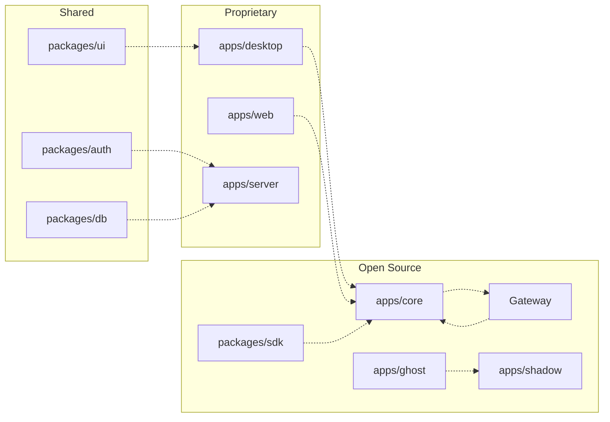

Ryu is an open-core project: the Rust **Core** and **Gateway** are Apache-2.0 and AGPL-3.0
respectively; the Desktop, Web, and Backend are proprietary. Contributions to the open-source parts
are welcome and follow the workflow described here.

## Repository layout

Ryu is a **Bun + Turborepo** monorepo. TypeScript apps and packages live under Bun workspaces; Rust
apps and crates form Cargo workspaces.



### Open-source units

| App / Crate | Stack | License |
|---|---|---|
| `apps/core` | Rust / Axum | Apache-2.0 |
| `apps/gateway` | Rust | AGPL-3.0 |
| `apps/cli` | Rust / ratatui | Apache-2.0 |
| `apps/ghost` + `crates/ghost-*` | Rust | Apache-2.0 |
| `apps/shadow` + `crates/shadow-*` | Rust | Apache-2.0 |
| `packages/sdk` | TypeScript | Apache-2.0 |
| `packages/create-ryu-app` | TypeScript | Apache-2.0 |
| `crates/ryu-sdk` + `-ffi` + `-napi` | Rust | Apache-2.0 |

### Proprietary units

| App / Package | Stack |
|---|---|
| `apps/desktop` | Tauri v2 + React |
| `apps/web` | Next.js |
| `apps/server` | Hono / TS |
| `apps/native` | Expo / RN |
| `apps/island` | Electron |
| `packages/ui` | shadcn / React |

See [Open Core](/docs/start-here/architecture/open-core) for the full licensing boundary.

## Build system

### Prerequisites

- **Bun** 1.3.5+
- **Rust** (stable) for Core, Gateway, and Rust crates
- **Node.js** 18+ for TypeScript apps

### Common commands

```bash
# Install all dependencies
bun install

# Run everything (all apps in parallel)
bun run dev

# Run a specific app
bun run dev:core      # Core on :7980
bun run dev:gateway   # Gateway on :7981
bun run dev:desktop   # Desktop (Tauri)
bun run dev:web       # Web on :3001

# Build everything
bun run build

# Build just the API docs for fumadocs
bun run generate:docs
```

### Turborepo

The monorepo uses Turborepo for task orchestration. Tasks declared in `turbo.json` run in
dependency order with caching. Run `turbo run build --filter=core` to build just Core and its
dependencies.

## Code standards

### TypeScript

Ryu uses **Ultracite** (Biome-based) for formatting and linting:

```bash
bun x ultracite fix    # auto-fix formatting + lint issues
bun x ultracite check  # check without fixing
```

Key rules:
- Use `const` by default, `let` only when reassignment is needed
- Arrow functions for callbacks
- Optional chaining (`?.`) and nullish coalescing (`??`)
- No `console.log` in production code
- Semantic HTML and ARIA attributes for accessibility

### Rust

- `cargo fmt` for formatting
- `cargo clippy` for linting
- `cargo test` for unit tests
- Error types use `thiserror` for library code, `anyhow` for application code

### Core-vs-Gateway rule

When placing new code, apply the single design rule:

- **What runs** (which agent, session, workflow, tool) → **Core**
- **What is allowed, shared, measured, or paid for** (security, routing, budgets, audit) → **Gateway**

Core must never enforce policy inline; it routes every model call through the Gateway.

## PR workflow

### 1. Fork and branch

```bash
git checkout -b feat/my-feature
```

### 2. Make changes

- Keep changes focused: one logical unit per PR
- Write or update tests for new behavior
- Run the linter before committing

### 3. Verify

```bash
# TypeScript
bun x ultracite check

# Rust
cargo check --workspace
cargo test --workspace
cargo clippy --workspace
```

### 4. Commit

Use conventional commit messages:

```
feat(core): add new hook phase for notification filtering
fix(gateway): resolve circuit breaker not tripping on 503s
docs(develop): add hooks & lifecycle reference page
```

### 5. Open a PR

- Describe what changed and why
- Link any related issues
- Include screenshots for UI changes
- Note breaking changes explicitly

## Testing

### Unit tests

```bash
# Rust
cargo test --workspace

# TypeScript (if using vitest)
bun test
```

### Integration tests

Core's test suite includes live sandbox tests (`plugin_host::tests::live_*`) that run real Deno
fixtures against the built-in double-check, goal, and advisor hooks.

### Smoke tests

Run the dev server and verify the flow manually:

```bash
bun run dev:core
# In another terminal:
curl http://localhost:7980/api/health
```

## Working on the Gateway

The Gateway is AGPL-3.0. Key paths:

- `apps/gateway/src/router/` — model routing (smart + deterministic)
- `apps/gateway/src/pipeline/` — request pipeline
- `apps/gateway/src/security/` — firewall, DLP, SSRF
- `apps/gateway/src/budgets/` — budget enforcement
- `apps/gateway/src/evals/` — eval scoring
- `apps/gateway/src/passthrough/` — Claude Code / Codex passthrough

## Working on Core

Key paths:

- `apps/core/src/server/mod.rs` — Axum routes + chat handler
- `apps/core/src/sidecar/` — sidecar lifecycle + ACP/OpenAI-compat adapters
- `apps/core/src/plugins/` — plugin manifest + lifecycle + binding registry
- `apps/core/src/plugin_host/` — turn hook runtime (Deno sandbox)
- `apps/core/src/workflow/` — DAG engine + durable execution
- `apps/core/src/tool_registry/` — unified tool catalog

## Working on the SDK

The TypeScript SDK (`packages/sdk/`) and Rust SDK (`crates/ryu-sdk/`) share the Runnable contract.
See [SDK Reference](/docs/develop/sdk) for the API surface.

```bash
# Build the native addon (required for model client)
cd crates/ryu-sdk-napi && npm run build

# Run SDK tests
cd packages/sdk && bun test
```

## Community plugins

Third-party plugins are built via `plugin.json` + the SDK. The plugin runtime lives in OSS Core,
so the closed desktop stays extensible. See [Build an Extension](/docs/develop/extensions) for the
three extension paths.

## Related

<Cards>
  <DocCard href="/docs/start-here/architecture/open-core" />
  <DocCard href="/docs/develop/extensions" />
  <DocCard href="/docs/develop/sdk" />
  <DocCard href="/docs/develop/quickstart" />
</Cards>
