The Gateway is decomposed into 11 crates, each owning one pipeline stage. The Gateway app
(`apps/gateway`) wires them together.

## Pipeline flow

```mermaid
flowchart LR
  REQ[Request] --> AUTH[Authentication]
  AUTH --> BUDGET["ryu-gw-budget<br/>per-key/org/agent budgets"]
  BUDGET --> FIREWALL["ryu-gw-firewall<br/>PII/DLP/injection detection"]
  FIREWALL --> ROUTER["ryu-gw-router<br/>model→provider resolution"]
  ROUTER --> CACHE["ryu-gw-cache<br/>exact + semantic cache"]
  CACHE --> PROVIDERS["ryu-gw-providers<br/>OpenAI/Anthropic/local/..."]
  PROVIDERS --> AUDIT["ryu-gw-audit<br/>append-only request log"]
  AUDIT --> EVALS["ryu-gw-evals<br/>inline evaluation"]
  EVALS --> RESP[Response]
```

## ryu-gw-contracts

**Path:** `crates/gateway/contracts`

Shared value-types between Gateway stages.

| Export | Type | Purpose |
|---|---|---|
| `AlertTier` | enum | Severity tiers for alerts |
| Cross-stage types | enums/structs | Shared vocabulary |

**Build on it:** Add new shared types here. This is a leaf crate with no deps.

## ryu-gw-budget

**Path:** `crates/gateway/budget`

Token-budget enforcement.

| Export | Type | Purpose |
|---|---|---|
| `BudgetBackend` | trait | Abstract budget storage |
| Per-user/org/agent | scopes | Budget enforcement at multiple levels |
| Exec budget | fn | Tool-execution budget gating |

**Build on it:** Implement `BudgetBackend` for external budget stores (Redis, Postgres).

## ryu-gw-firewall

**Path:** `crates/gateway/firewall`

Firewall scanning: PII, DLP, prompt injection, custom patterns.

| Export | Type | Purpose |
|---|---|---|
| `DetectionKind` | enum | PII, secret, injection, code-injection, toxicity, bias |
| `FirewallMatch` | struct | Match details with position |
| Pattern builders | fns | Curated regex detection |
| Unicode normalization | fn | Normalize before scanning |
| Luhn validators | fn | Credit card validation |

**Build on it:** Add new detection patterns or custom rules. The firewall scans both request
and response bodies.

## ryu-gw-cache

**Path:** `crates/gateway/cache`

Response caching: exact-match + semantic similarity.

| Export | Type | Purpose |
|---|---|---|
| `CacheBackend` | trait | Exact-match TTL cache |
| `SemanticCacheBackend` | trait | Embedding-similarity cache |
| Cache lookup | fn | Check before provider call |

**Build on it:** Implement `CacheBackend` or `SemanticCacheBackend` for external caches
(Redis, Memcached, vector DB).

## ryu-gw-audit

**Path:** `crates/gateway/audit`

Append-only request audit log.

| Export | Type | Purpose |
|---|---|---|
| `AuditBackend` | trait | Abstract audit storage |
| `AuditLogger` | struct | Request/response logging |
| SQLite store | default | Append-only log |

**Build on it:** Implement `AuditBackend` for external audit stores (S3, ELK, Splunk).

## ryu-gw-evals

**Path:** `crates/gateway/evals`

Inline evaluation and dataset scoring.

| Export | Type | Purpose |
|---|---|---|
| `EvalsBackend` | trait | Abstract eval storage |
| `EvalsRunner` | struct | Per-request evaluation |
| `score_case()` | fn | Score a single eval case |
| `aggregate_scores()` | fn | Aggregate across dataset |

**Build on it:** Add new evaluator types or scoring strategies.

## ryu-gw-router

**Path:** `crates/gateway/router`

Model routing: model → provider resolution.

| Export | Type | Purpose |
|---|---|---|
| `route()` | fn | Exact → prefix → builtin → default resolution |
| Built-in prefix table | map | Model name to provider mapping |
| Smart routing | fn | Classifier-based model selection |
| Cost-tier fallback | fn | Fallback by cost tier |

**Build on it:** Add new model-to-provider mappings or routing strategies.

## ryu-gw-providers

**Path:** `crates/gateway/providers`

Concrete provider implementations.

| Export | Type | Purpose |
|---|---|---|
| `Provider` | trait | Abstract LLM provider |
| Implementations | structs | OpenAI, Anthropic, local, core, OpenRouter, Modal, GenAI, Replicate, Fal |
| Quota sink | fn | Rate-limit tracking per provider |

**Build on it:** Implement `Provider` for new LLM backends. Each provider handles its own
wire format (OpenAI, Anthropic Messages, etc.).

## ryu-gw-governance

**Path:** `crates/gateway/governance`

Grant validation and manifest signing.

| Export | Type | Purpose |
|---|---|---|
| `verify_manifest()` | fn | Ed25519 manifest signature verification |
| `sign_manifest()` | fn | Sign a manifest with the gateway key |
| Grant matching | fn | Match plugin grants against allowlist |

**Build on it:** Extend the grant model or add new signing backends.

## ryu-gw-passthrough

**Path:** `crates/gateway/passthrough`

Passthrough proxy for Claude Code / Codex.

| Export | Type | Purpose |
|---|---|---|
| `PassthroughFirewall` | struct | Request/response DLP redaction |
| `WireFormat` | enum | Anthropic Messages, OpenAI Responses |
| Redaction | fn | Native format DLP scanning |

**Build on it:** Add new wire formats for passthrough proxying.

## ryu-gw-channels

**Path:** `crates/gateway/channels`

Channel adapters: Telegram, Slack, Discord, WhatsApp.

| Export | Type | Purpose |
|---|---|---|
| `ChannelHost` | trait | Abstract channel backend |
| Adapters | structs | Per-platform inbound/outbound |
| Allowlist | fn | Channel allowlist enforcement |

**Build on it:** Add new channel adapters via `ChannelHost`.
