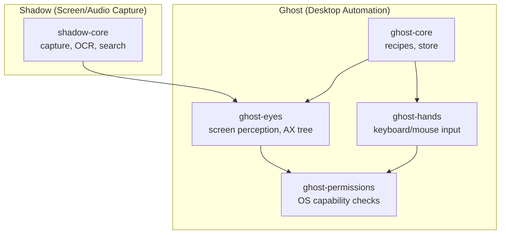

Ghost and Shadow are Ryu's desktop perception and automation systems, decomposed into 5 crates.

## Architecture



## ghost-core

**Path:** `crates/ghost/core`

Core automation primitives: recipes and store.

| Export | Type | Purpose |
|---|---|---|
| `RecipeStore` | struct | Persistent recipe storage |
| Recipe types | structs | Parameterized, replayable automations |
| Store path | `~/.ghost/recipes/` | Default storage location |

**Build on it:** Add new recipe types or automation primitives. This crate has no native input
dependencies — it's cross-platform.

## ghost-eyes

**Path:** `crates/ghost/eyes`

Screen perception: AX tree traversal, screen capture, input monitoring.

| Export | Type | Purpose |
|---|---|---|
| AX tree traversal | fn | Walk the accessibility tree |
| Screen capture | fn | Capture screen regions |
| Input monitoring | fn | Monitor keyboard/mouse events |
| `@eN` refs | format | Screenshot references for agents |

**Build on it:** Add new perception capabilities. Platform-specific implementations for
Win32, macOS, and Linux.

## ghost-hands

**Path:** `crates/ghost/hands`

Synthetic input: keyboard, mouse, window control.

| Export | Type | Purpose |
|---|---|---|
| `click()` | fn | Click at coordinates |
| `type()` | fn | Type text |
| `scroll()` | fn | Scroll wheel |
| `key()` | fn | Press/release keys |
| Window control | fns | Move, resize, focus windows |

**Build on it:** Add new input primitives. Platform-specific implementations.

## ghost-permissions

**Path:** `crates/ghost/permissions`

Cross-platform OS capability checks.

| Export | Type | Purpose |
|---|---|---|
| `check_permissions()` | fn | Check if required permissions are granted |
| `request_permissions()` | fn | Prompt user for permissions |
| Zero deps | leaf crate | No external dependencies |

**Build on it:** Add new permission types for additional OS capabilities.

## shadow-core

**Path:** `crates/ghost/shadow`

Screen/audio/input capture, OCR, and semantic search.

| Export | Type | Purpose |
|---|---|---|
| Event types | structs | Capture events (screen, audio, input) |
| Capture primitives | fns | Screen/audio/input capture |
| Semantic search | tantivy | Full-text search over captured content |
| Timeline keyframes | struct | Temporal capture indexing |

**Build on it:** Add new capture types or intelligence engines. The `full` feature enables
video capture; the `video` feature enables webcam.

## How to use Ghost tools

Ghost exposes 30 MCP tools via Core's MCP registry:

| Tool | What it does |
|---|---|
| `ghost__screenshot` | Capture screen region |
| `ghost__click` | Click at coordinates |
| `ghost__type` | Type text |
| `ghost__scroll` | Scroll wheel |
| `ghost__key` | Press/release key combo |
| `ghost__record` | Start recording actions |
| `ghost__replay` | Replay recorded recipe |
| `ghost__ax_tree` | Get accessibility tree |
| `ghost__find` | Find element by description |
| `ghost__drag` | Drag from A to B |
| ... | +20 more tools |

Register Ghost with Core:

```bash
curl -X POST http://localhost:7980/api/mcp/servers \
  -H 'content-type: application/json' \
  -d '{"name": "ghost", "command": ["ghost"]}'
```

## How to use Shadow

Shadow runs on port 3030 and provides:

- Screen capture with OCR
- Audio capture with transcription
- Input monitoring
- Proactive engine (suggests actions based on context)
- Semantic memory over captured content
- Timeline keyframes for meeting capture

Shadow is registered with Core's MCP registry and its tools are callable from chat.
