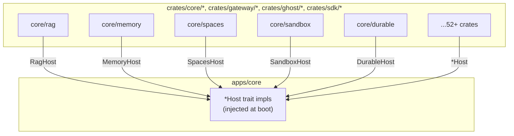

Ryu is decomposed into **58 Rust crates**. Each crate has **zero dependency on `apps/core`** — host
couplings are inverted through `*Host` traits injected at boot. This is the fundamental
decomposition strategy: crates are swappable capability packages, not monolith internals.

## How crates connect to Core

Every crate defines a `*Host` trait. Core implements that trait and injects the implementation at
boot. The crate never imports `apps/core` — it only knows about its own trait interface.

## Architecture categories

Crates fall into five groups:

| Group | Count | Purpose |
|---|---|---|
| [Core Capabilities](/docs/develop/crates/core-capabilities) | 36 | Storage, RAG, memory, sandbox, workspace, voice, image, tools, etc. |
| [Gateway Stages](/docs/develop/crates/gateway-stages) | 11 | Budget, firewall, cache, audit, evals, routing, providers |
| [SDK Bindings](/docs/develop/crates/sdk-bindings) | 4 | Rust core + FFI/NAPI/UniFFI for multi-language SDK |
| [Ghost & Shadow](/docs/develop/crates/ghost-shadow) | 5 | Desktop automation, screen perception, input control |
| [Kernel & Infrastructure](/docs/develop/crates/kernel) | ~14 | Contracts, crypto, tracing, mesh, downloads, catalogs |

---

## Core Capability Crates (36)

All under `crates/core/`. These are the pluggable capability primitives.

| Crate | Path | Purpose |
|---|---|---|
| **ryu-activity** | `crates/core/activity` | Unified cross-module activity feed: SQLite-backed `ActivityStore` with newest-first paging, SSE fan-out, and `ActivityItem`/`ActivityLevel` v1 contract |
| **ryu-collab** | `crates/core/collab` | Authoritative CRDT document engine: Yjs `DocRegistry`, `CollabStore` (rusqlite append-only doc_updates + compacted snapshots), `DocSyncMessage` wire protocol, and Y.Doc-to-source projection for RAG |
| **ryu-composio** | `crates/core/composio` | Composio integration orchestration: API-key resolver, toolkit/action/trigger catalog client, connection initiate/status, trigger-subscription store (poll + HMAC-SHA256 webhook verification), MCP execute-action path |
| **ryu-crypto** | `crates/core/crypto` | Encryption-at-rest primitive: ChaCha20-Poly1305 AEAD `FieldCipher` with `enc:v1:` envelope + swappable master-key custody (env / OS keychain / file fallback) |
| **ryu-downloads** | `crates/core/downloads` | DownloadCenter artifact-fetch: stream-to-`.part` with HTTP Range resume, bounded retry, checksum-verify + atomic rename, pause/resume/cancel, live SSE progress, durable history log |
| **ryu-durable** | `crates/core/durable` | Durable-execution primitive: `DurableEngine` trait (checkpoint/resume/replay) plus `FileCheckpointStore` with atomic temp+fsync+rename for crash-recoverable resume |
| **ryu-email-send** | `crates/core/email-send` | BYOK SMTP email sink: multi-recipient / cc-bcc / text+html multipart / threaded / attachment builder, BYO relay resolved prefs-first then `RYU_SMTP_*` env |
| **ryu-engines** | `crates/core/engines` | Engine-agnostic inference configuration: per-request `SamplingConfig` and per-launch `LaunchConfig` translated per engine (llama.cpp/Ollama/vLLM/SGLang/MLX) into OpenAI-compat bodies and CLI args |
| **ryu-eval-code** | `crates/core/eval-code` | Core-side code evaluators: runs user `(input,output,expected,vars)->{score}` functions in isolated runtimes (JS via Deno sandbox, Python via sandbox backend) to score eval cases |
| **ryu-hardware** | `crates/core/hardware` | RHP v1 node backend: paired-device registry, pairing nonce verification, Opus/WAV codec, per-connection realtime session state machine, display-nudge loop, device-registry + TRMNL display HTTP surface |
| **ryu-image** | `crates/core/image` | Image-generation modality: `generate(prompt)->image` with swappable engine seam (local sd.cpp by default; OpenRouter/Replicate/fal cloud providers via Gateway) |
| **ryu-kernel-contracts** | `crates/core/kernel-contracts` | Pure-data plugin.json manifest model (types + validation) shared by Core and the SDK. No I/O, no runtime deps; serde/schemars only |
| **ryu-knowledge** | `crates/core/knowledge` | Open Knowledge Format (OKF) primitive: in-memory model, permissive parser, and serializer for git-shippable knowledge bundles (Concept/Bundle/IndexDoc/LogDoc) |
| **ryu-mcp-catalog** | `crates/core/mcp-catalog` | MCP server catalog: browse/install MCP servers from the official registry and Smithery/Ryu-hosted sources, with SSRF-safe pagination and security-hardened install-plan builder |
| **ryu-memory** | `crates/core/memory` | Long-term memory primitive: SQLite-backed encrypted `MemoryStore` with multi-level scope model (user/node/project), category/importance/tags metadata, scoped recall/CRUD |
| **ryu-mesh** | `crates/core/mesh` | Mesh read/shape primitive: Tailscale/Headscale plane gating, `GET /api/mesh/status` shaping, fail-closed shared-mesh-token bearer resolution, Funnel helpers for webhook ingress |
| **ryu-model-catalog** | `crates/core/model-catalog` | HF model catalog + device-fit verdict: HF search/detail, GGUF tree inspection, per-node device detection and fit estimation, installed-model tracking, capability overrides |
| **ryu-model-format** | `crates/core/model-format` | Model weight-format primitive: `ModelFormat` enum (GGUF/Safetensors/MLX) and pure format-to-engine capability tables |
| **ryu-notify** | `crates/core/notify` | Shared notification-delivery wire types + send primitives: swappable channel targets (webhook/Telegram/Expo push/BYO SMTP) behind monitor/policy/workflow alerts |
| **ryu-predict** | `crates/core/predict` | Predictive-typing brain: completion engine (config, per-app allowlist, secure-field denylist, prompt assembly, reply cleanup) and `/api/predict/*` HTTP surface |
| **ryu-rag** | `crates/core/rag` | Retrieval-augmented-generation: embedder (local hashing + remote OpenAI-compatible), reranker (local term-overlap + remote cross-encoder), sqlite-backed `RetrievalStore` behind `RagProvider` trait |
| **ryu-realtime** | `crates/core/realtime` | Room-keyed realtime fan-out: transport-agnostic `RoomRegistry` mapping room_id to per-room tokio actor with presence map, idle clock, bounded broadcast sender |
| **ryu-sandbox** | `crates/core/sandbox` | Sandbox execution: `run(command|wasm,spec)->output` behind swappable backend seam (wasmtime/WASI default; docker/microsandbox/Daytona swaps), long-lived workspace sessions, per-run metering heartbeat |
| **ryu-search** | `crates/core/search` | Conversation search: sqlite-vec semantic KNN index + contentless FTS5 lexical index over past chat messages, with injected embedder via `SearchEmbedder` trait |
| **ryu-skills** | `crates/core/skills` | Agent Skills: SKILL.md registry, dual-root scan, progressive-disclosure injection, authoring + version history, `/api/skills/*` CRUD surface |
| **ryu-spaces** | `crates/core/spaces` | Spaces primitive: named document collections with sqlite-vec vector store, content-addressed blob store, per-space embedder, GraphRAG (entity/relation) retrieval strategy |
| **ryu-storage** | `crates/core/storage` | Plugin-owned key/value storage: isolated `(plugin_id,namespace,key)`-namespaced SQLite KV store for the plugin-host `storage:kv` capability |
| **ryu-stt** | `crates/core/stt` | Speech-to-text modality: `transcribe(audio)->text` with swappable engine seam (parakeet ONNX default; whisper.cpp and cloud Whisper via HTTP) |
| **ryu-tool-exec** | `crates/core/tool-exec` | PTC code-execution sandbox: Deno-subprocess backend (deny-by-default permissions), gated V8-isolate backend, bounded parked-execution store for Composio, `CodeExecutor` enum |
| **ryu-tool-registry** | `crates/core/tool-registry` | Unified tool-catalog: `ToolKind`/`ToolDescriptor`/`DescribedTool` types, swappable `ToolRanker` (BM25 default + semantic seam), argument-schema parsing |
| **ryu-tracing** | `crates/core/tracing` | Per-run observability trace: ordered-span `TraceStore` (SQLite) recording tool-call/model-call spans keyed by conversation_id, args-hash privacy fingerprinting |
| **ryu-usage** | `crates/core/usage` | Per-agent subscription usage-metering: reads OAuth tokens from subscription CLIs (Claude Code/Codex) and calls vendor usage endpoints for normalized rolling rate-limit windows |
| **ryu-vad** | `crates/core/vad` | Voice activity detection: `detect(frame)->speech_prob` feeding endpointing/barge-in state machine, with Silero VAD ONNX inference behind `voice-vad` feature |
| **ryu-vault** | `crates/core/vault` | Identity Vault: crypto-sealed per-domain credential store (SQLite + `enc:v1:` envelope), swappable `CredentialSource` capture/rotation seam, staleness health-sweep engine |
| **ryu-webhook-ingress** | `crates/core/webhook-ingress` | Webhook ingress: four backends (RyuRelay, Tailscale Funnel, cloudflared, BYO relay), path-routed inbound dispatcher with HMAC re-verification, replay-window + delivery dedup |
| **ryu-workspace** | `crates/core/workspace` | Git-native workspace: git/worktree engine, per-run worktrees, aggregate run diff, whole-tree apply (commit/merge/push/PR), read-only git status/branches helpers |

---

## Gateway Stage Crates (11)

All under `crates/gateway/`. The Gateway pipeline is decomposed into one crate per stage.

| Crate | Path | Purpose |
|---|---|---|
| **ryu-gw-audit** | `crates/gateway/audit` | Gateway audit stage: SQLite-backed append-only request log, lifetime token totals, query/summary, as a swappable `AuditBackend` trait + `AuditRegistry` |
| **ryu-gw-budget** | `crates/gateway/budget` | Gateway token-budget stage: per-user/per-agent/per-session token budgets + per-window exec budget, as a swappable `BudgetBackend` trait + registry |
| **ryu-gw-cache** | `crates/gateway/cache` | Gateway response-cache: exact-match TTL cache and embedding-similarity semantic cache, each a swappable trait + registry |
| **ryu-gw-channels** | `crates/gateway/channels` | Gateway channel-layer engine: external messaging adapters (Telegram, Slack, Discord, WhatsApp) with shared inbound path over a narrow `ChannelHost` seam |
| **ryu-gw-contracts** | `crates/gateway/contracts` | Shared value-types exchanged between Gateway stages (e.g. `AlertTier`). Neutral home for cross-stage vocabulary |
| **ryu-gw-evals** | `crates/gateway/evals` | Gateway evals stage: per-request sampling + provider-score EMA, pure dataset scorers (score_case, aggregate_scores, assertions, judge helpers) |
| **ryu-gw-firewall** | `crates/gateway/firewall` | Gateway firewall scanning core: regex detection engine (PII/secret/injection/code-injection/toxicity/bias patterns), Unicode-obfuscation normalization, Luhn/credit-card validators, command-injection scanner |
| **ryu-gw-governance** | `crates/gateway/governance` | Gateway marketplace-governance: grant-allowlist matching + ed25519 manifest sign/verify crypto over canonicalized JSON |
| **ryu-gw-passthrough** | `crates/gateway/passthrough` | Gateway passthrough wire-format redaction: native-format (Anthropic/OpenAI) request-body + streaming-SSE DLP redaction over a narrow `PassthroughFirewall` interface |
| **ryu-gw-providers** | `crates/gateway/providers` | Gateway concrete backend providers: OpenAI/Anthropic/local/core/OpenRouter/Modal/GenAI/Replicate/Fal HTTP implementations behind the `Provider` trait, shared HTTP helpers, per-provider quota sink |
| **ryu-gw-router** | `crates/gateway/router` | Gateway model-routing core (Plane A): model-to-provider resolution logic, built-in zero-config prefix table, modality-slot resolution, eval-driven A/B picker, classifier smart-routing helpers |

---

## SDK Binding Crates (4)

All under `crates/sdk/`. One Rust core with language-specific bindings.

| Crate | Path | Purpose |
|---|---|---|
| **ryu-sdk** | `crates/sdk/core` | Ryu developer SDK core: shared Rust kernel (manifest model, gateway egress rules, gateway-mandatory model client) that every language binding builds on |
| **ryu-sdk-ffi** | `crates/sdk/ffi` | C-ABI surface over `ryu-sdk`, consumed by Go (cgo) binding and any other C-FFI client |
| **ryu-sdk-napi** | `crates/sdk/napi` | Node-API (napi-rs) binding exposing `ryu-sdk` to TypeScript/JavaScript as a native addon |
| **ryu-sdk-uniffi** | `crates/sdk/uniffi` | UniFFI binding surface: multi-language (Python/Swift/Kotlin) path over `ryu-sdk`, blocking surface only (streaming deferred) |

---

## Ghost & Shadow Crates (5)

Desktop automation and screen/audio capture.

| Crate | Path | Purpose |
|---|---|---|
| **ghost-core** | `crates/ghost/core` | Core automation primitives: recipe store, WS client, recipe serialization, and action synthesis for the Ghost desktop-automation MCP server |
| **ghost-eyes** | `crates/ghost/eyes` | Screen perception: cross-platform AX tree, screen capture, and input monitoring (Win32/UIA, macOS CoreGraphics/AXUIElement, Linux X11/AT-SPI2) |
| **ghost-hands** | `crates/ghost/hands` | Synthetic keyboard/mouse/window input: cross-platform input synthesis (Win32 SendInput, macOS CGEvent, Linux XTEST/evdev) |
| **ghost-permissions** | `crates/ghost/permissions` | Cross-platform OS capability check/request for UI automation + screen capture permissions |
| **ryu-shadow-core** | `crates/ghost/shadow` | Screen/audio/input capture, OCR, and semantic search engine for Shadow (tantivy FTS, rusqlite, zstd compression, rmp-serde) |

---

## Kernel & Infrastructure Crates (14)

Foundational crates that all others depend on.

| Crate | Path | Purpose |
|---|---|---|
| **ryu-kernel-contracts** | `crates/core/kernel-contracts` | Pure-data plugin.json manifest model (types + validation) shared by Core and the SDK. No I/O, no runtime deps |
| **ryu-crypto** | `crates/core/crypto` | Encryption-at-rest: ChaCha20-Poly1305 AEAD `FieldCipher` with `enc:v1:` envelope + swappable master-key custody |
| **ryu-storage** | `crates/core/storage` | Plugin-owned KV storage: isolated `(plugin_id,namespace,key)`-namespaced SQLite table |
| **ryu-realtime** | `crates/core/realtime` | Room-keyed realtime fan-out: transport-agnostic `RoomRegistry` with per-room tokio actors |
| **ryu-collab** | `crates/core/collab` | Authoritative CRDT document engine: Yjs `DocRegistry`, `CollabStore`, `DocSyncMessage` wire protocol |
| **ryu-mesh** | `crates/core/mesh` | Mesh networking: Tailscale integration, fail-closed auth, Funnel helpers |
| **ryu-activity** | `crates/core/activity` | Unified activity feed: SQLite-backed `ActivityStore` with SSE fan-out |
| **ryu-notify** | `crates/core/notify` | Notification delivery: shared wire types + swappable channel targets |
| **ryu-tracing** | `crates/core/tracing` | Per-run observability: ordered-span `TraceStore` with privacy fingerprinting |
| **ryu-usage** | `crates/core/usage` | Per-agent subscription usage-metering across vendor APIs |
| **ryu-downloads** | `crates/core/downloads` | Download center with Range resume, checksum verification, atomic rename |
| **ryu-integration-tests** | `crates/testing/integration` | Decomposition seam integration test suite: boots Core as subprocess, drives over HTTP |
| **ryu-test-sidecar** | `crates/testing/sidecar` | Minimal controllable out-of-process sidecar for integration tests |

---

## Apps-Store Backend Crates

These live under `apps-store/*/backend/` and are consumed by Core as path dependencies.
All have **zero dependency on `apps/core`**.

| Crate | Path | Purpose |
|---|---|---|
| **ryu-clips** | `apps-store/clips/backend` | Agent-native Loom/Jam: capture and browse screen/timeline clips |
| **ryu-finetune** | `apps-store/finetune/backend` | LoRA/QLoRA fine-tuning: SQLite job store + adapter catalog |
| **ryu-mail** | `apps-store/mail/backend` | Agent Inboxes: email-as-a-service over AWS SES/S3 |
| **ryu-meetings** | `apps-store/meetings/backend` | Meeting notes: record, transcribe, AI notes, mic-in-use detection |
| **ryu-monitors** | `apps-store/monitors/backend` | Website monitors: price/stock/keyword/content-diff/uptime checks |
| **ryu-quests** | `apps-store/quests/backend` | Quests: auto-detecting todo list with NL completion conditions |
| **ryu-recipes** | `apps-store/recipes/backend` | Parameterized, replayable native-desktop automation recipes |
| **ryu-research** | `apps-store/research/backend` | Deep/auto-research: multi-step experiment runs with git workspaces |
| **ryu-teams** | `apps-store/teams/backend` | Agent teams: named, ordered agent collections + coordination strategy |

---

## Build on a crate

To build an extension that uses a Ryu capability:

1. **Pick the crate** that owns the capability you need
2. **Depend on it** in your `Cargo.toml` (it has zero Ryu-internal deps)
3. **Implement the `*Host` trait** if you need to provide a custom backend
4. **Register it** with Core's boot sequence

For TypeScript/JS extensions, use the `@ryuhq/sdk` primitives client which wraps these crates
over HTTP.

## Crate listing

<Cards>
  <DocCard href="/docs/develop/crates/core-capabilities" />
  <DocCard href="/docs/develop/crates/gateway-stages" />
  <DocCard href="/docs/develop/crates/sdk-bindings" />
  <DocCard href="/docs/develop/crates/ghost-shadow" />
  <DocCard href="/docs/develop/crates/kernel" />
</Cards>
