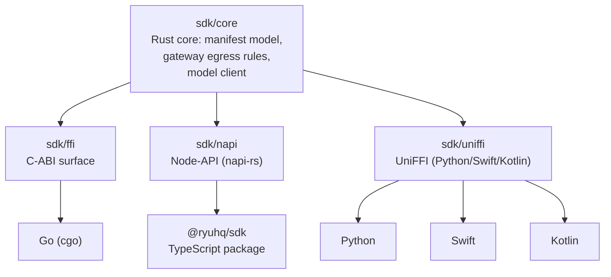

Ryu's SDK is a layered system: one Rust core (`sdk/core`) with language-specific bindings.

## Architecture

## ryu-sdk

**Path:** `crates/sdk/core`

The Rust core of the developer SDK.

| Export | Type | Purpose |
|---|---|---|
| `ModelClient` | struct | Gateway-mandatory model client |
| `assertAllowedEgressUrl()` | fn | Reject direct-provider URLs at construction |
| Manifest validation | fn | Validate `manifest.json` against schema |
| Gateway egress blocklist | const | Known direct-provider URLs |

**Key invariant:** `ModelClient` validates egress in the Rust core, so a direct-provider base URL
throws immediately rather than at request time. This is the gateway-mandatory guarantee.

**Build on it:** Extend the model client with new wire formats or add new manifest validation rules.

## ryu-sdk-ffi

**Path:** `crates/sdk/ffi`

C-ABI surface over `sdk/core`, consumed by Go (cgo) and other C-FFI clients.

| Export | Type | Purpose |
|---|---|---|
| C-ABI functions | fns | `extern "C"` wrappers over sdk/core |
| String handling | conventions | Caller-freed strings |

**Build on it:** Add new C-ABI exports for capabilities you need from a C-FFI consumer.

## ryu-sdk-napi

**Path:** `crates/sdk/napi`

Node-API (napi-rs) binding for TypeScript/JavaScript.

| Export | Type | Purpose |
|---|---|---|
| NAPI exports | classes/functions | Native addon wrapping sdk/core |
| `@ryuhq/sdk-native` | npm package | Published native addon |

**Build on it:** The TypeScript SDK (`@ryuhq/sdk`) imports this as `@ryuhq/sdk-native`. Add new
NAPI exports if you need Rust-powered features from JS.

## ryu-sdk-uniffi

**Path:** `crates/sdk/uniffi`

UniFFI binding for Python, Swift, and Kotlin.

| Export | Type | Purpose |
|---|---|---|
| Blocking surface | fns | UniFFI-compatible blocking API |
| Streaming | deferred | Planned for future |

**Build on it:** Add new UniFFI exports for multi-language SDK access.

## TypeScript SDK (`@ryuhq/sdk`)

**Path:** `packages/sdk`

The TypeScript SDK wraps `ryu-sdk-napi` and adds typed factories.

| Factory | Purpose |
|---|---|
| `defineAgent()` | Create an agent with composable slots (chat, rag, memory, tts, stt, tools) |
| `defineWorkflow()` | Create a workflow that orchestrates other Runnables |
| `defineTool()` | Create a tool with JSON Schema validation |
| `defineSkill()` | Create a reusable skill |
| `definePlugin()` | Assemble a complete `manifest.json` manifest |
| `defineApp()` | Assemble a manifest for a Ryu App (widget tools) |
| `defineTurnHook()` | Create a turn hook that runs after assistant turns |
| `defineModel()` | Create a gateway-mandatory model client |
| `createPrimitives()` | Create typed clients for RAG, memory, TTS, STT, etc. |

See [SDK Reference](/docs/develop/sdk) for the full API.

## How to build a multi-language extension

1. **Rust:** Depend on `sdk/core` directly. Implement your logic as a Runnable.
2. **TypeScript:** Use `@ryuhq/sdk` factories. The NAPI addon handles Rust interop.
3. **Python:** Use `ryu-sdk-uniffi` bindings (experimental).
4. **Go:** Use `ryu-sdk-ffi` via cgo.
5. **Swift/Kotlin:** Use `ryu-sdk-uniffi` bindings (experimental).

All paths route model calls through the Gateway — the SDK enforces this at construction time.
