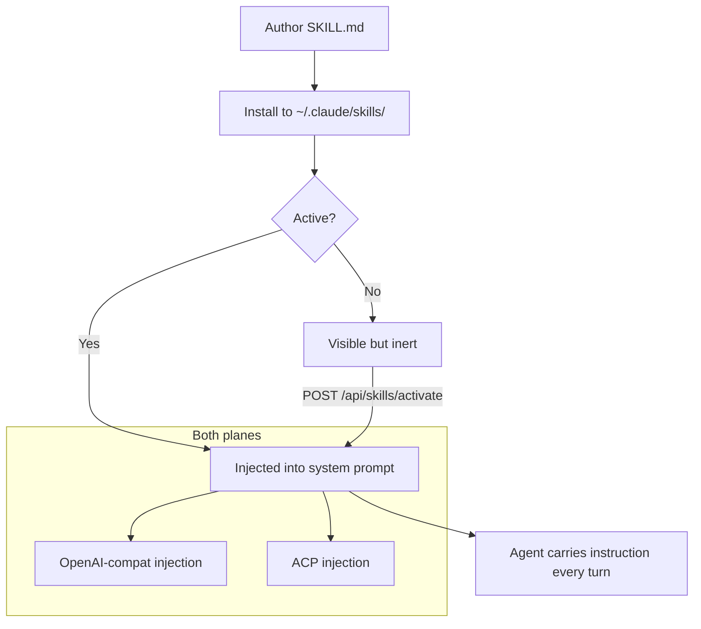

A Skill is a named, reusable prompt pattern: a Markdown instruction body plus a few lines of
front-matter. When a Skill is active, its body is injected into the system prompt on every turn so
the agent always carries that instruction. Ryu uses the **universal Agent Skills layout**, so a
Skill you author here is also usable by Claude Code and the `skills` CLI, and any Skill they
install shows up in Ryu.

This page is the authoring how-to. For how Ryu discovers, ranks, activates, and injects Skills (the
catalog and the per-agent allowlist), see [Skills catalog](/docs/core/skills-catalog).

## How skills flow through Ryu



## Where a Skill lives

A Skill is one directory under the shared Agent Skills home, holding a `SKILL.md` plus any bundled
resource files:

```
~/.claude/skills/<slug>/
  SKILL.md
  examples/sample.txt   # optional bundled resources
```

The slug is the directory name and becomes the Skill's stable id. Ryu's `SkillRegistry`
(`apps/core/src/skills/mod.rs`) scans this directory; the install path is owned by
`apps/core/src/skills_catalog/mod.rs`, which lands every install at
`~/.claude/skills/<slug>/SKILL.md`.

<Callout type="info">
The directory is shared with Claude Code on purpose. Override it with the `RYU_SKILLS_DIR` env var
when you want a separate location - that override is yours to own and Ryu treats it as authoritative.
</Callout>

## Write the SKILL.md

A `SKILL.md` is a YAML front-matter block delimited by `---` lines, then the Markdown instruction
body. The front-matter fields (`apps/core/src/skills/mod.rs`, `SkillFrontMatter`) are:

| Field | Type | Required | Meaning |
|---|---|---|---|
| `name` | string | yes | Human-readable display name shown in the Skills UI |
| `description` | string | no | One-line summary, shown on cards and catalog detail |
| `allowed-tools` | string list | no | Tool names the Skill declares it needs (advisory) |
| `enabled` | bool | no | Installed-but-inactive when `false`; defaults to `true` |

Unknown front-matter keys are silently ignored, so a Skill written for a newer schema still parses.

A minimal Skill:

```markdown
---
name: "Polite Greeter"
description: "Adds a polite greeting to every reply."
---
Always begin every response with "Hello!".
```

A Skill that declares the tools it expects:

```markdown
---
name: "Web Researcher"
description: "Enables web search for this turn."
allowed-tools:
  - "agentbrowser"
  - "spider"
---
You have access to web-search tools. Search the web when you need factual information.
```

The instruction body is everything below the closing `---`. Keep it tight: it is concatenated into
the system prompt for every turn the Skill is active on, so verbose bodies eat a local model's
context budget.

## Bundle resource files

Anything else in the `<slug>/` directory ships with the Skill: example inputs, reference data, or
templates the body points to. The catalog's `SkillDetail.files` lists every file in the package
(`SKILL.md` plus your assets). Installs from a remote source are path-traversal guarded, so a bundled
file can never write outside its own Skill directory.

## Install it

You author a Skill by writing the directory by hand, or you publish it somewhere and install it
through Core. The from-source installer (`apps/core/src/skills_catalog/from_source.rs`) accepts six
forms via `POST /api/skills/install-from-source`:

| Source form | Strategy |
|---|---|
| `owner/repo` | github tarball at the default branch |
| `https://github.com/owner/repo` | github tarball |
| `https://github.com/owner/repo/tree/<ref>/<subdir>` | github tarball at `<ref>`, scoped to `<subdir>` |
| `https://gitlab.com/owner/repo` (and subgroups) | gitlab tarball |
| `git@host:owner/repo.git` | `git clone --depth 1` |
| `/abs/path` or `./rel/path` (existing dir) | local copy |

Browsing and installing from the public skills.sh directory uses the catalog routes instead:
`GET /api/skills/catalog`, `GET /api/skills/catalog/detail`, and `POST /api/skills/catalog/install`.
End users do this from the desktop Skills page.

<TryInRyu page="skills" />

## Installed is not active

Installing a Skill does not automatically inject it. Ryu gates injection behind an activation set so
the shared `~/.claude/skills` directory (which can hold dozens of Skills from Claude Code) does not
overflow a local model's context. Skills installed through Ryu are active; bulk-discovered ones are
visible but inactive until you toggle them with `POST /api/skills/activate`. The full activation and
per-agent allowlist behavior is documented in [Skills catalog](/docs/core/skills-catalog).

<Callout type="warn">
An ACP agent that reads `~/.claude/skills` itself (for example Claude Code) also receives Ryu's
injected preamble, so an active Skill can appear twice for it. The flagship Pi-based `ryu` agent does
not self-read, so for it injection is the only path and there is no doubling. Skipping injection for
self-reading agents is a tracked follow-up.
</Callout>

## How it fits the object model

A Skill is one of Ryu's eight `RunnableKind` variants
(`apps/core/src/runnable/mod.rs`), peers with Agent, Workflow, Tool, and the rest. Authoring a Skill
is the lightest way to extend an agent: no code, no manifest, just a `SKILL.md`. For the heavier
extension surfaces, see the cards below.

<Cards>
  <DocCard href="/docs/core/skills-catalog" />
  <DocCard href="/docs/develop/extensions/hooks-lifecycle" />
  <DocCard href="/docs/develop/extensions/mcp-server" />
  <DocCard href="/docs/develop/extensions/plugin-json-manifest" />
</Cards>
