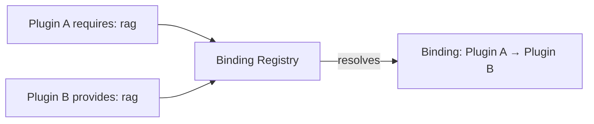

The capability broker is how plugins declare abstract capabilities and how Core resolves them to
concrete provider apps. It is the platform decomposition layer — apps become swappable capability
packages.

## The concept

A plugin declares what it needs (`requires`) and what it offers (`provides`). The binding registry
resolves the abstract requirements to concrete providers at enable time.



## Declaring capabilities in plugin.json

### Providing a capability

```json
{
  "id": "com.ryu.rag",
  "provides": [
    {
      "capability": "rag",
      "version": "1.0.0",
      "sidecar": "ryu-rag",
      "route": "/api/rag",
      "grant": "rag:use"
    }
  ]
}
```

| Field | Purpose |
|---|---|
| `capability` | The abstract capability name (e.g., `rag`, `tts`, `stt`, `image`) |
| `version` | Semver version of the capability |
| `sidecar` | The sidecar process name to spawn |
| `route` | The HTTP route prefix for the capability |
| `grant` | The Gateway grant required to use this capability |

### Requiring a capability

```json
{
  "id": "com.example.my-plugin",
  "requires": {
    "capabilities": ["rag"]
  }
}
```

When this plugin is enabled, the binding registry resolves `rag` to a concrete provider.

## Resolution order

The binding registry (`apps/core/src/plugins/binding.rs`) resolves capabilities in this order:

1. **Override** — a user-configured override for this capability wins
2. **Single provider** — if exactly one installed plugin provides the capability, use it
3. **Ambiguous** — multiple providers exist → error (operator must pick via override)
4. **Missing** — no providers → `MissingDependency` error

This is the same pattern as the Gateway's model router (override > single > ambiguous refusal).

## Built-in capabilities

| Capability | Default provider | Description |
|---|---|---|
| `rag` | `com.ryu.rag` | Embedding, vector storage, retrieval |
| `tts` | `com.ryu.tts` | Text-to-speech synthesis |
| `stt` | `com.ryu.stt` | Speech-to-text transcription |
| `image` | `com.ryu.image` | Image generation |
| `storage` | `com.ryu.storage` | File and blob storage |
| `sandbox` | `com.ryu.sandbox` | Code execution sandbox |

## Setting overrides

Override which provider fulfills a capability:

```json
{
  "overrides": {
    "rag": "com.custom.rag",
    "tts": "com.custom.tts"
  }
}
```

Or via the API:

```bash
curl -X PUT http://localhost:7980/api/plugins/binding-config \
  -H 'Content-Type: application/json' \
  -d '{ "overrides": { "rag": "com.custom.rag" } }'
```

## How it connects to the dependency graph

Once resolved, the binding is lowered to a bare app-id edge. The existing plugin dependency graph
(`apps/core/src/plugins/graph.rs`) handles:

- **Topological ordering** — providers are enabled before consumers
- **Cycle detection** — circular dependencies are rejected
- **Cascade** — disabling a provider cascades to consumers

## Error handling

| Error | Meaning | Fix |
|---|---|---|
| `Ambiguous` | Multiple providers for one capability | Set an override |
| `MissingDependency` | No provider for a required capability | Install a provider plugin |
| `VersionMismatch` | Provider version doesn't satisfy requirement | Update the provider |

## Related

<Cards>
  <DocCard href="/docs/core/app-manifest-lifecycle" />
  <DocCard href="/docs/develop/extensions/plugin-json-manifest" />
  <DocCard href="/docs/start-here/architecture/platform-decomposition" />
  <DocCard href="/docs/start-here/architecture/capability-layers" />
  <DocCard href="/docs/develop/sdk/plugin-api" />
</Cards>
