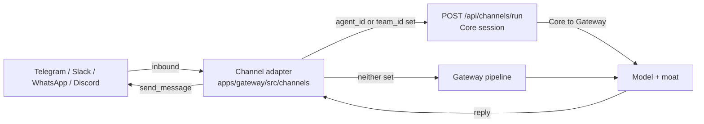

A **Channel** is one of the eight [Runnable kinds](/docs/start-here/architecture/runnable-model).
It binds a messaging platform - Telegram, Slack, WhatsApp, or Discord - to a Core session, so an
inbound chat message becomes one agent (or [team](/docs/core/agent-teams)) turn and the reply is
delivered back to the originating chat. The platform listeners ship in the Gateway
(`apps/gateway/src/channels/`); a plugin declares the channel as a Runnable in `manifest.json`.

This page is the developer reference for the Channel Runnable kind. To configure and route a bot
from the desktop UI, see [Channels](/docs/gateway/channels) instead.

<Callout type="info">
  Channel listeners run inside the **Gateway**, not Core. The Gateway owns external messaging
  surfaces because routing inbound traffic to a model, applying the firewall/DLP/budget moat, and
  delivering the reply are all "what is allowed and measured" concerns. See
  [Core vs Gateway](/docs/start-here/architecture/core-vs-gateway).
</Callout>

## How a channel turn flows

A registered channel implements the `Channel` trait (`apps/gateway/src/channels/mod.rs`): it owns
its transport (long-poll loop or webhook), normalises inbound text into an `InboundMessage`, and
delivers outbound replies via `send_message`. There are two inbound paths, chosen per bot config:

- **Session path** (recommended) - when the bot config carries an `agent_id` or `team_id`, the
  adapter POSTs the turn to Core's `POST /api/channels/run`. The bot becomes a first-class Session
  client: conversation history persists in the Core conversation store, and model calls still flow
  Core to Gateway so the moat governs every call.
- **Pipeline path** (legacy) - when neither id is set, the adapter funnels through the shared
  `handle_message` helper, which builds an OpenAI-style request body and runs the Gateway
  `pipeline` directly. No Core session, no persisted history.



### The Core session endpoint

The session path is one non-streaming call.

```
POST /api/channels/run
```

| Field | Type | Required | Meaning |
|---|---|---|---|
| `conversation_id` | string | yes | Stable per-chat identifier (e.g. the Telegram `chat_id`) used as the Core conversation id, so multi-turn exchanges share history |
| `agent_id` | string | yes (unless `team_id`) | Which agent answers the turn |
| `team_id` | string | no | Targets a whole [team](/docs/core/agent-teams); the lead orchestrates members. Takes precedence over `agent_id` |
| `text` | string | yes | The user's inbound message |

The response is plain JSON `{ "reply": "..." }`. Internally a non-empty `team_id` dispatches to
`run_team_reply_text` and otherwise to `run_reply_text` (`apps/core/src/server/mod.rs`) - the same
ACP path, memory, and Gateway routing the desktop chat uses.

## Declaring a channel in manifest.json

A plugin bundles a channel as a Runnable entry. Each entry carries its identity fields plus a
per-kind `config`; for `kind: "channel"` the only required field is `platform`
(`apps/core/src/plugin_manifest/schema.rs`, `ChannelConfig`).

```json
{
  "id": "io.example.telegram-support",
  "name": "Support Bot",
  "version": "1.0.0",
  "runnables": [
    {
      "id": "channel-telegram",
      "name": "Telegram Support",
      "kind": "channel",
      "config": {
        "platform": "telegram"
      }
    }
  ]
}
```

`validate_runnable` rejects a channel entry with no `config` or a missing `platform`
(error `runnable '...' (kind=channel): missing required 'config' (needs 'platform')`). See the
[manifest.json manifest reference](/docs/develop/extensions/plugin-json-manifest) for the full
manifest shape and the [Runnable model](/docs/start-here/architecture/runnable-model) for the
other seven kinds.

<Callout type="warn">
  The manifest `ChannelConfig` declares the **platform only**. Credentials (bot token, signing
  secret), the routed `agent_id`/`team_id`, model, and system prompt are not part of the plugin
  manifest - they live in the control-plane channel config the Gateway reads at
  `GET /api/channels/gateway/enabled` and are edited in the desktop Gateway dialog. The plugin
  declares *that the bot exists*; the operator wires *how it routes*. See
  [Channels](/docs/gateway/channels).
</Callout>

## Supported platforms

Each platform has its own adapter file under `apps/gateway/src/channels/`.

| Platform | `platform` value | Adapter | Transport |
|---|---|---|---|
| Telegram | `telegram` | `telegram.rs` | Bot API `getUpdates` long-poll (no public URL needed) |
| Slack | `slack` | `slack.rs` | Slack events |
| WhatsApp | `whatsapp` | `whatsapp.rs` | WhatsApp webhook |
| Discord | `discord` | `discord.rs` | Discord gateway |

Adding a new messaging surface means implementing the `Channel` trait in a new adapter file; the
shared inbound path (`handle_message`, `build_request_body`, `extract_reply`) and the Core session
seam are reused unchanged, so only the transport differs.

## Caveats

<Callout type="warn">
  Channel bots are tracked under roadmap milestone **M11** and were verified at the API level, not
  against live platform credentials end to end. The pipeline-path default bot model is `gpt-4o`
  (`DEFAULT_BOT_MODEL`, `apps/gateway/src/channels/mod.rs`) when a store-sourced config omits a
  model - set an explicit model, or use the session path with an `agent_id`, to control routing.
</Callout>

- The session path requires a reachable Core sidecar at the adapter's configured `core_url`
  (defaults to `http://127.0.0.1:7980`). When neither `agent_id` nor `team_id` is set, the bot
  falls back to the Gateway pipeline path and does **not** persist conversation history.
- Channel-originated traffic carries no HTTP API key. The Gateway synthesises a request context
  scoped to the channel (`channel:<name>`) so audit and rate-limit buckets are namespaced per
  channel without per-user auth.

## Next steps

<Cards>
  <DocCard href="/docs/gateway/channels" />
  <DocCard href="/docs/start-here/architecture/runnable-model" />
  <DocCard href="/docs/develop/extensions/plugin-json-manifest" />
  <DocCard href="/docs/core/agent-teams" />
</Cards>
