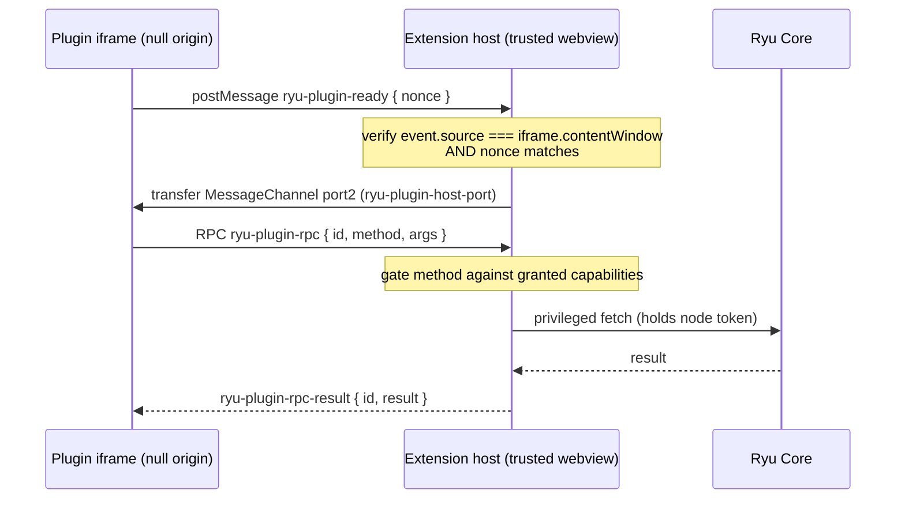

A **Companion** is a plugin surface that renders its own UI inside the desktop app: a sidebar
panel, an overlay, or a settings pane. Because plugin code is untrusted, the desktop runs it in a
sandboxed iframe and lets it reach Core only through a capability-gated RPC bridge. This guide
walks the contribution path end to end, using the built-in example plugin
(`apps/desktop/src/contributions/host/example-plugin.ts`) as the worked example.

`Companion` is one of the eight `RunnableKind` variants
(`apps/core/src/runnable/mod.rs`), so a Companion is declared in a `manifest.json` manifest like any
other Runnable. For the manifest schema and grant strings, see
[the manifest.json manifest reference](/docs/develop/extensions/plugin-json-manifest).

<Callout type="warn">
The desktop extension host is an **MVP** (#446). The pure RPC dispatch and the handshake protocol
are unit-tested (`apps/desktop/src/contributions/host/rpc.test.ts`,
`bridge.integration.test.ts`), but the **live in-webview handshake has not been verified** because
it needs a running display. Treat this as the foundation it is: prove your panel against the
example plugin, expect to iterate.
</Callout>

## The three-tier UI model

Plugin UIs in Ryu follow a three-tier model, each with different trust and capability levels:

| Tier | Trust level | What it can do | Example |
|---|---|---|---|
| **Widget** (in-chat) | Lowest — sandboxed iframe, null origin | Render data from a tool call; call companion tools via `callTool` through the host | Checklist, chart, data grid |
| **Companion** (sidebar/overlay) | Medium — sandboxed iframe, capability-gated RPC | Read agent lists, call Core APIs through the gated bridge | Settings panel, extension page |
| **Full-page app** | Highest — iframe with host bridge | Deep Core integration via the RPC bridge; the host holds the node token | Extension pages, whiteboard |

All three tiers share the same security model: the iframe is null-origin, the host is the single
trusted proxy, and every RPC method is gated by a declared capability. The difference is the surface
area each tier exposes.

### Widget tier (in-chat)

Widgets render inline in a chat message. They are produced by a "render" tool and consume the
tool's arguments and output through `window.openai.toolInput` / `toolOutput`. See
[Ryu Apps](/docs/develop/extensions/ryu-apps) for the full authoring path.

### Companion tier (sidebar/overlay)

Companions are sidebar panels or overlays that persist across turns. They use the same null-origin
iframe and RPC bridge as widgets, but they are not tied to a single tool call. A companion can
maintain state, poll for updates, and call multiple Core APIs.

### Full-page app tier

Full-page apps (also called "extension pages") render in the desktop's main content area. They
use the same ExtensionHost iframe and RPC bridge, but can present a richer UI since they have the
full page to work with. The host routes their RPC calls through the same capability-gated bridge.

## The security model

The host renders your plugin in an `<iframe sandbox="allow-scripts">` **without**
`allow-same-origin`, so the frame runs at a **null origin**
(`apps/desktop/src/contributions/host/ExtensionHost.tsx`). That has three consequences your plugin
must design around:

- The frame cannot read the parent DOM, cannot touch app storage, and does **not** receive
  `window.__TAURI__`. Tauri injects IPC into the app's own webview, never into a null-origin
  sandboxed frame.
- Your plugin reaches Core **only** by sending RPC envelopes to the host. The host (the trusted
  webview) is the single place that holds the Core node token and performs the privileged fetch.
  The plugin never sees the token.
- Each RPC method is gated by a declared **capability**. A call to a method whose capability the
  plugin was not granted is rejected before any service runs.



<Callout type="info">
Because the frame is null-origin, `event.origin` is the literal string `"null"` and is useless as
an auth boundary - any null-origin context matches it. The real identity check is
`event.source === iframe.contentWindow` plus the host-generated nonce. Do not "harden" this with an
origin allowlist; it would be security theatre here.
</Callout>

## Step 1 - Announce readiness from your frame

The host bakes a per-mount nonce (a `crypto.randomUUID()`, host-generated, never plugin or user
input) into your document. Your frame echoes that nonce back in a `ryu-plugin-ready` message so
the host can verify the message came from the frame it created:

```js
const NONCE = /* baked in by the host */;
window.parent.postMessage({ kind: "ryu-plugin-ready", nonce: NONCE }, "*");
```

## Step 2 - Accept the channel port

After the host verifies your handshake it transfers one `MessagePort` into your frame, tagged with
the same nonce. Accept only the port carrying your nonce, then run all RPC over it:

```js
let port = null;
window.addEventListener("message", (ev) => {
  const msg = ev.data;
  if (!msg || msg.kind !== "ryu-plugin-host-port" || msg.nonce !== NONCE) {
    return;
  }
  port = ev.ports?.[0];
  if (port) {
    port.onmessage = onPortMessage;
  }
});
```

Point-to-point ports sidestep the `targetOrigin: "*"` ambiguity that a null-origin frame would
otherwise force on every message.

## Step 3 - Call Core over the gated bridge

Send a request envelope over the port and correlate the reply by `id`. The envelope shape is
defined in `apps/desktop/src/contributions/host/rpc.ts`:

```js
let nextId = 1;
const pending = {};

function call(method, args) {
  return new Promise((resolve, reject) => {
    if (!port) {
      reject(new Error("bridge not ready"));
      return;
    }
    const id = nextId++;
    pending[id] = { resolve, reject };
    port.postMessage({ kind: "ryu-plugin-rpc", id, method, args: args ?? [] });
  });
}

// then: await call("core.listAgents", [])
```

The host replies with a `ryu-plugin-rpc-result` envelope carrying exactly one of `result` or
`error`.

## The RPC contract

These are the envelope kinds exchanged over the bridge (`rpc.ts`):

| Kind | Direction | Payload |
|---|---|---|
| `ryu-plugin-ready` | frame to host | `{ nonce }` |
| `ryu-plugin-host-port` | host to frame | `{ nonce }` + a transferred `MessagePort` |
| `ryu-plugin-rpc` | frame to host | `{ id, method, args }` |
| `ryu-plugin-rpc-result` | host to frame | `{ id, result }` or `{ id, error }` |

The host validates every inbound payload with `asRpcRequest`, so any message not shaped like the
envelope is dropped before it reaches dispatch.

## Capabilities

Every callable method is mapped to a required capability in `METHOD_CAPABILITY` (`rpc.ts`). A
method that is not in that map is **unknown** and always rejected (never default-allow). The MVP
ships one method:

| Method | Capability | Result |
|---|---|---|
| `core.listAgents` | `core.listAgents` | The agents on the active node |

<Callout type="warn">
For the MVP the granted-capability set is **host-provided config** passed in at mount time. Reading
it from the plugin's `manifest.json` grants is the manifest activation work (#443). The gate itself
is real and enforced today; what is still wired is sourcing the grant set from your manifest. See
[the manifest.json manifest reference](/docs/develop/extensions/plugin-json-manifest) for how grants
are declared.
</Callout>

### Capability catalog

The full set of RPC methods and their required capabilities:

| Method | Capability | Description |
|---|---|---|
| `core.listAgents` | `core.listAgents` | List agents on the active node |
| `core.getAgent` | `core.getAgent` | Get a specific agent's configuration |
| `core.listConversations` | `core.listConversations` | List conversations |
| `core.getConversation` | `core.getConversation` | Get a specific conversation |
| `core.listSpaces` | `core.listSpaces` | List knowledge spaces |
| `core.searchTools` | `core.searchTools` | Search the unified tool catalog |
| `core.callTool` | `core.callTool` | Execute a tool through the Gateway |
| `core.getNodeStatus` | `core.getNodeStatus` | Get node health and sidecar status |

Unknown methods (not in the capability map) are always rejected — there is no default-allow path.

## Try it

The example plugin runs live in the desktop today. Open **Extensions**
(`apps/desktop/src/pages/ExtensionsPage.tsx`): the panel at the top is the example plugin running
in its sandboxed null-origin iframe. Click **List agents** to watch a real `core.listAgents` call
travel over the gated bridge and render the result.

<TryInRyu page="extensions" />

## Next steps

<Cards>
  <DocCard href="/docs/develop/extensions/plugin-json-manifest" />
  <DocCard href="/docs/develop/extensions/typescript-sdk" />
  <DocCard href="/docs/core/app-manifest-lifecycle" />
</Cards>
