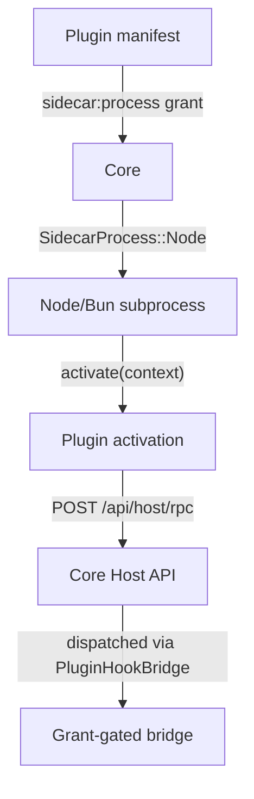

The Extension Host v1 gives plugins their own managed Node/Bun backend process. It is the mechanism
for third-party code execution inside Ryu, experimental-gated and grant-gated.

## How it works



1. A plugin declares `sidecars: [{ process: { kind: "node" } }]` in its `manifest.json`
2. Core spawns a managed Node/Bun subprocess for the plugin
3. The subprocess calls `activate(context)` to initialize
4. The plugin communicates with Core via `POST /api/host/rpc`
5. Core dispatches RPC calls through the `PluginHookBridge` with grant enforcement

## The activate() lifecycle

```typescript
// Plugin entry point (loaded by the extension host)
export function activate(context: ExtensionContext) {
  // Register tools, hooks, views
  context.registerTool({
    name: "my-tool",
    handler: async (args) => { /* ... */ }
  });

  // Access host APIs
  const model = await context.host.modelComplete({
    prompt: "Hello",
    model: "gemma4"
  });

  // Storage
  await context.host.storage.set("key", "value");
  const value = await context.host.storage.get("key");
}
```

| Lifecycle phase | What happens |
|---|---|
| **Spawn** | Core spawns the Node/Bun process with the plugin's entry point |
| **activate()** | Plugin registers tools, hooks, and views |
| **Running** | Plugin handles requests via RPC |
| **Idle stop** | After inactivity, Core stops the process |
| **Wake on demand** | Next request re-spawns the process |

## Host API

The plugin communicates with Core via `POST /api/host/rpc`. Available host calls:

| Call | Grant required | Purpose |
|---|---|---|
| `host_model_complete` | `hook:side-model` | Gateway-routed model completion |
| `host_storage_get/set/delete` | `storage:kv` | Plugin KV storage |
| `host_log` | none | Captured logs |
| `host_capability` | varies | Capability broker calls |
| `host_navigate` | none | Deep-link the shell |

## Grant gating

Every host call is grant-gated. The plugin must declare the required grants in its manifest:

```json
{
  "permission_grants": ["hook:side-model", "storage:kv"]
}
```

The Gateway validates these grants on enable. An ungranted capability call rejects with
`is_error: true`.

## Experimental gating

The Extension Host v1 is behind a feature flag:

```bash
RYU_EXPERIMENTAL_PLUGIN_RUNTIME=1  # enable (default OFF)
```

When disabled, plugins with `SidecarProcess::Node` are loaded but their subprocess is not spawned.

## Security model

| Property | Guarantee |
|---|---|
| **Backend code signed** | `backend_code` is sha256-hashed at install time; tampering fails closed |
| **Grant-gated** | Every host call requires an explicit grant |
| **Sandboxed** | Plugin runs in its own process, isolated from Core |
| **Idle-stop** | No runaway processes |
| **Fail-closed** | Uncaught errors degrade to `{ kind: "none" }` |

## Building an extension host plugin

### 1. Declare the sidecar in manifest.json

```json
{
  "id": "com.example.my-plugin",
  "name": "My Plugin",
  "version": "1.0.0",
  "sidecars": [
    {
      "name": "backend",
      "process": {
        "kind": "node",
        "entry": "dist/activate.js"
      }
    }
  ],
  "permission_grants": ["hook:side-model", "storage:kv"]
}
```

### 2. Implement activate()

```typescript
export function activate(context: ExtensionContext) {
  context.registerTool({
    name: "my-analysis",
    description: "Analyze data with AI",
    inputSchema: {
      type: "object",
      properties: {
        data: { type: "string", description: "Data to analyze" }
      },
      required: ["data"]
    },
    handler: async ({ data }) => {
      const result = await context.host.modelComplete({
        prompt: `Analyze: ${data}`,
        model: "gemma4"
      });
      return { analysis: result };
    }
  });
}
```

### 3. Pack and install

```bash
bunx ryu pack .
curl -X POST http://localhost:7980/api/plugins/install \
  -H 'content-type: application/json' \
  -d '{"url": "https://example.com/my-plugin/manifest.json"}'
curl -X POST http://localhost:7980/api/plugins/com.example.my-plugin/enable
```

## What's next

The extension host v1 covers the Node/Bun backend path. Future work:

- **Desktop/renderer extension host** (#446) — plugins that contribute UI
- **Rust-native in-process plugins** — no subprocess overhead
- **Hot reload** — file-watch triggered re-activation
- **`ryu install`-to-node DX** — seamless install from the marketplace

See [Plugin Runtime](/docs/develop/extensions/plugin-runtime) for the full runtime reference.

## Related

<Cards>
  <DocCard href="/docs/develop/extensions/plugin-runtime" />
  <DocCard href="/docs/develop/extensions/hooks-lifecycle" />
  <DocCard href="/docs/develop/extensions/plugin-json-manifest" />
  <DocCard href="/docs/develop/sdk/plugin-api" />
</Cards>
