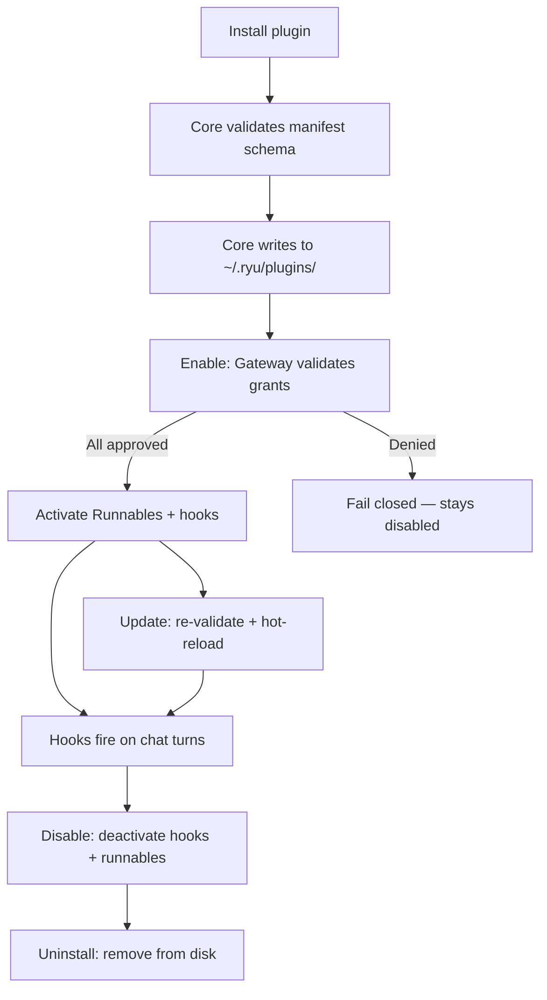
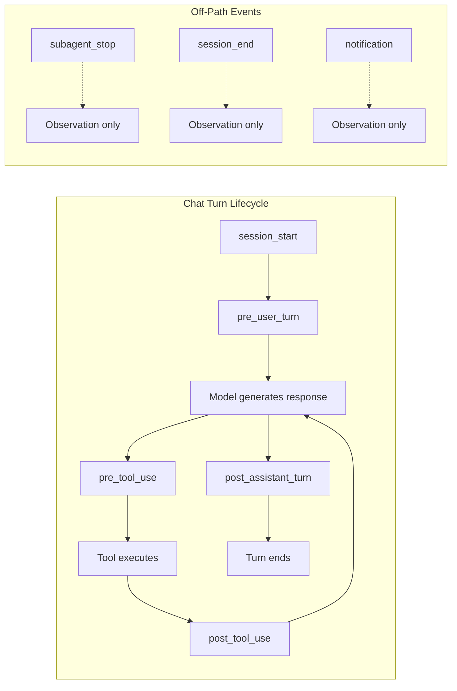
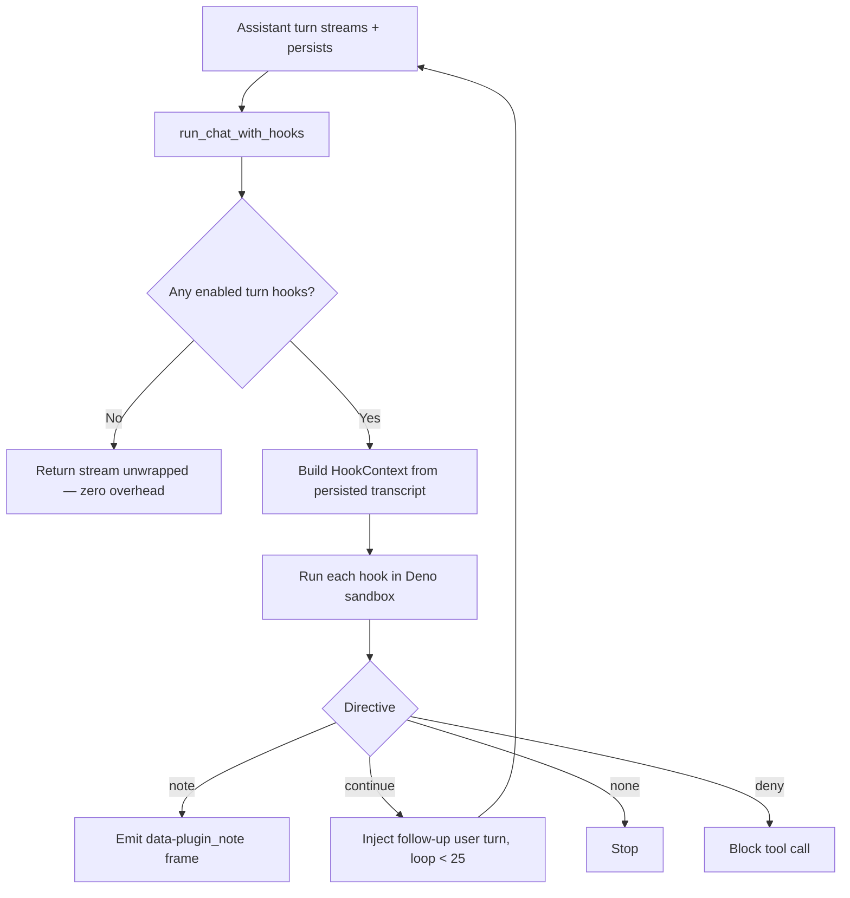

Plugins in Ryu go through a well-defined lifecycle: install, validate, enable, run, disable, and
uninstall. At each stage, Core enforces manifest schema validation and Gateway grant checks. Hooks
let your plugin code react to chat events at specific boundaries — before a user message, after an
assistant reply, before or after a tool call, and more.

This page is the single reference for how plugins load, when hooks fire, and what lifecycle events
you can use to control activation.

## Plugin lifecycle overview



### Lifecycle stages

| Stage | What happens | Route |
|---|---|---|
| **Install** | Fetch manifest from URL, validate schema, write to `~/.ryu/plugins/<id>/`, hot-reload manifest set | `POST /api/plugins/install` |
| **Install by id** | Install a known catalog plugin by its id | `POST /api/plugins/:id/install` |
| **Enable** | Validate each declared `permission_grants` via Gateway `POST /v1/grants/validate`, then activate Runnables + hooks | `POST /api/plugins/:id/enable` |
| **Disable** | Deactivate hooks (stop firing on next turn) + Runnables | `POST /api/plugins/:id/disable` |
| **Update** | Re-fetch manifest, re-validate, hot-reload | `POST /api/plugins/:id/update` |
| **Uninstall** | Remove plugin directory from disk | `DELETE /api/plugins/:id` |

Enable **fails closed** if any declared grant is denied by the Gateway. This keeps the
Core-vs-Gateway split intact: Core decides what runs, the Gateway decides what is allowed.

### What happens on enable

When a plugin is enabled, Core runs `build_runnable_registry` (`apps/core/src/server/mod.rs`):

1. **Agent runnables** get an `app__`-namespaced id in the agent store and appear in the agent picker.
2. **Workflow runnables** are saved as skeleton definitions and appear in the workflow list.
3. **Tool runnables** are registered into the MCP registry and appear in tool search on both planes.
4. **Turn hooks** are collected by `collect_enabled_hooks` and will fire on the next assistant turn.
5. **Declarative contributions** (composer controls, settings tabs, slash commands) are stored and served at `GET /api/plugins/contributions`.

<Callout type="warn">
  Only `agent`, `workflow`, and `tool` Runnables activate on enable today. A `skill`, `companion`,
  `channel`, `engine`, or `policy` entry parses and validates but returns a per-Runnable "no handler"
  outcome. Ship agents, workflows, and tools; treat the other five as declared-but-inert.
</Callout>

## Hook phases

Turn hooks are declared under `contributes.turn_hooks` in `manifest.json`. Each hook fires at a
specific boundary in the chat lifecycle. The `on` field selects the phase:



| Phase | `on` value | Fires when | Directives |
|---|---|---|---|
| **Session start** | `session_start` | First turn of a conversation | `inject`, `note` |
| **Pre-user turn** | `pre_user_turn` | Before the user message reaches the model | `replace`, `inject` |
| **Pre-tool use** | `pre_tool_use` | Before a tool call executes | `deny` (blocks the call) |
| **Post-tool use** | `post_tool_use` | After a tool call returns | Observation only (v1) |
| **Post-assistant turn** | `post_assistant_turn` | After the assistant reply streams and persists | `note`, `continue` |
| **Sub-agent stop** | `subagent_stop` | When a delegated sub-agent finishes | Observation only (v1) |
| **Session end** | `session_end` | When a conversation is deleted | Observation only (v1) |
| **Notification** | `notification` | When a notification is fanned out | Observation only (v1) |

### Directives reference

| Directive | Effect | Phase |
|---|---|---|
| `{ kind: "none" }` | Do nothing (also the fail-safe for errors) | All |
| `{ kind: "note", text }` | Surface `text` to the user as a `data-plugin_note` part, never in history | `post_assistant_turn`, `session_start` |
| `{ kind: "continue", text }` | Inject `text` as a follow-up user turn, loop < 25 | `post_assistant_turn` |
| `{ kind: "replace", text }` | Swap the outgoing user message before it reaches the model | `pre_user_turn` |
| `{ kind: "inject", text }` | Append additional context to the outgoing message | `pre_user_turn`, `session_start` |
| `{ kind: "deny", reason }` | Block a pending tool call; `reason` returned as tool error | `pre_tool_use` |

## The tool glob gate

A `pre_tool_use` or `post_tool_use` hook usually cares about only some tools. The manifest's
`match.tools` field is a spawn-avoidance gate evaluated in Rust before any sandbox spawn: the hook
runs only when the tool being called matches one of its patterns.

The matcher (`glob_match`) is deliberately tiny:

| Pattern | Matches |
|---|---|
| `*` | Everything |
| `bash*` | Prefix: `bash`, `bash_read`, etc. |
| `*write` | Suffix: `file_write`, `web_write` |
| `*edit*` | Substring: `file_edit`, `inline_edit` |
| `exact_name` | Exact match only |

A hook whose gate does not match the current tool never spawns the Deno sandbox.

## Building a turn hook

### 1. Declare the hook in manifest.json

```json
{
  "id": "com.example.double-check",
  "name": "Double Check",
  "version": "1.0.0",
  "permission_grants": ["hook:side-model"],
  "contributes": {
    "turn_hooks": [
      {
        "id": "dc.review",
        "on": "post_assistant_turn",
        "code": "// JS body: return { kind: 'note', text: '...' }"
      }
    ],
    "composer_controls": [
      { "id": "dc.toggle", "type": "toggle", "flag": "com.example.double-check" }
    ]
  }
}
```

### 2. Use the TypeScript SDK

```ts
import { definePlugin, defineTurnHook } from "@ryuhq/sdk";

export default definePlugin({
  id: "com.example.double-check",
  name: "Double Check",
  version: "1.0.0",
  grants: ["hook:side-model"],
  composerControls: [{ id: "dc.toggle", "type": "toggle", "flag": "com.example.double-check" }],
  turnHooks: [
    defineTurnHook({
      id: "dc.review",
      run: async (ctx, host) => {
        if (!ctx.flags["com.example.double-check"]) {
          return { kind: "none" };
        }
        const last = ctx.transcript.at(-1);
        const review = await host.sideModel({
          prompt: last?.content ?? "",
          model_pref_key: "double-check-model",
        });
        return { kind: "note", text: review };
      },
    }),
  ],
});
```

### 3. The `ctx` and `host` globals

Each hook body runs in a fresh Deno sandbox with exactly two globals:

**`ctx` — the turn context:**

| Field | Type | Description |
|---|---|---|
| `conversation_id` | `string` | Conversation id; natural key for per-conversation storage |
| `agent_id` | `string` | The agent that produced the turn |
| `transcript` | `{ role, content }[]` | Recent messages, oldest to newest |
| `flags` | `{ [pluginId]: boolean }` | Per-request plugin flags (e.g. composer toggles) |

**`host` — the capability bridge:**

| Call | Grant required | Returns |
|---|---|---|
| `host.sideModel({ prompt, system?, model?, model_pref_key?, effort? })` | `hook:side-model` | One non-streaming Gateway completion as text |
| `host.storage.get(key, namespace?)` | `storage:kv` | Stored string or `null` |
| `host.storage.set(key, value, namespace?)` | `storage:kv` | `true` |
| `host.storage.delete(key, namespace?)` | `storage:kv` | `true` |
| `host.storage.keys(namespace?)` | `storage:kv` | Namespace's keys |
| `host.log(...args)` | none | Captured logs |

Storage is namespaced per plugin. An ungranted capability call rejects with `is_error: true`; an
uncaught throw degrades the hook to `{ kind: "none" }` — a misbehaving plugin can never block a turn.

## Where hooks run

Hooks live in `apps/core/src/plugin_host/` because they decide *what runs next* — a Core concern.
Any model call a hook makes (`host.sideModel`) still routes through the Gateway.



The chat path wires hooks at `run_chat_with_hooks` (`apps/core/src/server/mod.rs`). When no plugin
contributes a hook (the common case) or the sandbox backend is absent, the inner stream is returned
unwrapped — zero overhead on the hot path.

## The process-global dispatcher

Off-path phases (`pre_tool_use`, `post_tool_use`, `subagent_stop`, `session_end`, `notification`)
fire at sites that have no `ServerState`. They reach the runtime through a process-global dispatcher
(`dispatch_global(phase, ctx)` over the `HookDispatch` trait), installed once at boot via `set_global`.

Every off-path dispatch first runs a DB-free gate (`any_manifest_declares`): if no loaded manifest
declares the phase, it returns instantly. A tool call pays nothing on the hot path unless a tool-hook
plugin is actually loaded.

## Maturity matrix

| Phase | Live-tested | Directives applied |
|---|---|---|
| `post_assistant_turn` | Yes (double-check, goal, advisor fixtures) | `note`, `continue` |
| `pre_user_turn` | Wired | `replace`, `inject` |
| `session_start` | Wired | `inject`, `note` |
| `pre_tool_use` | Wired | `deny` (blocks the call) |
| `post_tool_use` | Wired | Observation only |
| `subagent_stop` | Wired | Observation only |
| `session_end` | Wired | Observation only |
| `notification` | Wired | Observation only |

<Callout type="info">
  The observation-only phases fire (detached, fail-open) but their directives are not applied to
  the result in v1. Treat them as telemetry, not control points, until that changes.
</Callout>

## Related

<Cards>
  <DocCard href="/docs/develop/extensions/plugin-json-manifest" />
  <DocCard href="/docs/develop/extensions/plugin-runtime" />
  <DocCard href="/docs/core/double-check" />
  <DocCard href="/docs/core/goals" />
  <DocCard href="/docs/develop/sdk/plugin-api" />
</Cards>
