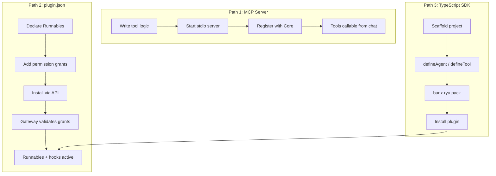

Ryu is built so that **nothing is hardcoded and everything is swappable**. Extending it means
adding new capabilities — tools, agents, workflows, skills — that plug into the same Core and
Gateway every built-in uses.

## Three extension paths



### 1. MCP Server (fastest)

Expose any tool over the Model Context Protocol. No manifest, no SDK, no restart required. Register
it with Core and its tools become callable from chat immediately.

```bash
pipx install headroom-ai[mcp]
curl -X POST http://localhost:7980/api/mcp/servers \
  -H 'content-type: application/json' \
  -d '{"name": "headroom", "command": ["headroom-mcp"]}'
```

Best for: wrapping an existing process in any language (Python, Go, stdio), quick tool exposure.

See [Register an MCP Server](/docs/develop/extensions/mcp-server).

### 2. `plugin.json` manifest (installable)

Bundle one or more Runnables (tools, agents, workflows, skills) plus the permission grants they need
into a single installable plugin. Core validates the manifest, writes it to disk, and hot-reloads it
with no restart.

```json
{
  "id": "com.example.my-plugin",
  "name": "My Plugin",
  "version": "1.0.0",
  "runnables": [
    { "id": "agent-main", "name": "Main", "kind": "agent", "config": { "model": "gemma4" } }
  ],
  "permission_grants": ["hook:side-model"]
}
```

Best for: shipping a named, versioned bundle; declaring permission grants the Gateway enforces;
contributing hooks, composer controls, or desktop UI.

See [Bundle Runnables with plugin.json](/docs/develop/extensions/plugin-json-manifest).

### 3. TypeScript SDK (typed)

Define agents, workflows, tools, and skills as typed Runnables in code, with the Gateway mandatory
on every model call. Pack into a `plugin.json` with `bunx ryu pack`.

```typescript
import { defineAgent } from "@ryuhq/sdk";

export const researcher = defineAgent({
  id: "agent-researcher",
  name: "Researcher",
  async run({ query }, ctx) {
    const result = await ctx.gateway.chat([{ role: "user", content: query }]);
    return { answer: result.content };
  },
});
```

Best for: authoring agents/workflows in typed TypeScript, gateway-routed model calls, validated
packaging for distribution.

See [TypeScript SDK](/docs/develop/extensions/typescript-sdk).

## Decision guide

| You want to... | Use |
|---|---|
| Expose a single tool or small toolset quickly | MCP server |
| Wrap an existing process in any language (Python, Go, stdio) | MCP server |
| Ship a named, versioned, installable bundle of Runnables | `plugin.json` manifest |
| Declare permission grants the Gateway should enforce | `plugin.json` manifest |
| React to chat events (turn hooks, tool gates) | `plugin.json` + turn hooks |
| Contribute desktop UI | `plugin.json` + companion |
| Author agents/workflows in typed TypeScript with Gateway-routed model calls | TypeScript SDK |
| Validate and package a plugin for distribution | TypeScript SDK (`bunx ryu pack`) |

An MCP server and a `plugin.json` manifest are not mutually exclusive. The MCP server is the
executable that exposes the tools; the manifest is the install and lifecycle wrapper.

## Quick start

```bash
bunx create-ryu-app my-plugin
cd my-plugin
bun install
bunx ryu pack   # produces plugin.json
```

The scaffolded project includes a starter Runnable, a gateway-pointed model config, and a
`plugin.json` manifest ready to load into Core.

## Explore further

<Cards>
  <Card title="Plugins & Hooks" href="/docs/develop/extensions/plugin-json-manifest" />
  <Card title="Hooks & Lifecycle" href="/docs/develop/extensions/hooks-lifecycle" />
  <Card title="Plugin Runtime" href="/docs/develop/extensions/plugin-runtime" />
  <Card title="MCP Server" href="/docs/develop/extensions/mcp-server" />
  <Card title="Agent Skills" href="/docs/develop/extensions/agent-skills" />
  <Card title="Ryu Apps" href="/docs/develop/extensions/ryu-apps" />
  <Card title="Desktop Companion" href="/docs/develop/extensions/desktop-companion" />
  <Card title="Channel Bot" href="/docs/develop/extensions/channel-bot" />
  <Card title="Author Workflows" href="/docs/develop/extensions/author-workflows" />
  <Card title="Marketplace" href="/docs/develop/extensions/marketplace" />
</Cards>
