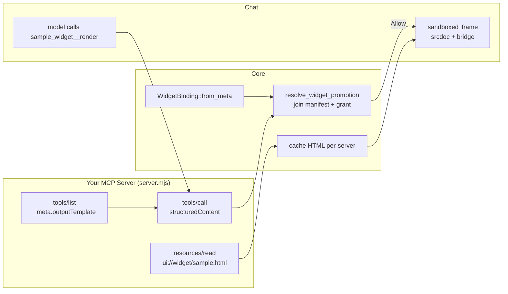

An **inline widget** is an interactive UI that renders directly inside a chat reply — a greeting card
you can click, a checklist you tick, a data grid you sort. It is the ChatGPT-Apps-SDK pattern brought
into Ryu: an **MCP server** exposes a **tool** whose result carries structured data and points at a
`ui://widget/<slug>.html` **skybridge** resource, and Core mounts that HTML as a **sandboxed iframe**
inline in the conversation. The widget reads the tool output, renders, and talks back to the host over
a `MessagePort` — it never touches the network.

This guide walks the **template path**: copy the built-in `sample-widget` plugin
(`plugins-store/sample-widget/`) and adapt it. It is a hand-written, zero-dependency Node MCP server —
the lowest-level way to author a widget, and the one to reach for when you already have an MCP server or
want no build step. To author the same thing through the SDK's `defineApp` instead, see
[Author a Ryu App](/docs/develop/extensions/ryu-apps).

<Callout type="warn">
  The inline-widget renderer is **experimental and opt-in**, behind two independent gates. **(1)** The
  desktop `AppWidget` renderer sits behind the plugin-runtime experimental flag
  (`ryu:experimental-plugin-runtime`, toggled in **Settings → Experimental**). While it is off the
  widget mounts an inert placeholder and the host context is withheld. **(2)** The plugin must be
  installed, enabled, and hold the `widget:render` grant. Headless widget render is proven; a running
  desktop render of a widget-bearing tool is not yet fully live-verified.
</Callout>

## The three files of a widget plugin

A widget plugin is exactly three files, and two independent halves must line up or Core silently falls
back to plain text.

<Files>
  <Folder name="sample-widget" defaultOpen>
    <File name="plugin.json" />
    <File name="server.mjs" />
    <File name="sample.html" />
  </Folder>
</Files>

| File | Role |
| --- | --- |
| `plugin.json` | Manifest: `mcp_servers` + `contributes.widgets` + the `widget:render` grant. The **consent gate**. |
| `server.mjs` | Zero-dependency stdio MCP server: the render tool + the widget HTML resource. |
| `sample.html` | Self-contained skybridge widget UI, mounted inline in a sandboxed iframe. |

The **binding** lives in the tool definition's `_meta`; the **consent** lives in the manifest. Neither
alone promotes a widget — Core joins them.

## How a widget renders



1. The model calls the tool `sample_widget__render`.
2. The server returns `{ structuredContent: {...} }`. Core maps `structuredContent` →
   `window.openai.toolOutput` (alias `window.ryu.toolOutput`).
3. Core reads the widget HTML from the server's `resources/read` (cached per-server) and ships it
   **inline** into a null-origin `sandbox="allow-scripts"` iframe (`srcdoc`). The widget never fetches
   anything itself.
4. `sample.html` reads `window.ryu.toolOutput` at module top level and renders. Every privileged call
   (state, call-tool-back, follow-up) travels over a transferred `MessagePort`, never the network.

## 1. The manifest (`plugin.json`)

The manifest declares the MCP server, binds its render tool to the widget resource, and holds the one
grant that authorizes promotion. This is the `sample-widget` manifest verbatim:

```json
{
  "id": "sample-widget",
  "name": "Sample Widget",
  "version": "1.0.0",
  "runnables": [],
  "permission_grants": ["widget:render"],
  "mcp_servers": {
    "sample_widget": {
      "command": "node",
      "args": ["server.mjs"],
      "description": "Sample widget MCP server: one render tool + the ui://widget/sample.html resource."
    }
  },
  "contributes": {
    "widgets": [
      {
        "tool_id": "sample_widget__render",
        "uri": "ui://widget/sample.html",
        "mime": "text/html+skybridge",
        "default_display_mode": "inline"
      }
    ]
  }
}
```

Three fields carry all the weight:

- **`mcp_servers`** — a stdio MCP server, keyed by name. The key (`sample_widget`) becomes half of the
  runtime tool id. `command`/`args` spawn the process; `args` is relative to the installed plugin
  directory, so `server.mjs` resolves next to `plugin.json`.
- **`contributes.widgets[]`** — the consent allowlist. Each entry names the `tool_id` allowed to
  promote, the resource `uri` it renders, its `mime`, and a `default_display_mode`
  (`inline` \| `fullscreen` \| `pip`).
- **`permission_grants: ["widget:render"]`** — the single grant that lets Core promote this plugin's
  tool result into a widget. `tool:call` / `ui:send_message` are **auto-derived** from the tool's
  `widgetAccessible` flag at emit time — you never list them here.

<Callout type="info">
  The `tool_id` is the **runtime** id, formed as `<mcp_servers-key>__<toolName>`. Here `sample_widget`
  (the server key) joined with `render` (the tool name from `tools/list`) gives
  `sample_widget__render`. The manifest `uri` and the tool's `_meta.outputTemplate` must be the
  **same** string, and the server must serve that uri from `resources/list` + `resources/read`.
</Callout>

The `sample-widget` manifest is also compiled into Core as a built-in fixture at
`apps/core/src/plugin_manifest/fixtures/sample-widget.plugin.json` (byte-identical to the plugin copy).
It is **opt-in** — not in `CORE_DEFAULT_ON` — so install/enable it before the widget can render.

## 2. The MCP server (`server.mjs`)

The server is newline-delimited JSON-RPC 2.0 over stdin/stdout — one compact JSON object per line,
`\n`-terminated. It implements exactly the five methods Core calls: `initialize`, `tools/list`,
`tools/call`, `resources/list`, `resources/read`. Zero dependencies (only `node:` built-ins), so the
plugin needs nothing installed.

### The binding lives in `tools/list`

The render tool's flat top-level `_meta` is what makes it a *widget* tool. Core reads these keys via
`WidgetBinding::from_meta` (`apps/core/src/sidecar/mcp/mod.rs`): `ryu/*` keys win, `openai/*` are the
fallback aliases, so an unmodified Apps-SDK tool works verbatim.

```js
const TOOLS = [
  {
    name: "render",
    description:
      "Render the Sample Widget: returns a greeting + a starting counter, shown inline in chat.",
    inputSchema: {
      type: "object",
      properties: {
        name: { type: "string", description: 'Who to greet. Defaults to "world".' },
      },
      additionalProperties: false,
    },
    _meta: {
      // REQUIRED — points at the resource served below. This is what makes
      // `render` a *widget* tool. Must match plugin.json's uri.
      "openai/outputTemplate": "ui://widget/sample.html",
      // Lets the mounted widget call THIS server's widget-accessible tools back
      // over the MessagePort. tool:call / ui:send_message grants are auto-derived
      // from this flag — do NOT list them in permission_grants. Omit for a
      // read-only widget.
      "openai/widgetAccessible": true,
      // Optional status labels shown while the tool runs.
      "openai/toolInvocation": {
        invoking: "Rendering sample widget…",
        invoked: "Sample widget ready",
      },
    },
  },
];
```

### `tools/call` returns the data channel

The key output is `structuredContent` — Core maps it to `window.openai.toolOutput`, which the widget
reads at module top level. `content` is the plain-text fallback shown when the widget can't render
(e.g. the experimental flag is off). Return `isError: false` (the default) — **an error result emits
no widget.**

```js
function callTool(params) {
  const who = (params?.arguments?.name ?? "world").toString().slice(0, 64);
  const structuredContent = {
    greeting: `Hello, ${who}!`,
    counter: 0,
    renderedAt: new Date().toISOString(),
  };
  return {
    // Plain-text fallback (shown if the widget itself doesn't render).
    content: [{ type: "text", text: `${structuredContent.greeting} (open the widget to interact)` }],
    // The widget's data channel → window.openai.toolOutput.
    structuredContent,
  };
}
```

### `resources/read` serves the HTML

Core fetches the widget HTML once, caches it per-server, and mounts it. Hand back the first content
entry with `text` and the `text/html+skybridge` mime:

```js
const WIDGET_URI = "ui://widget/sample.html";
const WIDGET_MIME = "text/html+skybridge";
// Read relative to THIS script (import.meta.url), not the process cwd, which Core controls.
const WIDGET_HTML = readFileSync(join(HERE, "sample.html"), "utf8");

function readResource(params) {
  if (params?.uri !== WIDGET_URI) throw new Error(`unknown resource: ${params?.uri}`);
  return { contents: [{ uri: WIDGET_URI, mimeType: WIDGET_MIME, text: WIDGET_HTML }] };
}
```

<Callout type="info">
  Anything the server prints to **stderr** is captured as server logs and does not corrupt the
  protocol — use it for debugging. Never emit a bare newline mid-frame; `JSON.stringify` guarantees a
  single-line frame.
</Callout>

## 3. The widget UI (`sample.html`)

`sample.html` is **one self-contained document** — inline `<style>` plus one inline
`<script type="module">`. The host CSP is hard-pinned and never widened:

- `default-src 'none'`, `connect-src 'none'` → **no** fetch / XHR / WebSocket. All live data arrives
  over the bridge.
- `script-src 'nonce-…'` → any non-nonced or CDN `<script>` is refused.
- `style-src 'unsafe-inline'`; `data:` images and fonts are allowed.

A trusted bootstrap installs `window.ryu` (alias `window.openai`) **synchronously** before your module
runs, so top-level reads of `toolOutput` / `theme` / `widgetState` work.

### Read the tool output

The single thing every widget does. `structuredContent` from the tool arrives as `toolOutput`;
`widgetState` is your own persisted UI state (survives reload, keyed by tool-call id) — prefer it for
live interaction so a reload restores what the user did.

```js
const bridge = window.ryu ?? window.openai;

function currentCount() {
  const fromState = bridge?.widgetState?.count;
  if (typeof fromState === "number") return fromState;
  const fromOutput = bridge?.toolOutput?.counter;
  return typeof fromOutput === "number" ? fromOutput : 0;
}

function render() {
  const out = bridge?.toolOutput ?? {};
  document.getElementById("greeting").textContent = out.greeting ?? "Hello!";
  document.getElementById("count").textContent = String(currentCount());
  // Tell the host our natural height so the inline box sizes to content.
  bridge?.notifyIntrinsicHeight?.(document.body.scrollHeight);
}
```

### Persist UI state (no grant needed)

`setWidgetState` is the guaranteed-working interaction: it needs no provenance and always works. It
updates the client store and best-effort persists so the value survives a reload.

```js
function setCount(next) {
  const count = Math.max(0, next);
  bridge?.setWidgetState?.({ ...(bridge.widgetState ?? {}), count });
  document.getElementById("count").textContent = String(count);
  bridge?.notifyIntrinsicHeight?.(document.body.scrollHeight);
}
```

### Call the tool back (advanced)

`callTool` round-trips to the **same** server. It only works because the render tool declared
`openai/widgetAccessible: true` **and** the target tool is widget-accessible on that server. If the
experimental runtime is off or provenance fails, it rejects — degrade gracefully rather than break the
UI.

```js
document.getElementById("refresh").addEventListener("click", async () => {
  try {
    const result = await bridge?.callTool?.("render", {
      name: bridge?.toolInput?.name ?? "world",
    });
    const fresh = result?.structuredContent;
    if (fresh?.renderedAt) {
      document.getElementById("meta").textContent = `Refreshed at ${fresh.renderedAt}`;
    }
  } catch {
    document.getElementById("meta").textContent =
      "Refresh unavailable (needs widgetAccessible + live session).";
  }
});
```

### React to host-pushed updates

The host re-dispatches global changes (theme, `toolOutput`, display mode) as window events on both
names:

```js
for (const evt of ["openai:set_globals", "ryu:set_globals"]) {
  window.addEventListener(evt, render);
}
render(); // first paint
```

## The bridge surface

`window.ryu` (alias `window.openai`) is installed by the app-host bootstrap
(`packages/app-host/src/widget-bootstrap.ts`). The globals are always present (never `undefined`), so a
top-level read never crashes.

| Member | Kind | Needs |
| --- | --- | --- |
| `toolInput` / `toolOutput` | global | nothing — always present |
| `widgetState` | global | nothing |
| `theme` / `locale` / `displayMode` / `maxHeight` / `view` | global | nothing |
| `setWidgetState(state)` | method | nothing — always works |
| `notifyIntrinsicHeight(px)` | method | nothing |
| `callTool(name, args)` | method | `widgetAccessible: true` + a widget-accessible tool on the **same** server |
| `sendFollowUpMessage(args)` | method | `widgetAccessible` (auto-derives `ui:send_message`) |
| `requestDisplayMode(mode)` / `requestModal({template})` / `requestClose()` | method | host caps the grant locally |
| `openExternal(url)` | method | host-governed |

The three privileged calls map to Core widget endpoints, one apiece:

<Cards>
  <DocCard href="/docs/develop/api-reference/core/widgets/widget_state" />
  <DocCard href="/docs/develop/api-reference/core/widgets/widget_call_tool" />
  <DocCard href="/docs/develop/api-reference/core/widgets/widget_follow_up" />
</Cards>

## Display modes

`default_display_mode` in `contributes.widgets[]` sets how the widget first appears; the widget can ask
to change it at runtime with `requestDisplayMode(mode)`.

| Mode | Behavior |
| --- | --- |
| `inline` | Renders in the chat reply, sized to `notifyIntrinsicHeight` up to the host `maxHeight`. The sample's default. |
| `fullscreen` | Takes over the surface. `requestModal({ template })` maps to fullscreen while keeping the requested template intact. |
| `pip` | Picture-in-picture — a floating, persistent panel. |

Read the current mode from `bridge.displayMode` (or `bridge.view.displayMode`) and re-render on
`set_globals` so a mode change reflows your layout.

## Promotion: how Core joins the two halves

The `_meta` binding alone does **not** authorize a widget. Core runs a single promotion decision
(`resolve_widget_promotion`, `apps/core/src/sidecar/mcp/mod.rs`) that joins the tool's binding to the
live manifest + grant state, and **fails closed**:

- **Allow** — an enabled plugin declares this `tool_id` in `contributes.widgets` and holds
  `widget:render`.
- **DeniedNoGrant** — declared but the plugin lacks the grant → text only.
- **DeniedDisabled** — the plugin's lifecycle record is disabled → text only.
- **DeniedUndeclared** — an enabled MCP-server record owns the tool's namespace but never declared this
  specific widget → text only. This closes the implicit-trust hole where any enabled server advertising
  an `outputTemplate` would auto-promote HTML with no per-widget consent.

## Copy the template

<Steps>
<Step>
### Copy the directory and rename the plugin

```bash
cp -r plugins-store/sample-widget ~/.ryu/plugins/my-widget
```

Open `plugin.json` and **change the `id`**. The template ships as the built-in `sample-widget` fixture;
a second copy keeping `id: "sample-widget"` is treated as a duplicate id and skipped by the loader. Pick
your own reverse-domain id, e.g. `com.acme.checklist`.
</Step>

<Step>
### Rename the server key, tool, and widget slug together

Three strings must stay in sync. If you rename the server key to `checklist` and the tool to `show`:

- `mcp_servers.checklist` in `plugin.json`
- `contributes.widgets[].tool_id` → `checklist__show`
- the tool `name: "show"` and its `_meta.outputTemplate` in `server.mjs`
- the `uri` (`ui://widget/checklist.html`) in both `plugin.json` and `server.mjs`, and the HTML filename

Keep the `uri` identical everywhere and make sure `resources/list` + `resources/read` serve it.
</Step>

<Step>
### Shape your data and build the UI

Return your real fields in `tools/call`'s `structuredContent`, and read them in the widget from
`bridge.toolOutput`. Keep the HTML one self-contained document (inline `<style>` + one inline module).
Set `openai/widgetAccessible: false` (or omit it) if your widget only reads output and uses
`setWidgetState` — you only need it for `callTool` / `sendFollowUpMessage`.
</Step>

<Step>
### Sanity-check the server by hand

The server is plain newline-delimited JSON-RPC, so you can drive it from a shell:

```bash
cd ~/.ryu/plugins/my-widget
printf '%s\n' \
  '{"jsonrpc":"2.0","id":1,"method":"initialize","params":{}}' \
  '{"jsonrpc":"2.0","id":2,"method":"tools/list","params":{}}' \
  '{"jsonrpc":"2.0","id":3,"method":"resources/read","params":{"uri":"ui://widget/checklist.html"}}' \
  | node server.mjs
```

You should see the tool (carrying `_meta.outputTemplate`) and the HTML come back.
</Step>

<Step>
### Enable it and make sure the renderer is on

Core scans `~/.ryu/plugins/` on load (`PluginManifestLoader`), so the directory you dropped in step 1
is discovered and shows up in `GET /api/plugins` as a disabled record. Enable it so it holds
`widget:render` and its `contributes.widgets` entry goes live:

```bash
curl -X POST http://localhost:7980/api/plugins/com.acme.checklist/enable
```

To ship a *hosted* plugin instead of a local drop, publish `plugin.json` at an `https://` URL and
install it with `POST /api/plugins/install` — the install endpoint accepts `https://` only (`file://`
and loopback are rejected). See [Bundle Runnables with plugin.json](/docs/develop/extensions/plugin-json-manifest#5-install-and-enable).

Finally, make sure the plugin-runtime experimental renderer is enabled in **Settings → Experimental**.
While it is off, Core withholds the widget host context and the tool row degrades to plain tool output
(`shouldRenderWidget`, `apps/desktop/src/lib/experimental.ts`).
</Step>
</Steps>

<TryInRyu page="store" />

## Related

<Cards>
  <DocCard href="/docs/develop/extensions/ryu-apps" />
  <DocCard href="/docs/develop/extensions/mcp-server" />
  <DocCard href="/docs/develop/extensions/plugin-json-manifest" />
  <DocCard href="/docs/develop/extensions/plugin-runtime" />
</Cards>
