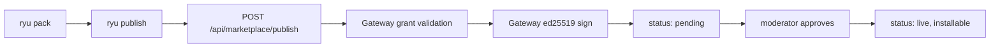

You have built a plugin (`plugin.json` bundling runnables) and want others to install it. This
page walks the publish path end to end: package the bundle, publish it to the Ryu-hosted
marketplace, let the Gateway sign it, and (optionally) price it. Everything here is the author
side. For the buyer experience see [The Marketplace](/docs/using-ryu/user-guide/marketplace).

If you have not built a plugin yet, start at
[plugin.json manifest](/docs/develop/extensions/plugin-json-manifest) and the
[TypeScript SDK](/docs/develop/extensions/typescript-sdk).

## How distribution works

Every catalog in Ryu (models, skills, MCP servers, plugins) is browsed and installed through one
swappable seam, the `CatalogSource` (`apps/core/src/catalog_source/`). The Ryu-hosted marketplace is
just one source behind that trait, served by the identity server
(`packages/api/src/routers/marketplace.ts`) over a `MarketplaceItem` collection. The SDK publishes a
`plugin.json` bundle to that source as a `plugin` kind item.



Two rules shape the flow:

- Publishing is **Better Auth authenticated**. The write surface is not anonymous (browse is).
- Signing and grant validation are the **Gateway's** job. Core decides what runs; the Gateway
  decides what is allowed and signs what ships. See
  [Gateway governance](/docs/gateway/governance) for the grant + signing ceremony.

## Step 1 - pack the bundle

`ryu pack` validates your `plugin.json` against the manifest schema and emits a publish-ready bundle
at `<dir>/dist/plugin.bundle.json` (`packages/sdk/src/cli.ts`).

```bash
bunx ryu pack ./my-plugin
# packed my.plugin@1.0.0 -> /abs/path/my-plugin/dist/plugin.bundle.json
```

Pack exits `1` with the exact failing field on any validation error, so fix what it reports before
moving on.

## Step 2 - authenticate

`ryu publish` reads your access token from the `RYU_AUTH_TOKEN` environment variable and sends it as
a Bearer token. The control plane accepts either a Better Auth session JWT or an OAuth access token.
The token is never read from a committed file.

```bash
export RYU_AUTH_TOKEN="<your Ryu access token>"
```

By default publish targets the local control plane (`http://localhost:3000`). Point it at another
deployment with `RYU_MARKETPLACE_API_URL`.

```bash
export RYU_MARKETPLACE_API_URL="https://your-control-plane.example.com"
```

## Step 3 - publish

```bash
bunx ryu publish ./my-plugin
# published my.plugin@1.0.0 (plugin) -> pending moderation
```

`ryu publish` re-validates the manifest, then POSTs to `POST /api/marketplace/publish` with the
manifest, its descriptor, and the `permission_grants` it requests. The SDK always publishes as the
`plugin` kind: a `plugin.json` bundle has no from-source `install_source`, so a `skill`-kind publish
would be uninstallable (models and MCP servers publish through their own tools).

On the server (`packages/api/src/routers/marketplace.ts`) the request goes through, in order:

1. **Grant validation** - the requested grants are checked against the Gateway
   (`POST /v1/grants/validate`). A denied grant blocks the publish with a 403. This is **fail-closed**:
   if the Gateway is unreachable the publish fails (502), so an over-privileged manifest can never
   slip through because governance was down.
2. **Ownership guard** - you cannot publish over an id another author owns (IDOR protection), and you
   cannot republish a first-party item.
3. **ed25519 signing** - the Gateway signs the canonical manifest (`POST /v1/manifests/sign`). The
   signing endpoint is **loopback-only** so there is no remote signing oracle.
4. **Store as pending** - the item lands with `status: "pending"` carrying the signature and public
   key. The browse API filters on live items, so a pending item is not served until a moderator
   approves it.

<Callout type="info">
  Re-publishing the same `id@version` updates the existing item in place (keyed on the unique
  `(kind, id)` index). A re-publish returns the item to `pending` and must be approved again.
</Callout>

## Step 4 - install-time verification (what buyers get)

At install time Core verifies the signature against a **pinned** key (`RYU_MARKETPLACE_PUBLIC_KEY`,
or the Gateway's resident key), never the manifest's self-attested key, so a forged manifest cannot
vouch for itself. Verification is fail-closed: a present-but-invalid signature is rejected; an absent
signature installs with a warning. You do not configure any of this as a publisher, but it is why the
signing step above is mandatory rather than cosmetic.

## Monetization (paid items)

A paid plugin needs a seller org with Stripe Connect payouts enabled. Complete seller onboarding
first (`POST /api/seller/onboard`); a paid publish from an org that has not enabled payouts is
refused with a clear error. The server resolves the publishing org and applies the platform fee, so
pricing is set under server policy, not by the manifest. Buyers purchase through a hosted Stripe
checkout (desktop is the only client with the full paid-purchase flow today).

<Callout type="warn">
  Monetization is **partially built**. Wallet top-up over standard Stripe works, but usage-based
  metering is **dormant**: Core's `gateway_spawn_env()` (`apps/core/src/sidecar/gateway.rs`) does not
  inject the `GATEWAY_CREDITS_*` variables when it spawns the Gateway, so the per-call debit hook
  never activates unless an operator sets those env vars on the host before launching Core. One-time
  and subscription item purchases work; per-call usage billing does not fire. This is the single
  wiring gap between coded and live for monetization.
</Callout>

## Reference

| Surface | Where | Notes |
|---|---|---|
| `ryu pack <dir>` | `packages/sdk/src/cli.ts` | Validate + bundle to `dist/plugin.bundle.json` |
| `ryu publish <dir>` | `packages/sdk/src/cli.ts` | Validate + POST to the marketplace |
| `POST /api/marketplace/publish` | `packages/api/src/routers/marketplace.ts` | Better Auth, stores `pending` |
| `POST /v1/grants/validate` | Gateway | Fail-closed grant check before publish |
| `POST /v1/manifests/sign` | Gateway | Loopback-only ed25519 signing |
| `RYU_AUTH_TOKEN` | env | Bearer token for publish |
| `RYU_MARKETPLACE_API_URL` | env | Target control plane (default `http://localhost:3000`) |
| `RYU_MARKETPLACE_PUBLIC_KEY` | env | Pinned key Core verifies installs against |

For the full grant catalog and the signing/verification endpoints, see
[Gateway governance](/docs/gateway/governance). For how the marketplace federates across all four
catalog kinds, see [the unified tool catalog](/docs/core/unified-tool-catalog).

<Cards>
  <DocCard href="/docs/develop/extensions/plugin-json-manifest" />
  <DocCard href="/docs/develop/extensions/typescript-sdk" />
  <DocCard href="/docs/using-ryu/user-guide/marketplace" />
  <DocCard href="/docs/gateway/governance" />
</Cards>
