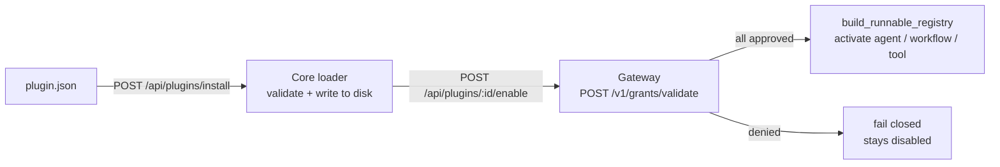

A Ryu **Plugin** is a bundle of one or more [Runnables](/docs/start-here/architecture/runnable-model)
plus the permission grants they need, described by a single declarative `plugin.json`. This page
walks you through assembling that file and installing it to Core. It is modeled on Codex's
`plugin.json` pattern: a thin descriptor naming everything the plugin contributes.

The full field-by-field schema (all eight Runnable kinds, per-kind `config`, `contributes`,
`activation_events`, `engines.ryu`) lives in the reference. This page does not re-state it.

<Cards>
  <DocCard href="/docs/develop/sdk/plugin-api" />
  <DocCard href="/docs/start-here/architecture/runnable-model" />
</Cards>

## 1. Write the manifest skeleton

Create a `plugin.json` with the three required top-level fields plus an empty `runnables` array.
The `id` is a reverse-domain identifier, `version` must be valid semver, and `name` is the display
label shown in the plugin store.

```json
{
  "id": "com.example.research-assistant",
  "name": "Research Assistant",
  "version": "1.0.0",
  "runnables": [],
  "permission_grants": []
}
```

The loader (`apps/core/src/plugin_manifest/mod.rs`) rejects a manifest whose `version` is not valid
semver. The canonical file name is `plugin.json`; the legacy `ryu.json` is still read for plugins
installed before the apps-to-plugins rename.

## 2. Add your Runnables

Each entry in `runnables` carries an `id`, a `name`, a `kind`, and an optional per-kind `config`.
The four kinds you can ship today are `agent`, `workflow`, `tool`, and `skill`. The example below
bundles one of each, taken from the built-in `sample.plugin.json` fixture.

```json
{
  "id": "com.example.research-assistant",
  "name": "Research Assistant",
  "version": "1.0.0",
  "runnables": [
    {
      "id": "agent-researcher",
      "name": "Researcher",
      "kind": "agent",
      "config": {
        "system_prompt": "You are a research assistant.",
        "model": "gemma4",
        "tools": ["web_search"]
      }
    },
    {
      "id": "tool-web-search",
      "name": "Web Search",
      "kind": "tool",
      "config": { "slug": "web_search" }
    }
  ],
  "permission_grants": ["mcp:web_search"]
}
```

The agent `model` field routes through the Gateway registry and is never hardcoded; an agent's
`tools` are a subset of the plugin's `permission_grants`. A `tool` entry wraps a single MCP tool
slug. For the exact `config` shape of every kind, see the
[plugin-api reference](/docs/develop/sdk/plugin-api).

<Callout type="warn">
  Only `agent`, `workflow`, and `tool` Runnables activate on enable today. Core validates all
  eight kinds, but `build_runnable_registry` (`apps/core/src/server/mod.rs`) registers only those
  three (an enabled agent gets an `app__`-namespaced id in the agent store, a workflow is saved as
  a skeleton, a tool is registered into the MCP registry). A `skill`, `companion`, `channel`,
  `engine`, or `policy` entry parses and validates but returns a per-Runnable "no handler" outcome,
  so enabling a plugin that ships them is a partial enable, not a hard failure. Ship
  agents/workflows/tools; treat the other five as declared-but-inert.
</Callout>

## 3. Declare permission grants

`permission_grants` are strings the plugin declares it needs, for example `mcp:web_search`. They
are declarations only. Enforcement is the Gateway's job: on enable, Core calls the Gateway's
`POST /v1/grants/validate` for each declared grant
(`validate_grants_via_gateway`, `apps/core/src/plugins/lifecycle.rs`) and fails closed if any grant
is denied. This keeps the Core-vs-Gateway split intact - Core decides what runs, the Gateway
decides what is allowed. See [governance](/docs/gateway/governance) for the grant model.

## 4. (Optional) Add contribution points and an engine pin

Two VS-Code-style blocks tune how the plugin loads. Both are optional and default off.

`contributes` is a declare-by-id block naming which of your `runnables` surface as commands, tools,
agents, workflows, or policies. Every id you reference must exist in `runnables` or the loader
rejects the manifest at load (a typo is caught immediately).

`engines.ryu` is a semver requirement string (e.g. `">=0.3.0"`); the loader rejects the manifest if
the running Core version does not satisfy it, mirroring `engines.vscode`.

```json
{
  "contributes": {
    "tools": [{ "id": "tool-web-search", "title": "Search the web" }]
  },
  "activation_events": ["onStartup"],
  "engines": { "ryu": ">=0.0.1" }
}
```

`activation_events` lazily wake the plugin. Recognised tokens are `"*"` (eager), `"onStartup"`,
`"onChat"`, and `"onCommand:<id>"`. An empty list (the default) means eager activation, so existing
manifests keep activating on enable.

<Callout type="warn">
  Activation-event firing is partly wired. `onStartup` fires at boot
  (`fire_activation_event`, called from `main.rs`), so a plugin declaring it is genuinely woken
  lazily. The wiring that fires `onChat` and `onCommand` from the chat and command-palette paths is
  a follow-on (`apps/core/src/runnable/mod.rs`). The TypeScript SDK's `RunnableKindSchema`
  (`packages/sdk/src/manifest.ts`) only enums the four common kinds; if you author
  companion/channel/engine/policy entries, write the `plugin.json` directly rather than relying on
  the SDK type for those.
</Callout>

## 5. Install and enable

Host the `plugin.json` at a URL, then install it by URL and enable it.

```bash
# Install: Core fetches the manifest, validates the schema, writes it under
# ~/.ryu/plugins/, and hot-reloads (no restart needed).
curl -X POST http://localhost:7980/api/plugins/install \
  -H 'content-type: application/json' \
  -d '{"url": "https://example.com/research-assistant/plugin.json"}'

# Enable: validate grants via the Gateway, then activate the Runnables.
curl -X POST http://localhost:7980/api/plugins/com.example.research-assistant/enable
```

After install the plugin appears in `GET /api/plugins` immediately. The lifecycle routes are
`POST /api/plugins/:id/{enable,disable,update}` (`apps/core/src/server/mod.rs`, backed by
`apps/core/src/plugins/lifecycle.rs`). Enable fails closed if any declared grant is denied by the
Gateway. The `/api/apps*` aliases still resolve to the same handlers but are deprecated.

<TryInRyu page="store" />

## What runs where



## Related

<Cards>
  <DocCard href="/docs/develop/extensions/mcp-server" />
  <DocCard href="/docs/develop/extensions/typescript-sdk" />
  <DocCard href="/docs/develop/extensions/marketplace" />
  <DocCard href="/docs/core/app-manifest-lifecycle" />
</Cards>
