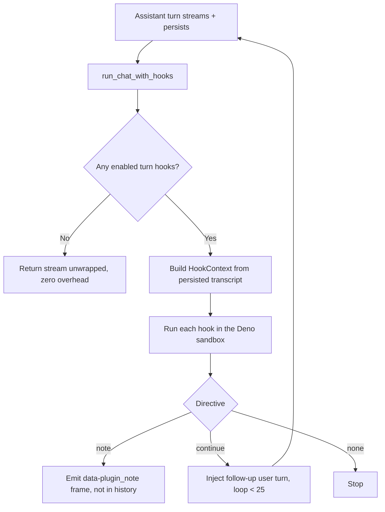

The plugin runtime is the code-execution layer that turns features like double-check, goal, and
advisor from hardcoded Core endpoints into real, installable, enable/disable-able plugins an outside
developer can ship. A plugin declares a **turn hook** in its `plugin.json`; the hook is
plugin-authored JS that runs in the same deny-by-default Deno sandbox that backs
[programmatic tool calling](/docs/core/programmatic-tool-calling), and it reaches Core only through
capability-gated host functions.

It lives in `apps/core/src/plugin_host/` (`mod.rs`, `bridge.rs`) and is wired into the chat path once,
at the top-level handler, so the CLI and bots get hooks too, not just the desktop. The declarative
manifest that carries a hook is described in
[Bundle Runnables with plugin.json](/docs/develop/extensions/plugin-json-manifest); this page covers
the runtime that executes it.

<Callout type="warn">
  The Core sandbox layer is live-verified: the `plugin_host::tests::live_*` tests run the shipped
  double-check, goal, and advisor fixture hooks in a real Deno 2.x sandbox, round-trip
  `host.sideModel` / `host.storage` through the capability bridge, and assert the correct directives.
  The **desktop** side is compile-checked only. The `data-plugin_note` banner render, the `continue`
  multi-turn streamed render, and the end-to-end double-check / goal flow through a running desktop
  are not yet live-verified. Only the `post_assistant_turn` boundary exists today; there is no
  pre-turn or per-token hook.
</Callout>

## What a turn hook is

A turn hook is server-side logic that runs at a chat turn boundary. You declare it under
`contributes.turn_hooks` in the manifest, and its `code` field is the JS body of your hook:

```jsonc
"contributes": {
  "turn_hooks": [
    { "id": "my.review", "on": "post_assistant_turn", "code": "<JS body that returns a directive>" }
  ]
}
```

The only boundary today is `post_assistant_turn` (the constant `ON_POST_ASSISTANT_TURN` in
`plugin_host/mod.rs`). The hook runs after the assistant turn has streamed and persisted, so it can
review the answer the user just received and decide what happens next.

Each hook body runs in a fresh sandbox with exactly two globals in scope, the way a Worker body has
only its message in scope. There is no module system, no captured closure, and no filesystem or
network outside the host bridge.

### `ctx`: the turn context

`ctx` is the serialized `HookContext`. A hook reads it to decide whether and how to act:

| Field | Type | What it carries |
|---|---|---|
| `conversation_id` | `string` | The conversation id, also the natural key for per-conversation plugin storage. |
| `agent_id` | `string` | The agent that produced the turn. |
| `transcript` | `{ role, content }[]` | Recent messages, oldest to newest, so the hook can inspect the last answer. |
| `flags` | `{ [pluginId]: boolean }` | Per-request plugin flags set by the client, for example a composer toggle. A hook reads its own flag to decide whether to act this turn. |

### `host`: the capability bridge

`host` is the only way out of the sandbox. Every call is routed through `PluginHookBridge`
(`plugin_host/bridge.rs`) and gated by a manifest `permission_grants` entry. The capability surface is
deliberately small:

| Call | Grant required | Returns |
|---|---|---|
| `await host.sideModel({ prompt, system?, model?, model_pref_key?, effort? })` | `hook:side-model` | One non-streaming Gateway completion as text. The model is resolved swappably (explicit `model`, then `model_pref_key` preference, then `RYU_DEFAULT_LLM_MODEL`, then the bundled local default), never hardcoded. |
| `await host.storage.get(key, namespace?)` | `storage:kv` | The stored string, or `null`. |
| `await host.storage.set(key, value, namespace?)` | `storage:kv` | `true`. Non-string values are JSON-stringified. |
| `await host.storage.delete(key, namespace?)` | `storage:kv` | `true`. |
| `await host.storage.keys(namespace?)` | `storage:kv` | The namespace's keys. |
| `host.log(...args)` | none | Captured logs. |

Storage is namespaced per plugin (`namespace` defaults to `"default"`), so one plugin can never read
another plugin's keys.

<Callout type="warn">
  Gating returns an error, it does not silently pass. An ungranted capability call (or an unknown
  `host.*` method) rejects the awaited call with `is_error: true` and a message like
  `capability 'hook:side-model' not granted`. A plugin can catch that error. The fail-open to a no-op
  directive happens one level up: an **uncaught** throw, like any other hook error, degrades the whole
  hook to `{ kind: "none" }`, so a misbehaving plugin can never block or break a chat turn.
</Callout>

## The directive contract

A hook returns a directive that the chat path applies. The shape is the `HookDirective` enum in
`plugin_host/mod.rs`:

| Directive | Effect |
|---|---|
| `{ kind: "none" }` | Do nothing. This is also the fail-safe for any error, unparseable result, or missing Deno binary. |
| `{ kind: "note", text }` | Surface `text` to the user out-of-band as a `data-plugin_note` AI-SDK part. It never enters chat history. This is double-check's review. |
| `{ kind: "continue", text }` | Inject `text` as a follow-up user turn and run another assistant turn, streamed into the **same** response. This is goal's loop, capped server-side at `MAX_CONTINUE_TURNS` (25). |

A missing, `null`, or unparseable return value, an explicit `{ kind: "none" }`, a thrown hook, an
unsupported sandbox pause, or a missing Deno binary all resolve to `{ kind: "none" }`. The runtime is
fail-open by construction: a plugin can never wedge a turn.

## Where it runs (Core vs Gateway)

A turn hook decides *what runs next*, which is a Core concern, so the runtime lives in
`apps/core/src/plugin_host/`. Any model call a hook makes still routes through the Gateway:
`host.sideModel` calls `call_side_model`, the same governed path that `/btw` and the side-question
feature use. The sandbox grants capabilities; the Gateway governs every model call.

The chat path wires hooks in at `run_chat_with_hooks` (`apps/core/src/server/mod.rs`). After the
assistant turn streams and persists, `dispatch_turn_hooks` collects every enabled `post_assistant_turn`
hook, runs each one, and applies the directives in plugin order: a `note` is emitted as a
`data-plugin_note` frame, a `continue` rebuilds the request from the persisted transcript and loops.
When no plugin contributes a hook (the common case) or the sandbox backend is absent, the inner stream
is returned unwrapped, so there is zero overhead on the hot path.



## Plugin lifecycle

The runtime reads from the live, hot-updated manifest set, so enable and disable take effect on the
next turn with no restart. The lifecycle routes are defined in `apps/core/src/server/mod.rs` and
backed by `apps/core/src/plugins/lifecycle.rs`:

| Method + path | Purpose |
|---|---|
| `GET /api/plugins` | List installed plugins and their enabled state. |
| `GET /api/plugins/contributions` | Serve the declarative UI contributions (composer controls, settings tabs, slash commands) verbatim for the renderer. |
| `POST /api/plugins/install` | Install by URL: fetch the manifest, validate, write under `~/.ryu/plugins/`, hot-reload. |
| `POST /api/plugins/:id/install` | Install a known catalog plugin by id. |
| `POST /api/plugins/:id/enable` | Validate grants via the Gateway, then activate the plugin's contributions. |
| `POST /api/plugins/:id/disable` | Deactivate the plugin; its hooks stop firing on the next turn. |
| `POST /api/plugins/:id/update` | Update an installed plugin to a newer manifest. |

A `post_assistant_turn` hook fires only while its plugin is **enabled**. `collect_enabled_hooks`
(`plugin_host/mod.rs`) filters the manifest set by enabled state on every assistant turn, so a toggle
in the store is immediate. Running hooks also requires the `deno` binary on PATH; when it is absent the
runtime no-ops and logs, the same graceful-degrade posture as the rest of the sandbox.

Declarative contributions (`composer_controls`, `settings_tabs`, `slash_commands`) are the
complementary half: Core stores them verbatim and serves them at `GET /api/plugins/contributions`, and
the renderer interprets them. Logic is real sandboxed code; UI is declarative. This mirrors the
VS Code split.

## Building one

1. Write a `plugin.json` with `id` (reverse-domain), `version` (semver), the `permission_grants` your
   hook needs (for example `hook:side-model`), and a `contributes.turn_hooks` entry whose `code` is
   your self-contained JS hook body.
2. Drop it at `~/.ryu/plugins/<id>/plugin.json`, or host it and install by URL.
3. Enable it (`POST /api/plugins/:id/enable`, or via the desktop store).
4. Your hook runs after each assistant turn, provided `deno` is on PATH.

The bundled fixtures in `apps/core/src/plugin_manifest/fixtures/` are the worked reference:
`double-check.plugin.json` returns a `note`, `goal.plugin.json` returns a `continue`, and
`advisor.plugin.json` consults a stronger model and returns either, depending on the composer toggle or
a `/advisor` slash command. Each was built as a manifest plus inline JS, with no Core or desktop edits
to add the plugin itself.

Rather than hand-writing the manifest JSON, the TypeScript SDK gives you typed factories:

```ts
import { definePlugin, defineTurnHook } from "@ryu/sdk";

export default definePlugin({
  id: "com.example.double-check",
  name: "Double Check",
  version: "1.0.0",
  grants: ["hook:side-model"],
  composerControls: [{ id: "dc.toggle", type: "toggle", flag: "com.example.double-check" }],
  turnHooks: [
    defineTurnHook({
      id: "dc.review",
      run: async (ctx, host) => {
        if (!ctx.flags["com.example.double-check"]) {
          return { kind: "none" };
        }
        const last = ctx.transcript.at(-1);
        const review = await host.sideModel({
          prompt: last?.content ?? "",
          model_pref_key: "double-check-model",
        });
        return { kind: "note", text: review };
      },
    }),
  ],
});
```

`defineTurnHook` serializes your `run(ctx, host)` into the sandbox `code`. The function must be
self-contained, with no captured variables or imports, because it runs in a fresh sandbox with only
`ctx` and `host` in scope.

## Not a turn hook: compression

Gateway-side message compression (headroom) is a related plugin mechanism but a different one. It is a
`policy` runnable read by the Gateway egress transform, not a `post_assistant_turn` hook, and it never
enters the Core sandbox. Reach for a turn hook when you need to react to a finished turn from Core;
reach for a compression policy when you need to transform requests on the way out through the Gateway.

## Related

<Cards>
  <DocCard href="/docs/develop/extensions/plugin-json-manifest" />
  <DocCard href="/docs/develop/sdk/plugin-api" />
  <DocCard href="/docs/core/double-check" />
  <DocCard href="/docs/core/goals" />
</Cards>
