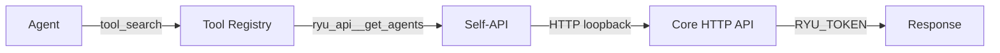

The Self-API turns Core's own HTTP endpoints into tools an agent can `tool_search` → `describe` →
`execute`, exactly like any MCP or built-in tool. Agents can drive Ryu itself.

## How it works



1. An agent calls `tool_search` with a query like "list agents"
2. The tool registry returns matching Self-API tools (e.g., `ryu_api__get_agents`)
3. The agent calls `execute` with the tool id and arguments
4. Core makes an HTTP loopback call to itself with the node's own `RYU_TOKEN`
5. The response is returned to the agent

## Tool naming

Every Self-API tool follows the pattern:

```
ryu_api__<method>_<path_segment>_<path_segment>_...
```

Examples:
- `ryu_api__get_agents` → `GET /api/agents`
- `ryu_api__post_plugins_install` → `POST /api/plugins/install`
- `ryu_api__get_spaces` → `GET /api/spaces`

## The denylist

Security-critical routes are **never** exposed. Non-negotiable.

| Denied prefix | Why |
|---|---|
| `/api/auth/` | Agent must never drive login/logout/device flow |
| `/api/identity/` | Never expose stored secrets or credential lifecycle |
| `/api/host/` | Cross-app privilege escalation surface |
| `/api/tools/` | Recursion (search/describe/exec are the tools themselves) |

| Denied exact | Why |
|---|---|
| `/api/openapi.json` | Agent enumerating the spec to self-expand is pointless recursion |
| `/api/mcp/tools/call` | Recursion into tool dispatch |

Streaming routes (WebSocket, SSE) are excluded at generation time — a blocking loopback call
to these hangs until timeout.

## Security invariants

### 1. Denylist is constant

The denylist is a compile-time constant. No runtime configuration can expose denied routes.
Reviewable in `apps/core/src/self_api/mod.rs`.

### 2. Loopback carries the node token

The loopback request uses `RYU_TOKEN` = full power. On an org-bound node, this would be a
tenancy bypass (the loopback runs as the node, not the calling agent's principal).

**Solution:** Self-API tools are **refused** whenever the node is org-bound (principal is not
`Unrestricted`). Personal/unbound nodes get full power (exactly one principal).

### 3. Mutations default to approval-gated

Non-GET requests (POST, PUT, PATCH, DELETE) default to approval-gated when the approval mode
is not `off`. The agent must get human approval before making changes.

## Tool discovery

The Self-API tools appear in the tool registry alongside MCP and built-in tools:

```bash
# Search for Self-API tools
curl http://localhost:7980/api/tools/search?q=list+agents

# Describe a specific tool
curl http://localhost:7980/api/tools/describe/ryu_api__get_agents
```

## What agents can do

| Capability | Example tools |
|---|---|
| Read data | `ryu_api__get_agents`, `ryu_api__get_spaces`, `ryu_api__get_conversations` |
| List resources | `ryu_api__get_plugins`, `ryu_api__get_skills`, `ryu_api__get_models` |
| Check status | `ryu_api__get_health`, `ryu_api__get_version` |
| Modify state | `ryu_api__post_plugins_enable`, `ryu_api__put_preferences` (approval-gated) |

## What agents cannot do

| Blocked | Why |
|---|---|
| Auth operations | Agent must never drive login/logout |
| Credential access | Never expose stored secrets |
| Tool recursion | Self-API tools cannot call other Self-API tools |
| Spec enumeration | Cannot self-expand by reading the OpenAPI spec |
| Streaming endpoints | WebSocket/SSE routes are excluded |

## Related

<Cards>
  <DocCard href="/docs/core/unified-tool-catalog" />
  <DocCard href="/docs/security/permissions" />
  <DocCard href="/docs/security/command-approval" />
  <DocCard href="/docs/develop/extensions/capability-broker" />
</Cards>
