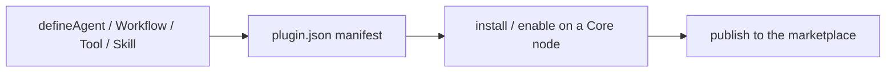

This realm is for developers building on top of Ryu: packaging extensions, authoring Runnables
with the SDK, calling a Core node over HTTP, and shipping to the marketplace.

Everything you add is a **Runnable** - the one contract that unifies agents, workflows, tools,
skills, and MCP servers (`packages/sdk/src/`). The SDK factories `defineAgent`, `defineWorkflow`,
`defineTool`, and `defineSkill` (`apps/core/src/runnable/mod.rs`) author them, a `plugin.json`
manifest bundles them, and every model call routes through the Gateway.

## Start here

New to building on Ryu? Scaffold a project with `create-ryu-app` in the
[Quickstart](/docs/develop/quickstart), then pick a path below.

<Cards>
  <DocCard href="/docs/develop/quickstart" />
  <DocCard href="/docs/develop/extensions" />
  <DocCard href="/docs/develop/sdk" />
  <DocCard href="/docs/develop/agent-inboxes" />
  <DocCard href="/docs/develop/api-reference" />
</Cards>

<Callout type="info">
The SDK and the `plugin.json` lifecycle are built (M8). The third-party plugin code-execution
runtime is still design-first - see the extensions realm for what is live today versus deferred.
</Callout>
