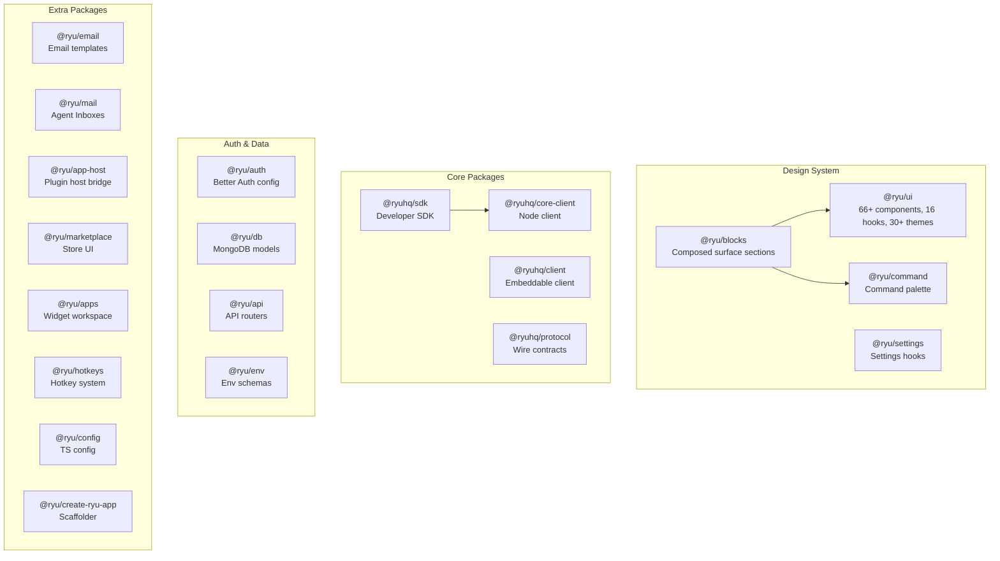

Ryu ships **20 TypeScript packages**. These are the shared libraries that all TypeScript apps consume.

## Package landscape

---

## Design System (4 packages)

### @ryu/ui

**Path:** `packages/ui`

The foundation: 66+ components, 16 hooks, 30+ themes, Plate.js editor, Three.js 3D.

| Export | Purpose |
|---|---|
| Components (`./components/*`) | Button, Input, Dialog, Table, Sheet, Select, Tabs, Tooltip, etc. |
| Hooks (`./hooks/*`) | useTheme, useMediaQuery, useLocalStorage, etc. |
| Types (`./types/*`) | Shared type definitions |
| Theme (`./theme/*`) | 30+ theme presets (dark, light, midnight, etc.) |
| Editor | Plate.js rich text editor |
| 3D | Three.js components |

**Build on it:** Import components directly. All components follow shadcn conventions.

### @ryu/blocks

**Path:** `packages/blocks`

Composed, surface-specific UI sections. Shared by desktop, island, web, extension.

| Surface | Path | Purpose |
|---|---|---|
| Desktop | `./desktop/*` | Desktop-specific sections (sidebar, settings, etc.) |
| Island | `./island/*` | Overlay-specific sections (mini chat, suggestions) |
| Web | `./web/*` | Marketing sections (hero, features, pricing) |
| Extension | `./extension/*` | Browser extension sections (popup, dashboard) |
| Composer | `./composer/*` | Chat composer sections (input, actions, attachments) |
| Command | `./command/*` | Command palette sections |

**Build on it:** Create new blocks by composing `@ryu/ui` components with surface-specific logic.

### @ryu/command

**Path:** `packages/command`

Shared, transport-agnostic command palette (desktop + island).

| Export | Purpose |
|---|---|
| `CommandPalette` | Main command palette component |
| `ChatView` | Chat view within palette |
| `registry` | Command registry (register new commands) |
| `types` | Command types and interfaces |

**Build on it:** Register new commands via the registry. The palette is used by both desktop and island.

### @ryu/settings

**Path:** `packages/settings`

Settings hooks and UI components shared across surfaces.

| Export | Purpose |
|---|---|
| Settings hooks | React hooks for reading/writing preferences |
| Settings components | Settings UI elements (toggle, select, etc.) |
| Feature flags | Per-feature enable/disable flags |
| Org settings | Organization-level configuration |

**Build on it:** Consume settings hooks in any surface. Settings are persisted via Core's preferences API.

---

## Core SDK & Client (4 packages)

### @ryuhq/sdk

**Path:** `packages/sdk`

The developer SDK: typed factories for agents, workflows, tools, skills, plugins, apps.

| Factory | Purpose |
|---|---|
| `defineAgent()` | Agent with composable slots (chat, rag, memory, tts, stt, tools) |
| `defineWorkflow()` | Workflow orchestrating Runnables |
| `defineTool()` | Tool with JSON Schema validation |
| `defineSkill()` | Reusable skill |
| `definePlugin()` | Complete `plugin.json` manifest |
| `defineApp()` | Manifest for Ryu Apps (widgets) |
| `defineTurnHook()` | Turn hook for post-assistant logic |
| `defineModel()` | Gateway-mandatory model client |
| `createPrimitives()` | Typed RAG/memory/TTS/STT clients |

See [SDK Reference](/docs/develop/sdk) for the full API.

### @ryuhq/client

**Path:** `packages/client`

TypeScript client SDK for embedding a Ryu Core agent in any app. Zero runtime deps.
Published to npm as `@ryuhq/client`.

| Export | Purpose |
|---|---|
| `createClient()` | Create a typed Core client |
| Chat methods | Stream chat, send messages |
| Conversation methods | List, create, delete conversations |
| Types | Typed request/response contracts |

**Build on it:** Embed a Ryu agent in any web app, mobile app, or backend service.

### @ryuhq/core-client

**Path:** `packages/core-client`

Platform-agnostic typed client for a Core node. Used by native, TUI, benchmark, and MCP.

| Export | Purpose |
|---|---|
| `client` | HTTP/SSE client to a Core node |
| Types | Typed request/response for all Core endpoints |
| SSE helpers | Stream parsing and reconnection |

**Build on it:** Build any client that connects to a Core node over HTTP.

### @ryuhq/protocol

**Path:** `packages/protocol`

Surface-agnostic wire-format contracts. Pure types, zero runtime deps.

| Module | Purpose |
|---|---|
| `./agent-rules` | Agent routing rules |
| `./deep-link` | `ryu://` deep link format |
| `./hardware` | RHP v1 protocol (device pairing, codecs) |
| `./sse` | SSE event format |
| `./voice` | Voice stream format |

**Build on it:** Import types for any surface that communicates with Core.

---

## Auth & Data (4 packages)

### @ryu/auth

**Path:** `packages/auth`

Better Auth configuration: email, OAuth, device, 2FA, OTP, magic-link.

| Feature | What it provides |
|---|---|
| Email auth | Password + magic link |
| OAuth | Google, GitHub, etc. |
| Device auth | Device pairing flow |
| 2FA | TOTP-based 2FA |
| API keys | Per-user API keys |
| Billing | Polar integration |

**Build on it:** Add new auth providers via the Better Auth plugin system.

### @ryu/db

**Path:** `packages/db`

MongoDB/Mongoose models shared by `apps/server`.

| Export | Purpose |
|---|---|
| User model | User accounts and profiles |
| Session model | Active sessions |
| Org model | Organization and membership |
| Content model | Notion-backed content |

**Build on it:** Extend models for new server-side features.

### @ryu/api

**Path:** `packages/api`

API routers consumed by `apps/server`.

| Router | Purpose |
|---|---|
| Content | Notion-backed content management |
| S3 | File upload/download |
| Stripe | Billing webhooks |
| AI | Guest playground proxy |

**Build on it:** Add new API routes for server-side features.

### @ryu/env

**Path:** `packages/env`

Environment variable schemas via t3-env + Zod.

| Export | Purpose |
|---|---|
| `./server` | Server-side env vars (database, auth, S3, etc.) |
| `./web` | Web-side env vars (NEXT_PUBLIC_*) |
| `./native` | Mobile-side env vars |

**Build on it:** Add new env vars to the appropriate surface's schema.

---

## App Infrastructure (8 packages)

### @ryu/email

**Path:** `packages/email`

Email templates (React Email) for auth flows and notifications.

| Template | Purpose |
|---|---|
| Welcome | New user welcome email |
| Verify | Email verification |
| Reset | Password reset |
| Notification | General notification template |

**Build on it:** Add new email templates using React Email.

### @ryu/mail

**Path:** `packages/mail`

Ryu Mail (Agent Inboxes): email-as-a-service for agents over AWS SES/S3.

| Export | Purpose |
|---|---|
| SES send | Send email via AWS SES |
| S3 presigned | Generate presigned URLs for attachments |
| Mail parsing | Parse incoming email (MIME, headers) |
| Inbox management | Per-agent inbox CRUD |

**Build on it:** Extend email handling or add new transport backends.

### @ryu/app-host

**Path:** `packages/app-host`

Plugin host bridge: RPC, views, ExtensionHost, widget bootstrap.

| Module | Purpose |
|---|---|
| `./rpc` | Host ↔ plugin RPC communication |
| `./views` | Plugin view components (iframe sandbox) |
| `./ExtensionHost` | Third-party plugin runtime |
| `./widget-bootstrap` | Widget initialization and lifecycle |
| `./widget-state-store` | Widget state management |

**Build on it:** Add new RPC methods or widget capabilities.

### @ryu/marketplace

**Path:** `packages/marketplace`

Shared marketplace catalog UI for desktop + web.

| Module | Purpose |
|---|---|
| `./catalog/*` | Catalog browsing (apps, skills, models) |
| `./sell-tab` | Seller interface for publishing |
| `./licenses-tab` | License management |
| `./star-rating` | Star rating display |
| `./install-flows` | Install/update/uninstall flows |

**Build on it:** Add new marketplace realms or install flows.

### @ryu/apps

**Path:** `packages/ryu-apps`

Ryu Apps widget workspace: shared frame-side bridge + built-in widget bundles.

| Export | Purpose |
|---|---|
| Widget bridge | Frame ↔ Core communication |
| Widget bundles | Self-contained HTML per app |
| Lifecycle | Mount, unmount, state sync |

**Build on it:** Add new widget bundles for feature apps.

### @ryu/hotkeys

**Path:** `packages/hotkeys`

Shared hotkey system: chord definitions, registry, React hooks.

| Export | Purpose |
|---|---|
| `parseChord()` | Parse keyboard chord strings |
| `HotkeyRegistry` | Global hotkey registration |
| `useHotkey()` | React hook for hotkey bindings |

**Build on it:** Register new hotkeys for desktop and island surfaces.

### @ryu/config

**Path:** `packages/config`

Shared TypeScript configuration for Ryu packages.

| Export | Purpose |
|---|---|
| `tsconfig.base.json` | Base TypeScript config |
| `tsconfig.react.json` | React-specific config |
| `tsconfig.node.json` | Node.js-specific config |

**Build on it:** Reference from any package's `tsconfig.json`.

### create-ryu-app

**Path:** `packages/create-ryu-app`

CLI scaffolder: `npx create-ryu-app my-plugin` generates a starter SDK project with a validated `plugin.json` manifest.

| Command | Purpose |
|---|---|
| `npx create-ryu-app <name>` | Scaffold a new plugin project |
| `--template` | Choose starter template |
| `--sdk` | Include SDK dependencies |

**Build on it:** Add new templates for different plugin types.
