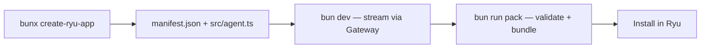

This tutorial walks the golden path: scaffold a plugin with `create-ryu-app`, run its starter
Runnable against your local gateway, then bundle it for the plugin store. By the end you will
have a valid `manifest.json` and an agent whose every model call routes through the Ryu gateway.

You write plugins with `@ryuhq/sdk` (the Ryu developer SDK) and scaffold them with
`create-ryu-app`. This page is the single entry point. For the full SDK surface see
[the SDK reference](/docs/develop/sdk), and for every manifest field see
[the manifest.json manifest](/docs/develop/sdk/plugin-api).

<Callout type="info">
  Ryu uses [Bun](https://bun.sh) across the monorepo. The commands below assume `bun` and `bunx`
  are on your PATH. A running local Core also runs the gateway as a managed sidecar, so the
  starter agent has something to call.
</Callout>

## What you build



The scaffold emits a directory with three files that matter:

| File | What it is |
|---|---|
| `manifest.json` | The plugin manifest, validated against `PluginManifestSchema` so the desktop plugin store can install it |
| `src/agent.ts` | A starter Runnable that streams one turn through the gateway-mandatory model client |
| `package.json` | A minimal project with a `@ryuhq/sdk` dependency plus `dev` and `pack` scripts |

## Step 1: Scaffold the project

Run the scaffolder, passing a project name. The name becomes the directory and the app id slug,
so use lowercase letters, digits, hyphens, or underscores.

```bash
bunx create-ryu-app my-first-plugin
```

`create-ryu-app` (`packages/create-ryu-app/index.ts`) copies the template, stamps your name into
`manifest.json`, validates the result against `PluginManifestSchema`, and writes `package.json`. On
success it prints the next steps:

```text
  created my-first-plugin/

  next steps:
    cd my-first-plugin
    bun install
    bun dev        # streams one turn via local gateway
    bun run pack   # validate and bundle manifest.json
```

The generated `manifest.json` looks like this (your name is stamped into the `id` and `name`):

```json
{
  "id": "com.example.my-first-plugin",
  "name": "My First Plugin",
  "version": "0.1.0",
  "runnables": [
    { "id": "agent-main", "name": "Main Agent", "kind": "agent" }
  ],
  "permission_grants": [],
  "companion": {
    "label": "My First Plugin",
    "icon": "sparkles",
    "shortcut": "ctrl+shift+r"
  }
}
```

A plugin bundles one or more Runnables (the unified Agent / Workflow / Tool / Skill / MCP-server
contract) plus an optional companion surface. See [the Runnable model](/docs/start-here/architecture/runnable-model)
for the concept and [the manifest reference](/docs/develop/sdk/plugin-api) for every field.

## Step 2: Install dependencies

```bash
cd my-first-plugin
bun install
```

This pulls `@ryuhq/sdk`, which gives you the gateway-mandatory model client and the
`defineAgent` / `defineWorkflow` / `defineTool` / `defineSkill` Runnable factories.

## Step 3: Read the starter agent

Open `src/agent.ts`. It defines a model with `defineModel` from `@ryuhq/sdk` and streams one
turn:

```ts
import { defineModel } from "@ryuhq/sdk";

const MODEL_ID = process.env.RYU_MODEL ?? "gpt-4o-mini";
const model = defineModel(MODEL_ID);

const messages = [
  { role: "system", content: "You are a helpful assistant running inside the Ryu platform." },
  { role: "user", content: "Hello! Say hi and tell me which model you are." },
];

for await (const delta of model.stream(messages)) {
  if (delta.content) {
    process.stdout.write(delta.content);
  }
}
```

Two things are deliberate here:

- **The model is a swappable string.** Change `MODEL_ID` in the file, or set `RYU_MODEL`, and the
  gateway resolves the provider. Nothing about a provider is hardcoded.
- **No key lives in your code.** Every call goes through the gateway, and credentials live in the
  gateway config, never in this file. This is the gateway-mandatory client: see
  [the gateway overview](/docs/gateway) for what the gateway governs.

## Step 4: Run it against the gateway

```bash
bun dev
```

This streams one turn. The model client targets `RYU_GATEWAY_URL` (default
`http://127.0.0.1:7981`); set `RYU_GATEWAY_TOKEN` first if your gateway requires auth.

<Callout type="warn">
  The starter agent needs a routable model behind the gateway. With a fresh local install Ryu
  ships a local engine and a default model, but if the gateway cannot resolve `gpt-4o-mini` (or
  your `RYU_MODEL`) the turn fails. Point `RYU_MODEL` at a model your gateway can route, for
  example a local model id or an `openrouter/...` slug.
</Callout>

## Step 5: Validate and bundle

When the agent works, bundle the plugin for the store:

```bash
bun run pack
```

This calls `bunx ryu pack .`. The `ryu` CLI (`packages/sdk/src/cli.ts`) validates `manifest.json`
against the same `PluginManifestSchema` and, on success, writes a publish-ready bundle to
`dist/plugin.bundle.json`. If the manifest is invalid it exits non-zero and names the failing
field, so a broken manifest never reaches the store.

The CLI also offers:

| Command | What it does |
|---|---|
| `bunx ryu pack <dir>` | Validate `manifest.json` and emit `dist/plugin.bundle.json` |
| `bunx ryu dev <entry>` | Run a Runnable locally with an interactive chat loop |
| `bunx ryu publish <dir>` | Validate and POST the plugin to the Ryu Marketplace (stored as `pending` until a moderator approves it) |

## Step 6: Install it in Ryu

Because `manifest.json` validates against the schema the desktop plugin store reads, your bundle
installs immediately. Open the store and add it from your local bundle.

<TryInRyu page="store" />

Publishing to the marketplace adds Gateway governance (grant validation plus manifest signing).
That flow lives on [the marketplace authoring page](/docs/develop/extensions/marketplace), not
here.

## Where to go next

<Cards>
  <DocCard href="/docs/develop/sdk" />
  <DocCard href="/docs/develop/sdk/plugin-api" />
  <DocCard href="/docs/develop/extensions/hooks-lifecycle" />
  <DocCard href="/docs/develop/extensions/marketplace" />
  <DocCard href="/docs/develop/contributing" />
  <DocCard href="/docs/start-here/architecture/runnable-model" />
</Cards>
