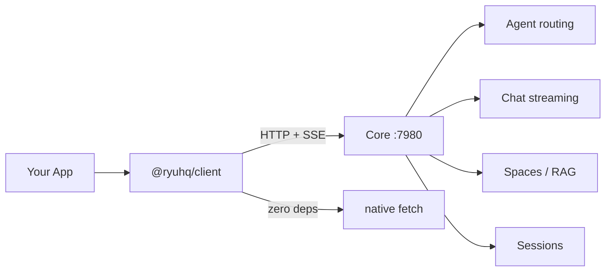

`@ryuhq/client` (`packages/client/`) is the TypeScript client SDK for calling a running Ryu **Core**
node over its HTTP API. Where [`@ryuhq/sdk`](/docs/develop/sdk) is for authoring Runnables and
packing them into a plugin, `@ryuhq/client` is for calling a Core node - create a client, pick an
agent, stream.

It has zero runtime dependencies (native `fetch` only), so it works in Node 18+, Bun, Deno, and
modern browsers.

<Callout type="warn">
  `@ryuhq/client` is currently `0.0.1` and not yet published to npm. Inside the Ryu monorepo it
  resolves as `workspace:*`.
</Callout>

## Architecture



`@ryuhq/client` is a thin typed wrapper over `fetch`. It calls Core's HTTP API directly with no
runtime dependencies — works in Node 18+, Bun, Deno, and browsers.

## Install

```bash
npm install @ryuhq/client
# or
bun add @ryuhq/client
```

## Create a client

`createRyuClient(options)` returns a `RyuClient` with three typed namespaces - `agents`, `sessions`,
and `spaces`. The only required option is `baseUrl`; pass a `token` for authenticated or remote nodes.

```typescript
import { createRyuClient } from "@ryuhq/client";

const client = createRyuClient({ baseUrl: "http://localhost:7980" });

// Authenticated / remote node:
const remote = createRyuClient({
  baseUrl: "https://my-node.example.com",
  token: process.env.RYU_TOKEN,
});
```

```typescript
interface RyuClientOptions {
  baseUrl: string; // Base URL of the Core server, e.g. "http://localhost:7980"
  token?: string;  // Optional bearer token for authenticated nodes
}
```

## `client.agents`

Agent CRUD and chat streaming over Core's `/api/agents` and `/api/chat/stream` endpoints.

| Method | Returns | Calls |
|---|---|---|
| `list()` | `AgentSummary[]` | `GET /api/agents` |
| `get(id)` | `Agent` | `GET /api/agents/:id` |
| `run(id, messages)` | `string` | `POST /api/chat/stream` (buffered) |
| `stream(id, messages)` | `AsyncGenerator<StreamChunk>` | `POST /api/chat/stream` |

### List and fetch agents

```typescript
const agents = await client.agents.list();
for (const agent of agents) {
  console.log(agent.id, agent.name);
}

// Full record (tools, engine binding, version) for one agent:
const pi = await client.agents.get("pi");
```

### Stream a chat turn

`stream()` yields a `StreamChunk` for every text fragment as it arrives from Core's SSE stream, then
a final `{ type: "done" }` chunk.

```typescript
const messages = [{ role: "user", content: "Write a haiku about Rust." }];

for await (const chunk of client.agents.stream("pi", messages)) {
  if (chunk.type === "text") {
    process.stdout.write(chunk.content ?? "");
  }
  if (chunk.type === "done") {
    break;
  }
}
```

### Buffer the whole reply

`run()` consumes the stream and returns the full text:

```typescript
const reply = await client.agents.run("pi", messages);
console.log(reply);
```

## `client.sessions`

Conversation listing and retrieval over Core's `/api/conversations` endpoints.

| Method | Returns | Calls |
|---|---|---|
| `list()` | `Conversation[]` | `GET /api/conversations` |
| `get(id)` | `Conversation` | `GET /api/conversations/:id` |

```typescript
const conversations = await client.sessions.list();
const detail = await client.sessions.get(conversations[0].id);
```

## `client.spaces`

Spaces / RAG search over Core's `/api/spaces` endpoints. A Space is a named document collection
backed by a sqlite-vec vector store.

| Method | Returns | Calls |
|---|---|---|
| `list()` | `Space[]` | `GET /api/spaces` |
| `search(id, query, limit?)` | `SpaceMatch[]` | `POST /api/spaces/:id/search` |

```typescript
const spaces = await client.spaces.list();
const matches = await client.spaces.search(spaces[0].id, "deployment steps", 5);
for (const match of matches) {
  console.log(match.content, match.distance);
}
```

Each `SpaceMatch` carries the chunk text plus a `distance` (squared L2 distance - smaller is closer).
Embeddings are computed server-side by Core's RAG pipeline.

## Types

All types are exported from the package root:

```typescript
import type {
  RyuClientOptions,
  Agent,
  AgentSummary,
  Message,
  StreamChunk,
  Space,
  SpaceMatch,
  Conversation,
} from "@ryuhq/client";
```

```typescript
interface Message     { role: "user" | "assistant" | "system"; content: string }
interface StreamChunk { type: "text" | "done" | "error"; content?: string }

interface SpaceMatch {
  chunkId: string;
  documentId: string;
  content: string;
  distance: number; // squared L2 distance; smaller is closer
}
```

## Errors

Non-2xx responses throw an `Error` with the status code and response body:

```typescript
try {
  await client.agents.run("does-not-exist", messages);
} catch (err) {
  console.error(err.message); // "RyuClient: stream failed (404): ..."
}
```

## Other languages

There is no published client SDK for Go, C#, or Python yet. Call Core's HTTP API directly - it is
plain JSON + SSE, documented in the [Core API reference](/docs/develop/api-reference/core).
